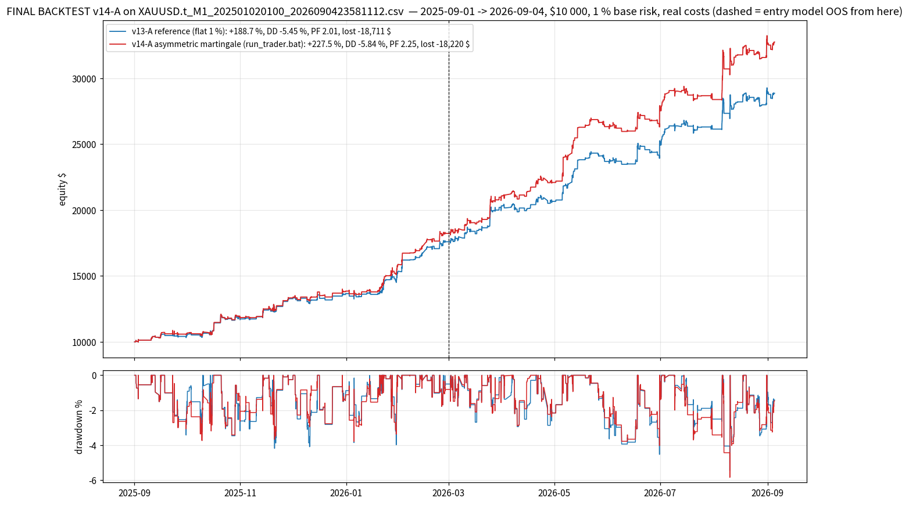

# FINAL BACKTEST — v14-A (asymmetric martingale) on `XAUUSD.t_M1_202501020100_2026090423581112.csv`

*Generated by `backtest_v14_final.py` on 2026-10-03 15:35 UTC.  Trader strings read from `run_trader.bat`; simulator `lubot/portfolio_sim.py`; selection streams `study_results/sel_v10_*.pkl` (the v10 recording of the scanner over this CSV).*

## Setup

- **Data**: 359,813 M1 bars, 2025-09-01 01:00 -> 2026-09-04 23:58 (the year used by every v10-v14 study; the CSV starts 2025-01-02 and the entry models were trained before the backtest window; the entry model is out-of-sample from 2026-03-01).
- **Account**: $10 000 start, **1.0 % base risk** per plan sized on equity, commission 7 $/lot round-turn, spread from the CSV, SL slippage 0.10 / market 0.05, daily loss limit 4.5 % -> flat until next server day, total loss 9 % -> halt.
- **Trader** (`--trader`): `tp_levels=0.6|1.2|2.4|4.8,tp_fracs=1|1|1|1,ladder_fallback=merge,dedupe_cross_tf=false,keep_replaced_bars=1,keep_replaced_tfs=M10|M15|M30|H1,regime_metric=adr_ratio,regime_threshold=1.0,regime_short=5,regime_long=20,range_tp_levels=0.5|1.0|1.5|2.5,range_tp_fracs=1|1|1|1,range_sl_after_leg=0|0.3|x|x,mart_mode=mult,mart_mult=1.5,mart_max_steps=3,mart_max_risk_pct=3,mart_scope=tf,mart_tfs=M10|M15|M30|H1,mart_sides=buy,mart_ungated_scale=0.5`
- **Trade filter**: `M5:max_cost_r=0.08;min_quality=0.55;sessions=asia|london|preny|ny|lclose/M10:min_quality=0.57/M15:min_quality=0.60/M30|H1:min_quality=0.57`
- **Confluence filter**: `M5:max_cost_r=0.08;min_quality=0.55;sessions=asia|london|preny|ny|lclose/M10:min_quality=0.50/M15:min_quality=0.60/M30|H1:min_quality=0.57`
- **Reference**: the same strings with every `mart_*` key removed = v13-A.
- **Reproducibility**: result IDENTICAL to the v14 study json `TF_1.5_c3_htfbuy_dn0.5.json` (430 tr / +227.53 % / DD -5.84 / PF 2.249).

## Result — full year

**v14-A: 430 trades, +227.53 % ($10 000 -> $32,753), max drawdown -5.84 %, profit factor 2.249, win rate 74.7 %, 13/13 months positive, worst day -1.99 % of equity, max risk on one plan 2.24 % of equity, OOS PF 2.15.**  Against v13-A: return +38.9 pt, $ lost -2.6 %, average loss -5.3 %, PF +0.241, max DD -0.39 pt, return/DD 34.6 -> 39.0.

| metric                  | v13-A reference   | v14-A (shipped)   |
|:------------------------|:------------------|:------------------|
| trades                  | 430               | 430               |
| return %                | +188.65           | +227.53           |
| end balance $           | 28,865            | 32,753            |
| net profit $            | 18,865            | 22,753            |
| max drawdown %          | -5.45             | -5.84             |
| max drawdown $          | -1,554            | -1,876            |
| profit factor           | 2.008             | 2.249             |
| win %                   | 75.3              | 74.7              |
| stop-outs %             | 24.2              | 24.9              |
| total R                 | 117.21            | 120.74            |
| avg R / trade           | 0.2726            | 0.2808            |
| expectancy $ / trade    | 43.87             | 52.91             |
| gross $ won             | 37,577            | 40,973            |
| gross $ lost            | -18,711           | -18,220           |
| avg loss $              | -176.5            | -167.2            |
| worst trade % of equity | -1.05             | -1.54             |
| worst day % of equity   | -2.04             | -1.99             |
| negative days           | 59                | 62                |
| max consecutive losses  | 3                 | 3                 |
| ulcer index             | 1.759             | 1.776             |
| return / max DD         | 34.6              | 39.0              |
| daily Sharpe            | 4.76              | 4.96              |
| max risk % of equity    | 1.02              | 2.24              |
| avg risk $              | 178               | 187               |
| commission $            | 556               | 579               |
| swap $                  | -142              | -217              |
| avg hold (min)          | 207               | 209               |
| months positive         | 13                | 13                |
| worst month $           | 148               | 362               |
| IS R (Sep25-Feb26)      | 64.88             | 63.49             |
| IS PF                   | 2.200             | 2.461             |
| OOS R (Mar-Sep26)       | 52.33             | 57.25             |
| OOS PF                  | 1.910             | 2.154             |
| OOS net $               | 11,268            | 14,524            |
| daily-loss halts        | 0                 | 0                 |
| stepped up / down       | 0 / 0             | 38 / 71           |

## Month by month

| month   |   trades |   v14-A net $ |   v14-A R |   v14-A win % |   v14-A $ lost |   up |   down |   v13-A net $ |   v13-A $ lost |
|:--------|---------:|--------------:|----------:|--------------:|---------------:|-----:|-------:|--------------:|---------------:|
| 2025-09 |       19 |        550.9  |      3.52 |          63.2 |        -509.95 |    3 |      2 |        332.09 |        -538.41 |
| 2025-10 |       44 |       1293.36 |     11.47 |          59.1 |       -1447.76 |    3 |     16 |       1410.41 |       -1675.39 |
| 2025-11 |       32 |       1491.03 |     12.81 |          84.4 |        -561.4  |    3 |      5 |       1532.4  |        -625.64 |
| 2025-12 |       30 |        516.26 |      2.86 |          70   |        -993.59 |    2 |      7 |        388.5  |       -1175.49 |
| 2026-01 |       48 |       2025.54 |     14.11 |          75   |       -1292.53 |    6 |      8 |       1691.71 |       -1496.22 |
| 2026-02 |       33 |       2351.94 |     18.72 |          84.8 |        -828.55 |    2 |      2 |       2242.05 |        -817.45 |
| 2026-03 |       40 |       2846.42 |     15.84 |          80   |       -1345.85 |    3 |      5 |       2722.93 |       -1282.35 |
| 2026-04 |       38 |       1019.46 |      4.86 |          71   |       -2099.49 |    5 |      7 |        342.53 |       -2196.09 |
| 2026-05 |       29 |       4235.23 |     14.6  |          86.2 |        -880.68 |    2 |      2 |       3026.89 |        -935.61 |
| 2026-06 |       31 |       1479.64 |      7.04 |          74.2 |       -1976.92 |    3 |      5 |       1489.47 |       -2116.36 |
| 2026-07 |       38 |        579.65 |      3.54 |          71   |       -3085.67 |    2 |      5 |        965.43 |       -2702.14 |
| 2026-08 |       43 |       4001.55 |     10.07 |          79.1 |       -2534.85 |    4 |      7 |       2572.57 |       -2561.52 |
| 2026-09 |        5 |        362.04 |      1.3  |          60   |        -662.4  |    0 |      0 |        148.22 |        -588.8  |

## By timeframe

| tf   |   trades |   win % |   v14-A net $ |   v14-A PF |   v13-A net $ |   v13-A PF |
|:-----|---------:|--------:|--------------:|-----------:|--------------:|-----------:|
| H1   |       14 |    78.6 |        950    |       3.08 |        901.58 |       3.11 |
| M10  |      148 |    77   |      10312.7  |       2.76 |       6728.26 |       2.19 |
| M15  |       51 |    80.4 |       3892.13 |       2.8  |       3685.32 |       2.93 |
| M30  |       39 |    71.8 |       1773.79 |       2.21 |       1127.84 |       1.62 |
| M5   |      178 |    71.3 |       5824.4  |       1.7  |       6422.2  |       1.72 |

## What the martingale did

| sizing                                               |   trades |   win % |   net $ |   $ lost |   avg risk $ |   avg scale |
|:-----------------------------------------------------|---------:|--------:|--------:|---------:|-------------:|------------:|
| base size (no streak)                                |      321 |    75.4 |   14418 |   -15253 |          195 |        1    |
| stepped UP (HTF buy after a loss of its TF)          |       38 |    92.1 |    7078 |     -905 |          312 |        1.64 |
| stepped DOWN x0.5 (M5 / sell after a loss of its TF) |       71 |    62   |    1257 |    -2062 |           85 |        0.5  |

*by streak step (negative = stepped down):*

|   mart_step |   trades |   win % |   net $ |   avg scale |   max risk $ |
|------------:|---------:|--------:|--------:|------------:|-------------:|
|          -1 |       71 |    62   |    1257 |        0.5  |          155 |
|           0 |      321 |    75.4 |   14418 |        1    |          324 |
|           1 |       31 |    90.3 |    3335 |        1.5  |          464 |
|           2 |        7 |   100   |    3743 |        2.25 |          709 |

Exit outcomes: partial_be 198, sl 107, tp2 71, trail 54.  Range-managed trades: 220, confluent: 153, re-entries: 0.  Pending orders placed 3954, cancelled unfilled 3524.

OOS half (from 2026-03-01): 224 trades, net 14,524 $, PF 2.15, win 76.3 %.

## Five worst trades

| key         | side   | close_time          | regime   |   mart_step |   risk_money |     net |   r_net | outcome   |
|:------------|:-------|:--------------------|:---------|------------:|-------------:|--------:|--------:|:----------|
| M10#6006447 | buy    | 2026-07-30 23:50:00 | range    |           1 |       429.3  | -444.6  |   -1.04 | sl        |
| M15#6003988 | buy    | 2026-07-15 05:18:00 | range    |           1 |       419.43 | -437.8  |   -1.04 | sl        |
| M10#6007686 | buy    | 2026-09-04 15:30:00 | trend    |           0 |       324    | -331.65 |   -1.02 | sl        |
| M5#11004866 | sell   | 2026-09-02 17:09:00 | trend    |           0 |       323.1  | -330.75 |   -1.02 | sl        |
| M5#11003888 | sell   | 2026-08-19 15:41:00 | range    |           0 |       321.2  | -328    |   -1.02 | sl        |

## Files

`study_results/final_v14/v14A_summary.json` (all metrics), `v14A_trades.csv` (every trade with `mart_step` / `mart_scale` / legs), `v14A_equity.csv` (hourly balance + equity), `v14A_monthly.csv`, `v14A_by_tf.csv`, the same four for `ref_*` (v13-A), chart `charts/final_v14_equity.png`.  Full study: `study_results/MARTINGALE_V14.md`.
