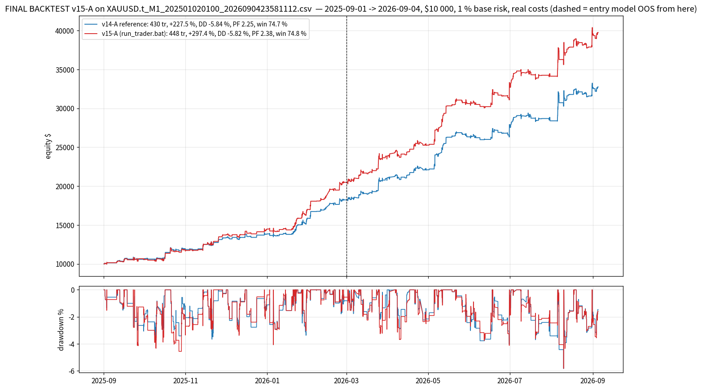

# FINAL BACKTEST — v15-A (more trades & more profit at the same loss percentage) on `XAUUSD.t_M1_202501020100_2026090423581112.csv`

*Generated by `backtest_v15_final.py` on 2026-10-05 20:21 UTC.  Trader strings read from `run_trader.bat`; simulator `lubot/portfolio_sim.py`; selection streams `study_results/sel_v10_*.pkl` (the v10 recording of the scanner over this CSV).*

## Setup

- **Data**: 359,813 M1 bars, 2025-09-01 01:00 -> 2026-09-04 23:58 (the year used by every v10-v15 study; the CSV starts 2025-01-02 and the entry models were trained before the backtest window; the entry model is out-of-sample from 2026-03-01).
- **Account**: $10 000 start, **1.0 % base risk** per plan sized on equity, commission 7 $/lot round-turn, spread from the CSV, SL slippage 0.10 / market 0.05, daily loss limit 4.5 % -> flat until next server day, total loss 9 % -> halt.
- **Trader** (`--trader`): `tp_levels=0.6|1.2|2.4|4.8,tp_fracs=1|1|1|1,ladder_fallback=merge,dedupe_cross_tf=false,keep_replaced_bars=1,keep_replaced_tfs=M10|M15|M30|H1,regime_metric=adr_ratio,regime_threshold=1.0,regime_short=5,regime_long=20,range_tp_levels=0.5|1.0|1.5|2.5,range_tp_fracs=1|1|1|1,range_sl_after_leg=0|0.3|x|x,mart_mode=mult,mart_mult=1.5,mart_max_steps=3,mart_max_risk_pct=3,mart_scope=tf,mart_tfs=M10|M15|M30|H1,mart_sides=buy,mart_ungated_scale=0.5,confluence_memory_min=240,confluent_risk_scale=1.25,plain_risk_scale=0.9`
- **Trade filter**: `M5:max_cost_r=0.08;min_quality=0.55;sessions=asia|london|preny|ny|lclose/M10:min_quality=0.57/M15:min_quality=0.60/M30|H1:min_quality=0.57`
- **Confluence filter**: `M5:max_cost_r=0.08;min_quality=0.55;sessions=asia|london|preny|ny|lclose/M10:min_quality=0.50/M15:min_quality=0.60/M30|H1:min_quality=0.57`
- **Reference**: the same strings with every v15 key removed = v14-A (reproduces FINAL_BACKTEST_V14: 430 tr / +227.53 % / DD -5.84).
- **Reproducibility**: result IDENTICAL to the v15 study json `CMB_cm240_cs1.25_0.9.json` (448 tr / +297.45 % / DD -5.82 / PF 2.375).

## Result — full year

**v15-A: 448 trades (v14-A 430, +18), net +29,745 $ (v14-A +22,753, +6,992 $ = +30.7 %), +297.45 % ($10 000 -> $39,745), max drawdown -5.82 % (v14-A -5.84), profit factor 2.375 (v14-A 2.249), win rate 74.8 % (v14-A 74.7), stop-outs 24.8 % (v14-A 24.9), worst day -2.42 % (v14-A -1.99), 13/13 months positive, OOS net +19,264 $ (v14-A +14,524), OOS PF 2.26 (v14-A 2.15).**  Scorecard: more trades True, more profit True, loss percentage held (full year) True, held OOS True -> score 4/4.

| metric                  |   v14-A reference |   v15-A (shipped) |
|:------------------------|------------------:|------------------:|
| trades                  |          430      |          448      |
| net profit $            |        22753      |        29745      |
| return %                |          227.53   |          297.45   |
| end balance $           |        32753      |        39745      |
| max drawdown %          |           -5.84   |           -5.82   |
| max drawdown $          |        -1876      |        -2202      |
| profit factor           |            2.249  |            2.375  |
| win %                   |           74.7    |           74.8    |
| stop-outs %             |           24.9    |           24.8    |
| total R                 |          120.74   |          125.8    |
| avg R / trade           |            0.2808 |            0.2808 |
| expectancy $ / trade    |           52.91   |           66.39   |
| gross $ won             |        40973      |        51376      |
| gross $ lost            |       -18220      |       -21631      |
| avg loss $              |         -167.2    |         -191.4    |
| worst trade % of equity |           -1.54   |           -1.37   |
| worst day % of equity   |           -1.99   |           -2.42   |
| negative days           |           62      |           62      |
| max consecutive losses  |            3      |            3      |
| ulcer index             |            1.776  |            1.834  |
| return / max DD         |           39      |           51.1    |
| daily Sharpe            |            4.96   |            5.35   |
| max risk % of equity    |            2.24   |            2.81   |
| avg risk $              |          187      |          226      |
| commission $            |          579      |          707      |
| swap $                  |         -217      |         -220      |
| avg hold (min)          |          209      |          205      |
| months positive         |           13      |           13      |
| worst month $           |          362      |          478      |
| IS R (Sep25-Feb26)      |           63.49   |           67.01   |
| IS PF                   |            2.461  |            2.655  |
| OOS trades (Mar-Sep26)  |          224      |          232      |
| OOS R                   |           57.25   |           58.79   |
| OOS PF                  |            2.154  |            2.259  |
| OOS win %               |           76.3    |           76.3    |
| OOS stop-outs %         |           23.7    |           23.7    |
| OOS net $               |        14524      |        19264      |
| OOS max DD %            |           -5.84   |           -5.82   |
| confluent trades        |          153      |          210      |
| tier trades             |            0      |            0      |
| stepped up (martingale) |           38      |           38      |
| stepped down            |           71      |           72      |
| daily-loss halts        |            0      |            0      |

## Where the extra trades and the extra profit come from

| population                                          |   trades |   win % |   stop % |   net $ |   avg R |   avg risk $ |   avg risk scale |   OOS trades |   OOS net $ |
|:----------------------------------------------------|---------:|--------:|---------:|--------:|--------:|-------------:|-----------------:|-------------:|------------:|
| CONFLUENT (zone active on another TF, incl. memory) |      210 |    79.5 |       20 |   21962 |   0.373 |          268 |             1.25 |          102 |       14685 |
| plain                                               |      238 |    70.6 |       29 |    7783 |   0.2   |          188 |             0.9  |          130 |        4579 |
| tier (second bar)                                   |        0 |     0   |        0 |       0 |   0     |            0 |             1    |            0 |           0 |

## Month by month

| month   |   v15-A trades |   v15-A net $ |   v15-A win % |   v15-A stop % |   confluent |   tier |   v14-A trades |   v14-A net $ |   v14-A win % |
|:--------|---------------:|--------------:|--------------:|---------------:|------------:|-------:|---------------:|--------------:|--------------:|
| 2025-09 |             22 |        478.49 |          59.1 |           31.8 |          12 |      0 |             19 |        550.9  |          63.2 |
| 2025-10 |             45 |       1242.85 |          60   |           40   |          20 |      0 |             44 |       1293.36 |          59.1 |
| 2025-11 |             32 |       1985    |          84.4 |           15.6 |          18 |      0 |             32 |       1491.03 |          84.4 |
| 2025-12 |             30 |        774.82 |          70   |           30   |          16 |      0 |             30 |        516.26 |          70   |
| 2026-01 |             50 |       2526.66 |          76   |           24   |          24 |      0 |             48 |       2025.54 |          75   |
| 2026-02 |             37 |       3472.86 |          86.5 |           13.5 |          18 |      0 |             33 |       2351.94 |          84.8 |
| 2026-03 |             41 |       3405.36 |          78   |           22   |          21 |      0 |             40 |       2846.42 |          80   |
| 2026-04 |             38 |       1379.18 |          71   |           29   |          17 |      0 |             38 |       1019.46 |          71   |
| 2026-05 |             31 |       5342.77 |          87.1 |           12.9 |          12 |      0 |             29 |       4235.23 |          86.2 |
| 2026-06 |             33 |       2503.05 |          72.7 |           27.3 |          13 |      0 |             31 |       1479.64 |          74.2 |
| 2026-07 |             39 |       1020.86 |          71.8 |           28.2 |          14 |      0 |             38 |        579.65 |          71   |
| 2026-08 |             45 |       5014.73 |          80   |           20   |          22 |      0 |             43 |       4001.55 |          79.1 |
| 2026-09 |              5 |        598.32 |          60   |           40   |           3 |      0 |              5 |        362.04 |          60   |

## By timeframe

| tf   |   v15-A trades |   v15-A win % |   v15-A net $ |   v15-A PF |   v14-A trades |   v14-A net $ |   v14-A PF |
|:-----|---------------:|--------------:|--------------:|-----------:|---------------:|--------------:|-----------:|
| H1   |             14 |          78.6 |       1602.34 |       4.35 |             14 |        950    |       3.08 |
| M10  |            166 |          76.5 |      12200.4  |       2.61 |            148 |      10312.7  |       2.76 |
| M15  |             51 |          80.4 |       5778.45 |       3.03 |             51 |       3892.13 |       2.8  |
| M30  |             39 |          71.8 |       2667.73 |       2.48 |             39 |       1773.79 |       2.21 |
| M5   |            178 |          71.9 |       7496.03 |       1.84 |            178 |       5824.4  |       1.7  |

Exit outcomes: partial_be 207, sl 111, tp2 75, trail 55.  Range-managed trades: 228, confluent: 210, tier: 0, stepped up / down: 38 / 72.  Pending orders placed 4201, cancelled unfilled 3753.

OOS half (from 2026-03-01): 232 trades, net 19,264 $, PF 2.26, win 76.3 %, stop-outs 23.7 %.

## Five worst trades

| key         | side   | close_time          | regime   | confluent   | tier   |   risk_money |     net |   r_net | outcome   |
|:------------|:-------|:--------------------|:---------|:------------|:-------|-------------:|--------:|--------:|:----------|
| M10#6007686 | buy    | 2026-09-04 15:30:00 | trend    | True        | False  |       489.6  | -501.16 |   -1.02 | sl        |
| M5#11003888 | sell   | 2026-08-19 15:41:00 | range    | True        | False  |       481.8  | -492    |   -1.02 | sl        |
| M15#6003988 | buy    | 2026-07-15 05:18:00 | range    | False       | False  |       457.56 | -477.6  |   -1.04 | sl        |
| M10#6006718 | buy    | 2026-08-06 18:35:00 | trend    | True        | False  |       457.6  | -465.08 |   -1.02 | sl        |
| M10#6006028 | sell   | 2026-07-20 03:59:00 | range    | True        | False  |       421.4  | -429.73 |   -1.02 | sl        |

## Files

`study_results/final_v15/v15A_summary.json` (all metrics), `v15A_trades.csv` (every trade with `confluent` / `tier` / `risk_scale` / legs), `v15A_equity.csv` (balance + equity), `v15A_monthly.csv`, `v15A_by_tf.csv`, the same for `ref_*` (v14-A), chart `charts/final_v15_equity.png`.  Full study: `study_results/MORE_TRADES_V15.md`.
