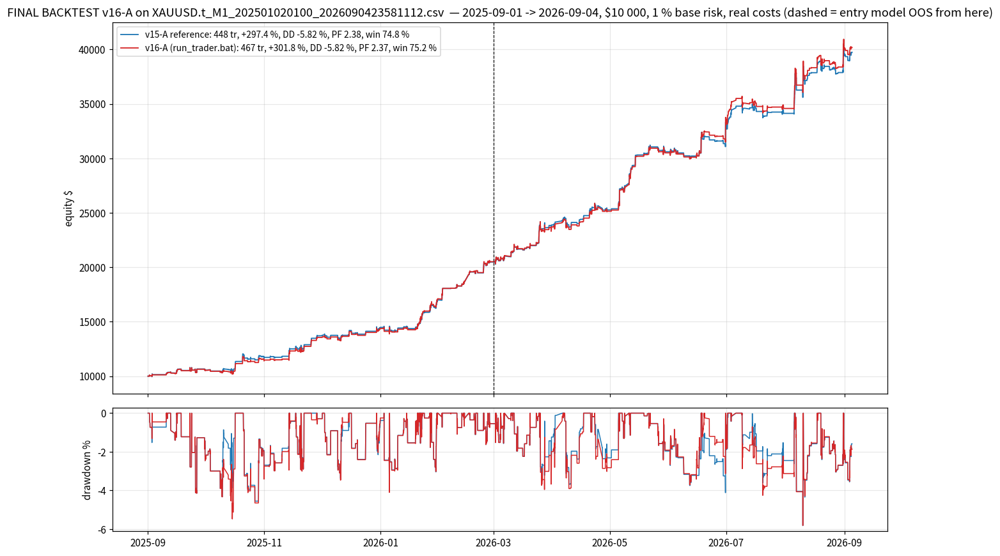

# FINAL BACKTEST — v16-A (new trade sources: ranked candidates + M20 — more trades & more profit at the same loss percentage) on `XAUUSD.t_M1_202501020100_2026090423581112.csv`

*Generated by `backtest_v16_final.py` on 2026-10-07 17:34 UTC.  Trader strings read from `run_trader.bat`; simulator `lubot/portfolio_sim.py`; selection streams `study_results/sel_v16_*.pkl` (the v16 top-3 recording of the scanner over this CSV, incl. M20; its rank-1 rows are identical to the v10 streams used by v10-v15).*

## Setup

- **Data**: 359,813 M1 bars, 2025-09-01 01:00 -> 2026-09-04 23:58 (the year used by every v10-v16 study; the CSV starts 2025-01-02 and the entry models were trained before the backtest window; the entry model is out-of-sample from 2026-03-01).
- **Account**: $10 000 start, **1.0 % base risk** per plan sized on equity, commission 7 $/lot round-turn, spread from the CSV, SL slippage 0.10 / market 0.05, daily loss limit 4.5 % -> flat until next server day, total loss 9 % -> halt.
- **Trader** (`--trader`): `tp_levels=0.6|1.2|2.4|4.8,tp_fracs=1|1|1|1,ladder_fallback=merge,dedupe_cross_tf=false,keep_replaced_bars=1,keep_replaced_tfs=M10|M15|M20|M30|H1,regime_metric=adr_ratio,regime_threshold=1.0,regime_short=5,regime_long=20,range_tp_levels=0.5|1.0|1.5|2.5,range_tp_fracs=1|1|1|1,range_sl_after_leg=0|0.3|x|x,mart_mode=mult,mart_mult=1.5,mart_max_steps=3,mart_max_risk_pct=3,mart_scope=tf,mart_tfs=M10|M15|M20|M30|H1,mart_sides=buy,mart_ungated_scale=0.5,confluence_memory_min=240,confluent_risk_scale=1.25,plain_risk_scale=0.9,tf_risk_scale=M20:0.4`
- **Trade filter**: `M5:max_cost_r=0.08;min_quality=0.55;sessions=asia|london|preny|ny|lclose/M10:min_quality=0.57/M15:min_quality=0.60/M30|H1:min_quality=0.57/M20:min_quality=0.99`
- **Confluence filter**: `M5:max_cost_r=0.08;min_quality=0.55;sessions=asia|london|preny|ny|lclose/M10:min_quality=0.50/M15:min_quality=0.60/M30|H1:min_quality=0.57/M20:min_quality=0.63`
- **Reference**: the same strings with every v16 key removed and M20 dropped = v15-A (reproduces FINAL_BACKTEST_V15: 448 tr / +297.45 % / DD -5.82).
- **Reproducibility**: result IDENTICAL to the v16 study json `M20SC_0.63_x0.4.json` (467 tr / +301.75 % / DD -5.82 / PF 2.365).

## Result — full year

**v16-A: 467 trades (v15-A 448, +19), net +30,175 $ (v15-A +29,745, +430 $ = +1.4 %), +301.75 % ($10 000 -> $40,175), max drawdown -5.82 % (v15-A -5.82), profit factor 2.365 (v15-A 2.375), win rate 75.2 % (v15-A 74.8), stop-outs 24.4 % (v15-A 24.8), worst day -2.64 % (v15-A -2.42), 13/13 months positive, OOS net +19,661 $ (v15-A +19,264), OOS PF 2.25 (v15-A 2.26).**  Scorecard: more trades True, more profit True, loss percentage held (full year) True, held OOS True -> score 4/4.

| metric                  |   v15-A reference |   v16-A (shipped) |
|:------------------------|------------------:|------------------:|
| trades                  |          448      |          467      |
| net profit $            |        29745      |        30175      |
| return %                |          297.45   |          301.75   |
| end balance $           |        39745      |        40175      |
| max drawdown %          |           -5.82   |           -5.82   |
| max drawdown $          |        -2202      |        -2227      |
| profit factor           |            2.375  |            2.365  |
| win %                   |           74.8    |           75.2    |
| stop-outs %             |           24.8    |           24.4    |
| total R                 |          125.8    |          134.28   |
| avg R / trade           |            0.2808 |            0.2875 |
| expectancy $ / trade    |           66.39   |           64.61   |
| gross $ won             |        51376      |        52276      |
| gross $ lost            |       -21631      |       -22102      |
| avg loss $              |         -191.4    |         -190.5    |
| worst trade % of equity |           -1.37   |           -1.35   |
| worst day % of equity   |           -2.42   |           -2.64   |
| negative days           |           62      |           62      |
| max consecutive losses  |            3      |            3      |
| ulcer index             |            1.834  |            1.944  |
| return / max DD         |           51.1    |           51.9    |
| daily Sharpe            |            5.35   |            5.37   |
| max risk % of equity    |            2.81   |            2.79   |
| avg risk $              |          226      |          221      |
| commission $            |          707      |          717      |
| swap $                  |         -220      |         -227      |
| avg hold (min)          |          205      |          217      |
| months positive         |           13      |           13      |
| worst month $           |          478      |          457      |
| IS R (Sep25-Feb26)      |           67.01   |           73.45   |
| IS PF                   |            2.655  |            2.659  |
| OOS trades (Mar-Sep26)  |          232      |          243      |
| OOS R                   |           58.79   |           60.84   |
| OOS PF                  |            2.259  |            2.247  |
| OOS win %               |           76.3    |           76.1    |
| OOS stop-outs %         |           23.7    |           23.9    |
| OOS net $               |        19264      |        19661      |
| OOS max DD %            |           -5.82   |           -5.82   |
| confluent trades        |          210      |          228      |
| tier trades             |            0      |            0      |
| rank-2 trades           |            0      |            0      |
| M20 trades              |            0      |           21      |
| stepped up (martingale) |           38      |           40      |
| stepped down            |           72      |           73      |
| daily-loss halts        |            0      |            0      |

## Where the extra trades and the extra profit come from

| population                        |   trades |   win % |   stop % |   net $ |   avg R |   avg risk $ |   avg risk scale |   OOS trades |   OOS net $ |
|:----------------------------------|---------:|--------:|---------:|--------:|--------:|-------------:|-----------------:|-------------:|------------:|
| rank-1 CONFLUENT (v15 population) |      207 |    79.2 |     20.3 |   21038 |   0.344 |          271 |             1.25 |          102 |       14642 |
| rank-1 plain (v15 population)     |      239 |    70.7 |     28.9 |    8085 |   0.22  |          187 |             0.9  |          129 |        4374 |
| RANK-2 zones (new in v16)         |        0 |     0   |      0   |       0 |   0     |            0 |             1    |            0 |           0 |
| M20 timeframe (new in v16)        |       21 |    85.7 |     14.3 |    1052 |   0.502 |          113 |             0.5  |           12 |         645 |

## Month by month

| month   |   v16-A trades |   v16-A net $ |   v16-A win % |   v16-A stop % |   confluent |   rank-2 |   v15-A trades |   v15-A net $ |   v15-A win % |
|:--------|---------------:|--------------:|--------------:|---------------:|------------:|---------:|---------------:|--------------:|--------------:|
| 2025-09 |             22 |        456.91 |          59.1 |           31.8 |          11 |        0 |             22 |        478.49 |          59.1 |
| 2025-10 |             45 |       1022.76 |          60   |           40   |          20 |        0 |             45 |       1242.85 |          60   |
| 2025-11 |             35 |       2076.19 |          85.7 |           14.3 |          21 |        0 |             32 |       1985    |          84.4 |
| 2025-12 |             31 |        818.86 |          71   |           29   |          17 |        0 |             30 |        774.82 |          70   |
| 2026-01 |             53 |       2734.53 |          77.4 |           22.6 |          27 |        0 |             50 |       2526.66 |          76   |
| 2026-02 |             38 |       3404.12 |          86.8 |           13.2 |          18 |        0 |             37 |       3472.86 |          86.5 |
| 2026-03 |             43 |       3193.11 |          76.7 |           23.3 |          23 |        0 |             41 |       3405.36 |          78   |
| 2026-04 |             41 |       1440.61 |          70.7 |           29.3 |          20 |        0 |             38 |       1379.18 |          71   |
| 2026-05 |             32 |       5359.59 |          87.5 |           12.5 |          13 |        0 |             31 |       5342.77 |          87.1 |
| 2026-06 |             36 |       3052.35 |          75   |           25   |          17 |        0 |             33 |       2503.05 |          72.7 |
| 2026-07 |             40 |       1027.12 |          70   |           30   |          15 |        0 |             39 |       1020.86 |          71.8 |
| 2026-08 |             46 |       5115.62 |          80.4 |           19.6 |          23 |        0 |             45 |       5014.73 |          80   |
| 2026-09 |              5 |        472.8  |          60   |           40   |           3 |        0 |              5 |        598.32 |          60   |

## By timeframe

| tf   |   v16-A trades |   v16-A win % |   v16-A net $ |   v16-A PF |   v15-A trades |   v15-A net $ |   v15-A PF |
|:-----|---------------:|--------------:|--------------:|-----------:|---------------:|--------------:|-----------:|
| H1   |             14 |          78.6 |       1602.34 |       4.35 |             14 |       1602.34 |       4.35 |
| M10  |            165 |          76.4 |      12167.8  |       2.59 |            166 |      12200.4  |       2.61 |
| M15  |             51 |          80.4 |       5517.27 |       2.92 |             51 |       5778.45 |       3.03 |
| M20  |             21 |          85.7 |       1051.81 |       4.16 |            nan |        nan    |     nan    |
| M30  |             39 |          71.8 |       2654.11 |       2.46 |             39 |       2667.73 |       2.48 |
| M5   |            177 |          71.8 |       7181.24 |       1.8  |            178 |       7496.03 |       1.84 |

Exit outcomes: partial_be 215, sl 114, tp2 78, trail 60.  Range-managed trades: 242, confluent: 228, tier: 0, rank-2: 0, M20: 21, stepped up / down: 40 / 73.  Pending orders placed 4344, cancelled unfilled 3877.

OOS half (from 2026-03-01): 243 trades, net 19,661 $, PF 2.25, win 76.1 %, stop-outs 23.9 %.

## Five worst trades

| key         | side   | close_time          | regime   | confluent   |   rank |   risk_money |     net |   r_net | outcome   |
|:------------|:-------|:--------------------|:---------|:------------|-------:|-------------:|--------:|--------:|:----------|
| M10#6007686 | buy    | 2026-09-04 15:30:00 | trend    | True        |      1 |       496.8  | -508.53 |   -1.02 | sl        |
| M5#11003888 | sell   | 2026-08-19 15:41:00 | range    | True        |      1 |       489.83 | -500.2  |   -1.02 | sl        |
| M15#6003988 | buy    | 2026-07-15 05:18:00 | range    | False       |      1 |       457.56 | -477.6  |   -1.04 | sl        |
| M10#6006718 | buy    | 2026-08-06 18:35:00 | trend    | True        |      1 |       468    | -475.65 |   -1.02 | sl        |
| M15#6003873 | sell   | 2026-07-09 11:23:00 | range    | True        |      1 |       440.82 | -443.88 |   -1.01 | sl        |

## Files

`study_results/final_v16/v16A_summary.json` (all metrics), `v16A_trades.csv` (every trade with `rank` / `confluent` / `risk_scale` / legs), `v16A_equity.csv` (balance + equity), `v16A_monthly.csv`, `v16A_by_tf.csv`, the same for `ref_*` (v15-A), chart `charts/final_v16_equity.png`.  Full study: `study_results/MORE_TRADES_V16.md`.
