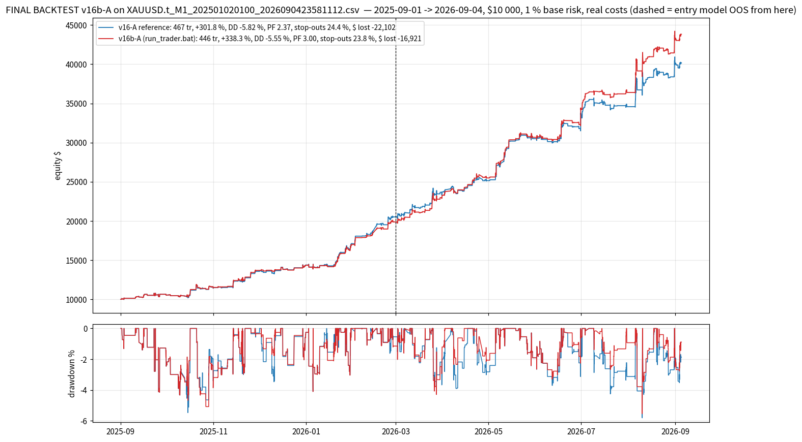

# FINAL BACKTEST — v16b-A (loss reduction: fewer stop-outs and fewer $ lost at the same or better profitability) on `XAUUSD.t_M1_202501020100_2026090423581112.csv`

*Generated by `backtest_v16b_final.py` on 2026-10-10 07:57 UTC.  Trader strings read from `run_trader.bat`; simulator `lubot/portfolio_sim.py`; selection streams `study_results/sel_v16_*.pkl` (the v16 top-3 recording of the scanner over this CSV, incl. M20).*

## Setup

- **Data**: 359,813 M1 bars, 2025-09-01 01:00 -> 2026-09-04 23:58 (the year used by every v10-v16b study; the CSV starts 2025-01-02 and the entry models were trained before the backtest window; the entry model is out-of-sample from 2026-03-01).
- **Account**: $10 000 start, **1.0 % base risk** per plan sized on equity, commission 7 $/lot round-turn, spread from the CSV, SL slippage 0.10 / market 0.05, daily loss limit 4.5 % -> flat until next server day, total loss 9 % -> halt.
- **Trader** (`--trader`): `tp_levels=0.6|1.2|2.4|4.8,tp_fracs=1|1|1|1,ladder_fallback=merge,dedupe_cross_tf=false,keep_replaced_bars=1,keep_replaced_tfs=M10|M15|M20|M30|H1,regime_metric=adr_ratio,regime_threshold=1.0,regime_short=5,regime_long=20,range_tp_levels=0.5|1.0|1.5|2.5,range_tp_fracs=1|1|1|1,range_sl_after_leg=0|0.3|x|x,mart_mode=mult,mart_mult=1.5,mart_max_steps=3,mart_max_risk_pct=3,mart_scope=tf,mart_tfs=M10|M15|M20|M30|H1,mart_sides=buy,mart_ungated_scale=0.5,confluence_memory_min=240,confluent_risk_scale=1.25,plain_risk_scale=0.9,tf_risk_scale=M20:0.4,min_fill_age_min=2,regime_side_scale=range:sell:0.5`
- **Trade filter**: `M5:max_cost_r=0.08;min_quality=0.55;sessions=asia|london|preny|ny|lclose/M10:min_quality=0.57/M15:min_quality=0.60/M30|H1:min_quality=0.57/M20:min_quality=0.99`
- **Confluence filter**: `M5:max_cost_r=0.08;min_quality=0.55;sessions=asia|london|preny|ny|lclose/M10:min_quality=0.50/M15:min_quality=0.60/M30|H1:min_quality=0.57/M20:min_quality=0.63`
- **Reference**: the same strings with every v16b key removed = v16-A (reproduces FINAL_BACKTEST_V16: 467 tr / +301.75 % / DD -5.82).
- **Reproducibility**: result IDENTICAL to the v16b study json `C_F2+RS_0.5.json` (446 tr / +338.31 % / DD -5.55 / PF 2.999).

## Result — full year

**v16b-A: 446 trades (v16-A 467, -21), stop-outs 23.8 % (v16-A 24.4, -0.6 pt), gross $ lost -16,921 (v16-A -22,102, -23.4 %), max drawdown -5.55 % (v16-A -5.82), net +33,831 $ (v16-A +30,175, +12.1 %), +338.31 % ($10 000 -> $43,831), profit factor 2.999 (v16-A 2.365), win rate 75.8 % (v16-A 75.2), worst day -2.34 % (v16-A -2.64), 13/13 months positive, OOS net +23,958 $ (v16-A +19,661), OOS PF 3.12 (v16-A 2.25), OOS stop-outs 21.1 % (v16-A 23.9).**  Scorecard (v16b_common.judge16b): less loss True, profit held True, OOS held True, no worse day True -> score 4/4.

| metric                      |   v16-A reference |   v16b-A (shipped) |
|:----------------------------|------------------:|-------------------:|
| trades                      |          467      |           446      |
| net profit $                |        30175      |         33831      |
| return %                    |          301.75   |           338.31   |
| end balance $               |        40175      |         43831      |
| max drawdown %              |           -5.82   |            -5.55   |
| max drawdown $              |        -2227      |         -2257      |
| profit factor               |            2.365  |             2.999  |
| win %                       |           75.2    |            75.8    |
| stop-outs %                 |           24.4    |            23.8    |
| gross $ lost                |       -22102      |        -16921      |
| avg loss $                  |         -190.5    |          -156.7    |
| gross $ won                 |        52276      |         50753      |
| total R                     |          134.28   |           138.55   |
| avg R / trade               |            0.2875 |             0.3106 |
| expectancy $ / trade        |           64.61   |            75.85   |
| worst trade % of equity     |           -1.35   |            -1.3    |
| worst day % of equity       |           -2.64   |            -2.34   |
| negative days               |           62      |            58      |
| max consecutive losses      |            3      |             3      |
| ulcer index                 |            1.944  |             1.691  |
| return / max DD             |           51.9    |            61      |
| daily Sharpe                |            5.37   |             5.98   |
| max risk % of equity        |            2.79   |             2.81   |
| avg risk $                  |          221      |           208      |
| commission $                |          717      |           632      |
| swap $                      |         -227      |          -234      |
| avg hold (min)              |          217      |           227      |
| months positive             |           13      |            13      |
| worst month $               |          457      |           457      |
| IS R (Sep25-Feb26)          |           73.45   |            68.77   |
| IS PF                       |            2.659  |             2.75   |
| OOS trades (Mar-Sep26)      |          243      |           232      |
| OOS R                       |           60.84   |            69.77   |
| OOS PF                      |            2.247  |             3.124  |
| OOS win %                   |           76.1    |            78.9    |
| OOS stop-outs %             |           23.9    |            21.1    |
| OOS net $                   |        19661      |         23958      |
| OOS max DD %                |           -5.82   |            -5.55   |
| confluent trades            |          228      |           223      |
| M20 trades                  |           21      |            20      |
| stepped up (martingale)     |           40      |            37      |
| stepped down                |           73      |            69      |
| counter-trend plans skipped |            0      |             0      |
| counter-trend plans scaled  |            0      |             0      |
| fast fills cancelled        |            0      |            22      |
| fast fills scaled           |            0      |             0      |
| pending orders placed       |         4344      |          4339      |
| daily-loss halts            |            0      |             0      |

## Where the loss reduction comes from

| slice                                              |   trades |   win % |   stop % |   net $ |   $ lost |   avg R |   OOS trades |   OOS net $ |
|:---------------------------------------------------|---------:|--------:|---------:|--------:|---------:|--------:|-------------:|------------:|
| v16-A trades NOT taken by v16b-A                   |       23 |    47.8 |     52.2 |   -2303 |    -2958 |  -0.372 |           11 |       -2357 |
| trades NEW in v16b-A                               |        2 |     0   |    100   |    -162 |     -162 |  -1.023 |            0 |           0 |
| common keys (same plan, result may differ by size) |      444 |    76.1 |     23.4 |   33993 |   -16759 |   0.317 |          232 |       23958 |

| trader   | population             |   trades |   win % |   stop % |   net $ |   $ lost |   avg R |   OOS trades |   OOS net $ |
|:---------|:-----------------------|---------:|--------:|---------:|--------:|---------:|--------:|-------------:|------------:|
| v16b-A   | all                    |      446 |    75.8 |     23.8 |   33831 |   -16921 |   0.311 |          232 |       23958 |
| v16b-A   | buys                   |      294 |    81   |     18.4 |   28483 |   -10803 |   0.389 |          161 |       19826 |
| v16b-A   | sells                  |      152 |    65.8 |     34.2 |    5349 |    -6118 |   0.159 |           71 |        4133 |
| v16b-A   | range-regime sells     |       70 |    61.4 |     38.6 |    -912 |    -2853 |  -0.083 |           40 |       -1181 |
| v16b-A   | counter-trend (scaled) |        0 |     0   |      0   |       0 |        0 |   0     |            0 |           0 |
| v16b-A   | confluent              |      223 |    79.8 |     19.7 |   24005 |    -7445 |   0.37  |          111 |       17714 |
| v16b-A   | plain                  |      223 |    71.7 |     27.8 |    9826 |    -9476 |   0.252 |          121 |        6244 |
| v16-A    | all                    |      467 |    75.2 |     24.4 |   30175 |   -22102 |   0.288 |          243 |       19661 |
| v16-A    | buys                   |      308 |    79.2 |     20.1 |   26259 |   -12844 |   0.354 |          169 |       17576 |
| v16-A    | sells                  |      159 |    67.3 |     32.7 |    3915 |    -9257 |   0.158 |           74 |        2085 |
| v16-A    | range-regime sells     |       75 |    64   |     36   |   -1816 |    -5765 |  -0.061 |           42 |       -2616 |
| v16-A    | counter-trend (scaled) |        0 |     0   |      0   |       0 |        0 |   0     |            0 |           0 |
| v16-A    | confluent              |      228 |    79.8 |     19.7 |   22090 |    -9609 |   0.359 |          114 |       15287 |
| v16-A    | plain                  |      239 |    70.7 |     28.9 |    8085 |   -12492 |   0.22  |          129 |        4374 |

## Month by month

| month   |   v16b-A trades |   v16b-A net $ |   v16b-A stop % |   v16b-A $ lost |   v16-A trades |   v16-A net $ |   v16-A stop % |   v16-A $ lost |
|:--------|----------------:|---------------:|----------------:|----------------:|---------------:|--------------:|---------------:|---------------:|
| 2025-09 |              22 |         456.91 |            31.8 |            -814 |             22 |        456.91 |           31.8 |           -814 |
| 2025-10 |              42 |        1052.68 |            42.9 |           -1529 |             45 |       1022.76 |           40   |          -1606 |
| 2025-11 |              35 |        2172.71 |            14.3 |            -502 |             35 |       2076.19 |           14.3 |           -613 |
| 2025-12 |              29 |         662.63 |            34.5 |            -754 |             31 |        818.86 |           29   |          -1018 |
| 2026-01 |              51 |        2637.94 |            23.5 |           -1371 |             53 |       2734.53 |           22.6 |          -1457 |
| 2026-02 |              35 |        2890.07 |            14.3 |            -672 |             38 |       3404.12 |           13.2 |           -828 |
| 2026-03 |              42 |        3399.7  |            21.4 |           -1459 |             43 |       3193.11 |           23.3 |          -1925 |
| 2026-04 |              39 |        2215.6  |            25.6 |           -1675 |             41 |       1440.61 |           29.3 |          -2631 |
| 2026-05 |              31 |        5180.44 |            12.9 |           -1023 |             32 |       5359.59 |           12.5 |          -1014 |
| 2026-06 |              35 |        3551.15 |            22.9 |           -2009 |             36 |       3052.35 |           25   |          -2404 |
| 2026-07 |              37 |        2178.34 |            24.3 |           -2127 |             40 |       1027.12 |           30   |          -3862 |
| 2026-08 |              44 |        6441.13 |            18.2 |           -2433 |             46 |       5115.62 |           19.6 |          -3053 |
| 2026-09 |               4 |         992    |            25   |            -553 |              5 |        472.8  |           40   |           -876 |

## By timeframe

| tf   |   v16b-A trades |   v16b-A win % |   v16b-A net $ |   v16b-A PF |   v16-A trades |   v16-A win % |   v16-A net $ |   v16-A PF |
|:-----|----------------:|---------------:|---------------:|------------:|---------------:|--------------:|--------------:|-----------:|
| H1   |              14 |           78.6 |        1621.04 |        4.86 |             14 |          78.6 |       1602.34 |       4.35 |
| M10  |             161 |           77   |       12620.4  |        3    |            165 |          76.4 |      12167.8  |       2.59 |
| M15  |              50 |           82   |        6280.47 |        3.67 |             51 |          80.4 |       5517.27 |       2.92 |
| M20  |              20 |           85   |        1084.65 |        5.86 |             21 |          85.7 |       1051.81 |       4.16 |
| M30  |              39 |           71.8 |        2994.97 |        3.07 |             39 |          71.8 |       2654.11 |       2.46 |
| M5   |             162 |           72.2 |        9229.73 |        2.49 |            177 |          71.8 |       7181.24 |       1.8  |

Exit outcomes: partial_be 206, sl 106, tp2 78, trail 56.  Range-managed trades: 229, confluent: 223, M20: 20, stepped up / down: 37 / 69.  Counter-trend plans skipped 0, scaled 0; fast fills cancelled 22, scaled 0.  Pending orders placed 4339, cancelled unfilled 3893.

OOS half (from 2026-03-01): 232 trades, net 23,958 $, PF 3.12, win 78.9 %, stop-outs 21.1 %.

## Five worst trades

| key         | side   | close_time          | regime   | confluent   |   risk_money |     net |   r_net | outcome   |
|:------------|:-------|:--------------------|:---------|:------------|-------------:|--------:|--------:|:----------|
| M10#6007686 | buy    | 2026-09-04 15:30:00 | trend    | True        |       540    | -552.75 |   -1.02 | sl        |
| M10#6006718 | buy    | 2026-08-06 18:35:00 | trend    | True        |       499.2  | -507.36 |   -1.02 | sl        |
| M15#6003988 | buy    | 2026-07-15 05:18:00 | range    | False       |       457.56 | -477.6  |   -1.04 | sl        |
| M15#6003469 | buy    | 2026-06-18 11:45:00 | trend    | True        |       403.26 | -407.68 |   -1.01 | sl        |
| M5#11004257 | sell   | 2026-08-24 04:00:00 | trend    | False       |       378.24 | -382.32 |   -1.01 | sl        |

## Files

`study_results/final_v16b/v16bA_summary.json` (all metrics), `v16bA_trades.csv` (every trade with `counter_trend` / `fast_fill` / `confluent` / `risk_scale` / legs), `v16bA_equity.csv` (balance + equity), `v16bA_monthly.csv`, `v16bA_by_tf.csv`, the same for `ref_*` (v16-A), chart `charts/final_v16b_equity.png`.  Full study: `study_results/LESS_LOSS_V16B.md`.
