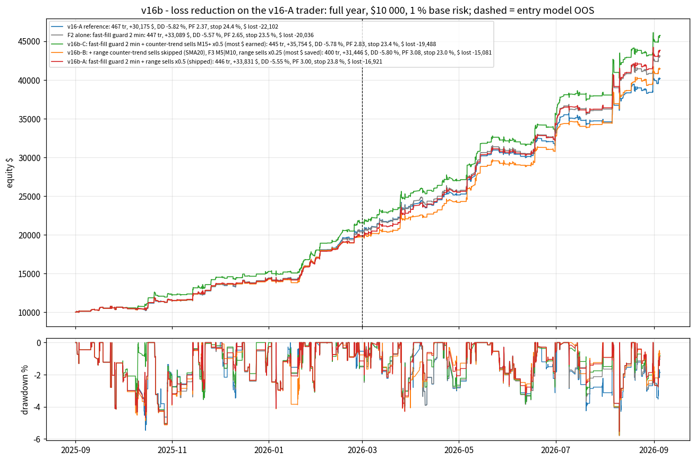
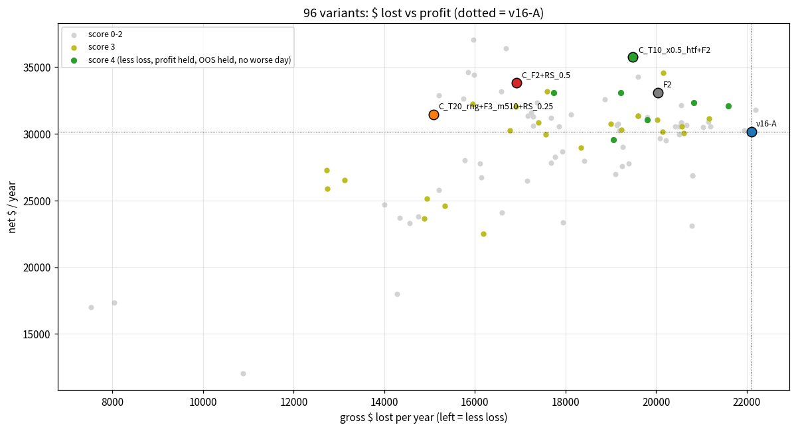
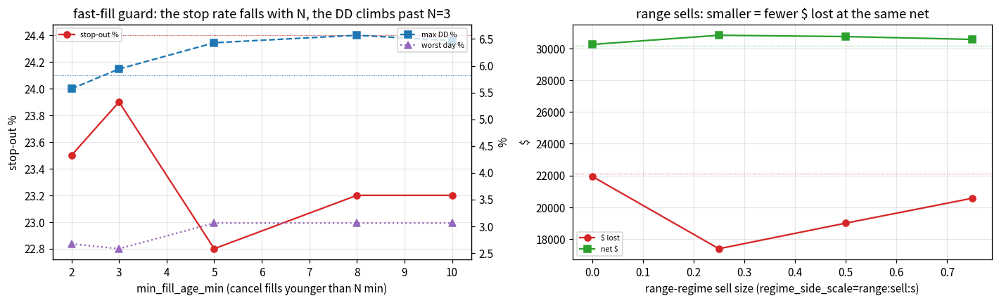
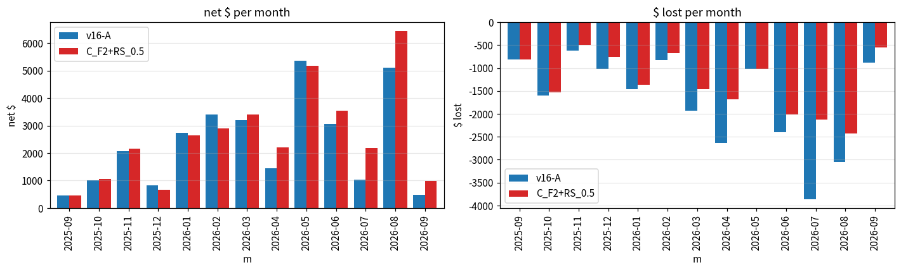

# REDUCE THE LOSS PERCENTAGE WHILE MAINTAINING THE PROFITABILITY PERCENTAGE (v16b) — the v16-A trader

*Generated by `make_v16b_report.py` on 2026-10-10 08:14 UTC from the result files in `study_results/` (nothing typed in).*

## 0. Answer

**v16b-A = v16-A + `min_fill_age_min=2` + `regime_side_scale=range:sell:0.5`** (shipped in `run_trader.bat`).  Full year Sep 2025 -> Sep 2026, $10 000, 1 % base risk, real costs (`FINAL_BACKTEST_V16B.md`): **stop-outs 23.8 % (v16-A 24.4), gross $ lost -16,921 (v16-A -22,102, -23.4 %), avg loss -157 $ (-191), max drawdown -5.55 % (-5.82), worst day -2.34 % (-2.64) — while the net went UP: +33,831 $ (+30,175, +12.1 %), profit factor 3.00 (2.37), win 75.8 % (75.2), OOS net +23,958 $ (+19,661), OOS PF 3.12 (2.25), OOS stop-outs 21.1 % (23.9), 13/13 months positive, 446 trades (467).**  Score 4/4 on the v16b judge; stress x6: profit held 6/6, OOS held 6/6, less loss 5/6, worst day in band 5/6; walk-forward OOS half passes every band.

The two levers are both decided BEFORE the fill and both live already (`trader.py`, tests `tests/test_trader_v16b.py`, `tests/test_bat_v16b.py`):
1. **Impulsive-arrival guard** (`min_fill_age_min=2`): a pending order that would fill less than 2 minutes after it was placed is cancelled - price was already running into the zone when the scanner showed it.  Live, a broker fills a limit order itself, so the bot closes a position it sees opened < 2 min after placement at market (cost: one spread; 22 cases in the year).
2. **Range-regime sells at half size** (`regime_side_scale=range:sell:0.5`): a SELL placed while the daily regime is 'range' (adr_ratio < 1.0, the v13 regime already live) is sized at 0.5 x.  Buys and trend-regime sells are untouched.

## 1. Method

Same discipline as v10-v16: the v16-A trader exactly as shipped (strings frozen in `v16b_common.py` and cross-checked against the bat), replayed through the M1 portfolio simulator over the full year; parity of the reference reproduced first (467 tr / +30,175 $ / DD -5.82 = FINAL_BACKTEST_V16).  **Judge (`v16b_common.judge16b`)**: *less_loss* = stop-out % < ref AND max DD better AND gross $ lost smaller; *hold_profit* = net >= 97 % of ref AND PF >= ref - 0.05 AND OOS net >= 97 %; *hold_oos* = OOS stop % < ref AND OOS PF >= ref - 0.10 AND OOS DD within 0.5 pt; *no_worse_day* = worst day >= ref - 0.25 pt.  Score 0-4.  Steps: diagnosis of the 114 stop-outs -> levers in the simulator (defaults byte-identical) -> grid of 96 variants -> stress x6 + walk-forward of 8 finalists -> port to the bat -> final backtest from the bat strings.

## 2. Diagnosis — where the losses of v16-A are (`v16b_diag/DIAG.md`, 37 tables)

The stop-outs are not spread evenly.  Three slices, all visible BEFORE the fill, carry most of the avoidable loss:

**Side** - sells stop out 1.6 x as often as buys and earn a seventh of the money:

| side   |   trades |   stop-outs |   stop % |   win % |   net $ |   $ lost |   avg R |
|:-------|---------:|------------:|---------:|--------:|--------:|---------:|--------:|
| buy    |      308 |          62 |     20.1 |    79.2 |   26259 |   -12844 |   0.354 |
| sell   |      159 |          52 |     32.7 |    67.3 |    3915 |    -9257 |   0.158 |

**Counter-trend sells** (last closed daily close above its SMA10 -> `up10 = True`): 93 trades, 39 % stop rate, nothing earned; counter-trend buys are fine:

| side   | up10   |   trades |   stop-outs |   stop % |   win % |   net $ |   $ lost |   avg R |
|:-------|:-------|---------:|------------:|---------:|--------:|--------:|---------:|--------:|
| buy    | False  |      135 |          33 |     24.4 |    75.6 |    8042 |    -7676 |   0.203 |
| buy    | True   |      173 |          29 |     16.8 |    82.1 |   18218 |    -5168 |   0.472 |
| sell   | False  |       66 |          16 |     24.2 |    75.8 |    4245 |    -3359 |   0.365 |
| sell   | True   |       93 |          36 |     38.7 |    61.3 |    -330 |    -5898 |   0.012 |

**Regime x side** - sells placed in a 'range' regime (the v13 adr_ratio regime) lose money; everything else earns:

| side   | regime   |   trades |   stop-outs |   stop % |   win % |   net $ |   $ lost |   avg R |
|:-------|:---------|---------:|------------:|---------:|--------:|--------:|---------:|--------:|
| buy    | range    |      167 |          30 |     18   |    82   |   13073 |    -6773 |   0.331 |
| buy    | trend    |      141 |          32 |     22.7 |    75.9 |   13186 |    -6072 |   0.382 |
| sell   | range    |       75 |          27 |     36   |    64   |   -1816 |    -5765 |  -0.061 |
| sell   | trend    |       84 |          25 |     29.8 |    70.2 |    5731 |    -3492 |   0.354 |

**Fill age** - orders FILLED within minutes of placement (price was already running into the zone): the first two bands lose, the patient fills earn:

| age_band              |   trades |   stop-outs |   stop % |   win % |   net $ |   $ lost |   avg R |
|:----------------------|---------:|------------:|---------:|--------:|--------:|---------:|--------:|
| (-1.0, 2.0]           |       29 |          10 |     34.5 |    65.5 |   -1321 |    -2720 |  -0.104 |
| (2.0, 5.0]            |       32 |          14 |     43.8 |    56.2 |    -675 |    -2957 |   0.09  |
| (5.0, 10.0]           |       44 |           7 |     15.9 |    84.1 |    5605 |     -870 |   0.455 |
| (10.0, 15.0]          |       25 |           5 |     20   |    80   |    2020 |     -305 |   0.258 |
| (15.0, 30.0]          |       78 |          14 |     17.9 |    80.8 |    5868 |    -2579 |   0.32  |
| (30.0, 60.0]          |       61 |          14 |     23   |    75.4 |    2361 |    -2991 |   0.251 |
| (60.0, 180.0]         |       98 |          23 |     23.5 |    76.5 |    9411 |    -4848 |   0.393 |
| (180.0, 1000000000.0] |      100 |          27 |     27   |    73   |    6905 |    -4832 |   0.291 |

...and the fast fills in a range regime are the worst cell of all:

| regime   |   trades |   stop-outs |   stop % |   win % |   net $ |   $ lost |   avg R |
|:---------|---------:|------------:|---------:|--------:|--------:|---------:|--------:|
| range    |       30 |          15 |       50 |      50 |   -3053 |    -4003 |  -0.335 |
| trend    |       31 |           9 |       29 |      71 |    1057 |    -1674 |   0.32  |

**Static estimate** (trade list, before re-simulation: no sizing / sequencing effects):

| lever                                       |   trades_affected |   stops_affected |   IS_net_$_affected |   OOS_net_$_affected |   new_sl_% |   new_net_$ |   new_gross_loss_$ |
|:--------------------------------------------|------------------:|-----------------:|--------------------:|---------------------:|-----------:|------------:|-------------------:|
| skip sells when daily close > SMA10         |                93 |               36 |                 647 |                 -978 |       20.9 |       30505 |             -16203 |
| skip sells when daily close > SMA20         |               100 |               35 |                1755 |                -1460 |       21.5 |       29880 |             -16983 |
| skip counter-trend both sides SMA20         |               217 |               67 |                2853 |                 4229 |       18.8 |       23093 |              -9274 |
| scale sells x0.5                            |               159 |               52 |                1830 |                 2085 |       24.4 |       28217 |             -17473 |
| scale counter-trend sells x0.5 (SMA20)      |               100 |               35 |                1755 |                -1460 |       24.4 |       30027 |             -19542 |
| skip fills within 5 min of placement        |                61 |               24 |                 343 |                -2339 |       22.2 |       32170 |             -16425 |
| skip fills within 3 min of placement        |                44 |               17 |                 483 |                -2337 |       22.9 |       32028 |             -17741 |
| skip fills within 0.5 bar of own TF         |                50 |               18 |                 511 |                 -249 |       23   |       29913 |             -18308 |
| skip zones closer than 0.5 ATR at selection |                39 |               12 |                 316 |                  229 |       23.8 |       29630 |             -19502 |
| skip range-regime sells                     |                75 |               27 |                 800 |                -2616 |       22.2 |       31991 |             -16336 |
| scale range-regime sells x0.5               |                75 |               27 |                 800 |                -2616 |       24.4 |       31083 |             -19219 |
| skip step-down (mart -1) plans              |                73 |               27 |                 323 |                 1199 |       22.1 |       28653 |             -19739 |
| skip sells SMA10 + fills <= 5 min           |               139 |               56 |                 354 |                -2441 |       17.7 |       32261 |             -11500 |
| skip sells SMA20 + fills <= 5 min           |               144 |               55 |                1443 |                -2742 |       18.3 |       31473 |             -12461 |

NOT levers (checked): quality band, session, kind, timeframe, concurrency, martingale step-down, day clusters (a day cap below 4.5 % catches 1-2 days).  A break-even trigger below TP1 looked promising on the stop-outs' MFE path (`sl_mfe.csv`) but the winners' retrace kills it - see the grid.

## 3. Levers (simulator + live bot, defaults off, parity byte-identical)

| key | what it does |
|:--|:--|
| `trend_sma=N`, `trend_sides`, `trend_mode=skip\|scale`, `trend_risk_scale`, `trend_tfs`, `trend_regime` | daily trend gate: a plan against the close-vs-SMA(N) trend of the last CLOSED server day, on the listed side(s), is skipped or scaled; tf / regime scope |
| `min_fill_age_min=N`, `fast_fill_mode=cancel\|scale`, `fast_fill_scale`, `fast_fill_tfs`, `fast_fill_regime` | impulsive-arrival guard: an order that would fill < N min after placement is cancelled (or scaled); tf / regime scope |
| `regime_side_scale=range:sell:0.5\|...` | regime x side sizing |
| `be_trigger_r`, `max_daily_loss_pct` | (existing) break-even trigger before TP1, day-loss cap - re-tested on v16-A |

## 4. Grid — 96 variants (`v16b_levers.csv`; one json + trade list + equity per run in `v16b_levers/`)

Flags: L = less loss, P = profit held, O = OOS held, D = no worse day.  **10 variants score 4/4**, sorted by $ lost (least first):

| variant                   |   trades |   net $ |   OOS net $ |   max DD % |    PF |   win % |   stop % |   $ lost |   worst day % |   OOS PF |   OOS stop % |   months + |   score | flags   | keys                                                                                                                                 |
|:--------------------------|---------:|--------:|------------:|-----------:|------:|--------:|---------:|---------:|--------------:|---------:|-------------:|-----------:|--------:|:--------|:-------------------------------------------------------------------------------------------------------------------------------------|
| C_T20_rng+F3_m510+RS_0.25 |      400 |   31446 |       21733 |      -5.8  | 3.085 |    76.5 |     23   |   -15081 |         -2.89 |    3.242 |         20   |         13 |       4 | LPOD    | trend_sma=20,trend_sides=sell,trend_regime=range,min_fill_age_min=3,fast_fill_tfs=M5|M10,regime_side_scale=range:sell:0.25           |
| C_F2+RS_0.5               |      446 |   33831 |       23958 |      -5.55 | 2.999 |    75.8 |     23.8 |   -16921 |         -2.34 |    3.124 |         21.1 |         13 |       4 | LPOD    | min_fill_age_min=2,regime_side_scale=range:sell:0.5                                                                                  |
| C_F3_rng+RS_0.5           |      450 |   33076 |       23204 |      -5.57 | 2.864 |    75.6 |     24   |   -17745 |         -2.36 |    2.929 |         21.7 |         13 |       4 | LPOD    | min_fill_age_min=3,fast_fill_regime=range,regime_side_scale=range:sell:0.5                                                           |
| T20_rng                   |      424 |   29584 |       20062 |      -5.72 | 2.552 |    75.9 |     23.6 |   -19056 |         -2.37 |    2.479 |         22.3 |         13 |       4 | LPOD    | trend_sma=20,trend_sides=sell,trend_regime=range                                                                                     |
| C_T10_x0.5_htf+F3_m510    |      438 |   33090 |       21718 |      -5.58 | 2.721 |    75.6 |     24   |   -19226 |         -2.34 |    2.653 |         21.7 |         13 |       4 | LPOD    | trend_sma=10,trend_sides=sell,trend_mode=scale,trend_risk_scale=0.5,trend_tfs=M15|M20|M30|H1,min_fill_age_min=3,fast_fill_tfs=M5|M10 |
| C_T10_x0.5_htf+F2         |      445 |   35754 |       24210 |      -5.78 | 2.835 |    76.2 |     23.4 |   -19488 |         -2.33 |    2.802 |         21.1 |         13 |       4 | LPOD    | trend_sma=10,trend_sides=sell,trend_mode=scale,trend_risk_scale=0.5,trend_tfs=M15|M20|M30|H1,min_fill_age_min=2                      |
| F3_m510                   |      440 |   31047 |       20779 |      -5.81 | 2.567 |    75.5 |     24.1 |   -19808 |         -2.63 |    2.528 |         22.1 |         13 |       4 | LPOD    | min_fill_age_min=3,fast_fill_tfs=M5|M10                                                                                              |
| F2                        |      447 |   33089 |       22723 |      -5.57 | 2.651 |    76.1 |     23.5 |   -20036 |         -2.67 |    2.638 |         21.5 |         13 |       4 | LPOD    | min_fill_age_min=2                                                                                                                   |
| F3_rng                    |      451 |   32348 |       22017 |      -5.58 | 2.553 |    75.8 |     23.7 |   -20828 |         -2.67 |    2.509 |         22   |         13 |       4 | LPOD    | min_fill_age_min=3,fast_fill_regime=range                                                                                            |
| T10_x0.5_htf              |      465 |   32112 |       20519 |      -5.63 | 2.487 |    75.3 |     24.3 |   -21600 |         -2.25 |    2.329 |         23.6 |         13 |       4 | LPOD    | trend_sma=10,trend_sides=sell,trend_mode=scale,trend_risk_scale=0.5,trend_tfs=M15|M20|M30|H1                                         |

### 4a. Single levers

**Trend gate on sells** (skip): cuts the $ lost by a quarter but gives up 8-25 % of the net and worsens the worst day (the 2026-04-08 cluster is made of WITH-trend sells):

| variant   |   trades |   net $ |   OOS net $ |   max DD % |    PF |   win % |   stop % |   $ lost |   worst day % |   OOS PF |   OOS stop % |   months + |   score | flags   |
|:----------|---------:|--------:|------------:|-----------:|------:|--------:|---------:|---------:|--------------:|---------:|-------------:|-----------:|--------:|:--------|
| T10       |      377 |   27781 |       18287 |      -5.3  | 2.724 |    78   |     21.5 |   -16118 |         -3.14 |    2.596 |         20.8 |         13 |       2 | L-O-    |
| T20       |      376 |   26739 |       18566 |      -5.44 | 2.656 |    77.1 |     22.3 |   -16149 |         -2.98 |    2.587 |         21.8 |         13 |       2 | L-O-    |
| T5        |      371 |   24098 |       14822 |      -5.64 | 2.451 |    76.3 |     23.2 |   -16603 |         -2.96 |    2.233 |         23.3 |         13 |       2 | L-O-    |
| T50       |      399 |   22520 |       15433 |      -5.48 | 2.391 |    75.2 |     24.3 |   -16193 |         -2.56 |    2.369 |         22.9 |         12 |       3 | L-OD    |

Scoped (tf / regime / scale) - the range-only and M15+ x0.5 versions keep the net:

| variant       |   trades |   net $ |   OOS net $ |   max DD % |    PF |   win % |   stop % |   $ lost |   worst day % |   OOS PF |   OOS stop % |   months + |   score | flags   |
|:--------------|---------:|--------:|------------:|-----------:|------:|--------:|---------:|---------:|--------------:|---------:|-------------:|-----------:|--------:|:--------|
| T10_htf       |      445 |   31055 |       19855 |      -5.93 | 2.551 |    77.1 |     22.5 |   -20022 |         -2.23 |    2.4   |         22.3 |         13 |       3 | -POD    |
| T10_m510      |      400 |   27963 |       18667 |      -5.71 | 2.518 |    75.8 |     23.8 |   -18421 |         -2.96 |    2.412 |         22.5 |         13 |       2 | L-O-    |
| T10_rng       |      423 |   28983 |       19716 |      -5.69 | 2.58  |    76.1 |     23.4 |   -18341 |         -2.36 |    2.562 |         21.3 |         13 |       3 | L-OD    |
| T10_x0.5_htf  |      465 |   32112 |       20519 |      -5.63 | 2.487 |    75.3 |     24.3 |   -21600 |         -2.25 |    2.329 |         23.6 |         13 |       4 | LPOD    |
| T10_x0.5_m510 |      464 |   29502 |       19825 |      -5.43 | 2.459 |    74.6 |     25   |   -20223 |         -2.46 |    2.381 |         23.9 |         13 |       2 | -P-D    |
| T10_x0.5_rng  |      466 |   30174 |       20512 |      -5.8  | 2.498 |    74.9 |     24.7 |   -20147 |         -2.36 |    2.454 |         23.6 |         13 |       3 | -POD    |
| T20_htf       |      444 |   30052 |       19463 |      -5.84 | 2.458 |    76.1 |     23.4 |   -20607 |         -2.63 |    2.307 |         23.4 |         13 |       3 | -POD    |
| T20_m510      |      400 |   27839 |       19132 |      -5.24 | 2.574 |    76   |     23.5 |   -17687 |         -2.96 |    2.512 |         22.3 |         13 |       2 | L-O-    |
| T20_rng       |      424 |   29584 |       20062 |      -5.72 | 2.552 |    75.9 |     23.6 |   -19056 |         -2.37 |    2.479 |         22.3 |         13 |       4 | LPOD    |
| T20_x0.5_htf  |      466 |   31783 |       20604 |      -5.59 | 2.431 |    74.9 |     24.7 |   -22203 |         -2.63 |    2.286 |         23.9 |         13 |       2 | -P-D    |
| T20_x0.5_m510 |      463 |   27795 |       18812 |      -5.2  | 2.433 |    74.3 |     25.3 |   -19396 |         -2.39 |    2.382 |         23.9 |         13 |       1 | ---D    |
| T20_x0.5_rng  |      467 |   29950 |       20168 |      -5.85 | 2.46  |    74.7 |     24.8 |   -20507 |         -2.67 |    2.385 |         23.9 |         13 |       2 | -P-D    |

Control - both sides gated: halves the trades and the profit (buys are not the problem):

| variant   |   trades |   net $ |   OOS net $ |   max DD % |    PF |   win % |   stop % |   $ lost |   worst day % |   OOS PF |   OOS stop % |   months + |   score | flags   |
|:----------|---------:|--------:|------------:|-----------:|------:|--------:|---------:|---------:|--------------:|---------:|-------------:|-----------:|--------:|:--------|
| TB10      |      242 |   17029 |        9462 |      -5.9  | 3.261 |    80.6 |     18.6 |    -7531 |         -3.14 |    3.222 |         17.2 |         13 |       1 | --O-    |
| TB10_x0.5 |      461 |   23696 |       14299 |      -5.35 | 2.652 |    73.5 |     26   |   -14348 |         -2.39 |    2.533 |         25.2 |         13 |       1 | ---D    |
| TB20      |      259 |   17343 |       10817 |      -7.16 | 3.159 |    78.8 |     20.5 |    -8031 |         -2.98 |    3.636 |         16.9 |         12 |       1 | --O-    |
| TB20_x0.5 |      462 |   23297 |       14835 |      -5.17 | 2.6   |    73.2 |     26.4 |   -14565 |         -2.45 |    2.609 |         25.1 |         13 |       1 | ---D    |

**Fast-fill guard** (cancel fills younger than N min): the stop rate falls with N, but from N=3 the DD climbs (sizing on a different equity path), F2 is the sweet spot:

| variant   |   trades |   net $ |   OOS net $ |   max DD % |    PF |   win % |   stop % |   $ lost |   worst day % |   OOS PF |   OOS stop % |   months + |   score | flags   |
|:----------|---------:|--------:|------------:|-----------:|------:|--------:|---------:|---------:|--------------:|---------:|-------------:|-----------:|--------:|:--------|
| F10       |      362 |   25799 |       16063 |      -6.47 | 2.696 |    76.2 |     23.2 |   -15210 |         -3.06 |    2.552 |         21.7 |         13 |       0 | ----    |
| F2        |      447 |   33089 |       22723 |      -5.57 | 2.651 |    76.1 |     23.5 |   -20036 |         -2.67 |    2.638 |         21.5 |         13 |       4 | LPOD    |
| F3        |      439 |   31326 |       21058 |      -5.94 | 2.598 |    75.6 |     23.9 |   -19605 |         -2.58 |    2.572 |         21.7 |         13 |       3 | -POD    |
| F5        |      412 |   31369 |       21558 |      -6.43 | 2.828 |    76.7 |     22.8 |   -17162 |         -3.06 |    2.857 |         20.3 |         13 |       1 | -P--    |
| F8        |      380 |   28012 |       18052 |      -6.57 | 2.776 |    76.3 |     23.2 |   -15775 |         -3.06 |    2.717 |         20.8 |         13 |       0 | ----    |

Scoped / scaled versions (scaling instead of cancelling does nothing - the fill happens anyway):

| variant      |   trades |   net $ |   OOS net $ |   max DD % |    PF |   win % |   stop % |   $ lost |   worst day % |   OOS PF |   OOS stop % |   months + |   score | flags   |
|:-------------|---------:|--------:|------------:|-----------:|------:|--------:|---------:|---------:|--------------:|---------:|-------------:|-----------:|--------:|:--------|
| F3_m510      |      440 |   31047 |       20779 |      -5.81 | 2.567 |    75.5 |     24.1 |   -19808 |         -2.63 |    2.528 |         22.1 |         13 |       4 | LPOD    |
| F3_rng       |      451 |   32348 |       22017 |      -5.58 | 2.553 |    75.8 |     23.7 |   -20828 |         -2.67 |    2.509 |         22   |         13 |       4 | LPOD    |
| F3_x0.5      |      468 |   30859 |       20532 |      -5.99 | 2.501 |    74.1 |     25.4 |   -20555 |         -2.57 |    2.425 |         23.9 |         13 |       2 | -P-D    |
| F3_x0.5_m510 |      468 |   30631 |       20304 |      -6.01 | 2.482 |    74.1 |     25.4 |   -20675 |         -2.59 |    2.397 |         23.9 |         13 |       2 | -P-D    |
| F3_x0.5_rng  |      467 |   30907 |       20470 |      -5.96 | 2.461 |    75.2 |     24.4 |   -21156 |         -2.63 |    2.367 |         23.9 |         13 |       2 | -P-D    |
| F5_m510      |      414 |   31313 |       21502 |      -6.44 | 2.811 |    76.6 |     22.9 |   -17292 |         -3.06 |    2.831 |         20.5 |         13 |       1 | -P--    |
| F5_rng       |      439 |   34264 |       23818 |      -6.54 | 2.748 |    76.8 |     22.8 |   -19604 |         -2.66 |    2.73  |         20.7 |         13 |       2 | -P-D    |
| F5_x0.5      |      465 |   30652 |       20693 |      -5.82 | 2.602 |    73.8 |     25.8 |   -19129 |         -3.04 |    2.568 |         23.9 |         13 |       1 | -P--    |
| F5_x0.5_m510 |      465 |   30240 |       20281 |      -5.85 | 2.576 |    73.8 |     25.8 |   -19194 |         -3.04 |    2.53  |         23.9 |         13 |       1 | -P--    |
| F5_x0.5_rng  |      467 |   32135 |       21621 |      -5.62 | 2.564 |    75.2 |     24.4 |   -20549 |         -2.68 |    2.491 |         23.9 |         13 |       2 | -P-D    |

**Range-sell size**: alone it saves $ and lifts the PF but fails less_loss on the DD (5.85-6.00 vs 5.82) - it is the best COMBINER:

| variant   |   trades |   net $ |   OOS net $ |   max DD % |    PF |   win % |   stop % |   $ lost |   worst day % |   OOS PF |   OOS stop % |   months + |   score | flags   |
|:----------|---------:|--------:|------------:|-----------:|------:|--------:|---------:|---------:|--------------:|---------:|-------------:|-----------:|--------:|:--------|
| RS_0.0    |      467 |   30246 |       20036 |      -5.78 | 2.378 |    75.2 |     24.4 |   -21953 |         -2.54 |    2.285 |         23.9 |         13 |       2 | -P-D    |
| RS_0.25   |      461 |   30826 |       21085 |      -5.85 | 2.772 |    74.2 |     25.4 |   -17397 |         -2.36 |    2.795 |         23.4 |         13 |       3 | -POD    |
| RS_0.5    |      466 |   30744 |       20814 |      -6    | 2.618 |    74.9 |     24.7 |   -19006 |         -2.36 |    2.582 |         23.6 |         13 |       3 | -POD    |
| RS_0.75   |      466 |   30565 |       20355 |      -6    | 2.485 |    75.3 |     24.2 |   -20576 |         -2.36 |    2.406 |         23.6 |         13 |       3 | -POD    |

**OUT** - break-even trigger before TP1 (the winners' retrace takes them out) and tighter day-loss caps (the flatten locks the loss in; DD and worst day get WORSE):

| variant   |   trades |   net $ |   OOS net $ |   max DD % |    PF |   win % |   stop % |   $ lost |   worst day % |   OOS PF |   OOS stop % |   months + |   score | flags   |
|:----------|---------:|--------:|------------:|-----------:|------:|--------:|---------:|---------:|--------------:|---------:|-------------:|-----------:|--------:|:--------|
| BE0.3     |      468 |   12056 |        6984 |      -6.43 | 2.107 |    51.5 |     15.8 |   -10886 |         -2.21 |    1.951 |         15.6 |         13 |       1 | ---D    |
| BE0.4     |      468 |   17980 |       11087 |      -6.54 | 2.259 |    59.8 |     17.7 |   -14281 |         -2.44 |    2.096 |         18.2 |         13 |       1 | ---D    |
| BE0.5     |      467 |   23350 |       15246 |      -5.82 | 2.301 |    69.2 |     21.2 |   -17943 |         -2.67 |    2.178 |         22.2 |         13 |       2 | --OD    |
| DL2.5     |      463 |   23121 |       15390 |      -7.95 | 2.112 |    72.8 |     25.1 |   -20796 |         -3.43 |    2.062 |         24.5 |         13 |       0 | ----    |
| DL3.0     |      467 |   26868 |       18038 |      -6.49 | 2.292 |    74.3 |     24.4 |   -20797 |         -3.54 |    2.251 |         23.9 |         13 |       0 | ----    |
| DL3.5     |      467 |   26868 |       18038 |      -6.49 | 2.292 |    74.3 |     24.4 |   -20797 |         -3.54 |    2.251 |         23.9 |         13 |       0 | ----    |

### 4b. Combinations

| variant                        |   trades |   net $ |   OOS net $ |   max DD % |    PF |   win % |   stop % |   $ lost |   worst day % |   OOS PF |   OOS stop % |   months + |   score | flags   |
|:-------------------------------|---------:|--------:|------------:|-----------:|------:|--------:|---------:|---------:|--------------:|---------:|-------------:|-----------:|--------:|:--------|
| C_T20_rng+F3_m510+RS_0.25      |      400 |   31446 |       21733 |      -5.8  | 3.085 |    76.5 |     23   |   -15081 |         -2.89 |    3.242 |         20   |         13 |       4 | LPOD    |
| C_F2+RS_0.5                    |      446 |   33831 |       23958 |      -5.55 | 2.999 |    75.8 |     23.8 |   -16921 |         -2.34 |    3.124 |         21.1 |         13 |       4 | LPOD    |
| C_F3_rng+RS_0.5                |      450 |   33076 |       23204 |      -5.57 | 2.864 |    75.6 |     24   |   -17745 |         -2.36 |    2.929 |         21.7 |         13 |       4 | LPOD    |
| C_T10_x0.5_htf+F3_m510         |      438 |   33090 |       21718 |      -5.58 | 2.721 |    75.6 |     24   |   -19226 |         -2.34 |    2.653 |         21.7 |         13 |       4 | LPOD    |
| C_T10_x0.5_htf+F2              |      445 |   35754 |       24210 |      -5.78 | 2.835 |    76.2 |     23.4 |   -19488 |         -2.33 |    2.802 |         21.1 |         13 |       4 | LPOD    |
| C_T50+F2+RS_0.25               |      381 |   27267 |       19814 |      -5.53 | 3.143 |    76.4 |     23.1 |   -12725 |         -2.34 |    3.461 |         20.4 |         12 |       3 | L-OD    |
| C_T50+F3_m510+RS_0.25          |      376 |   25881 |       18477 |      -5.42 | 3.032 |    75.8 |     23.7 |   -12737 |         -2.35 |    3.305 |         21   |         12 |       3 | L-OD    |
| C_T50+F3_rng+RS_0.25           |      386 |   26552 |       19238 |      -5.57 | 3.023 |    76.2 |     23.3 |   -13125 |         -2.36 |    3.313 |         20.6 |         12 |       3 | L-OD    |
| C_T50+F3_m510                  |      378 |   23639 |       16260 |      -5.15 | 2.588 |    75.9 |     23.5 |   -14889 |         -2.55 |    2.61  |         21.3 |         12 |       3 | L-OD    |
| C_T50+F2                       |      383 |   25155 |       17731 |      -5.27 | 2.683 |    76.5 |     23   |   -14946 |         -2.47 |    2.738 |         20.6 |         12 |       3 | L-OD    |
| C_T50+F3_rng                   |      388 |   24613 |       17325 |      -5.48 | 2.605 |    76.3 |     23.2 |   -15334 |         -2.7  |    2.656 |         20.9 |         12 |       3 | L-OD    |
| C_T20_rng+F3_rng+RS_0.25       |      412 |   32234 |       22471 |      -5.88 | 3.02  |    76.7 |     22.8 |   -15958 |         -2.89 |    3.134 |         20.4 |         13 |       3 | -POD    |
| C_T20_rng+RS_0.25              |      422 |   30262 |       20713 |      -5.83 | 2.804 |    75.8 |     23.7 |   -16777 |         -2.36 |    2.816 |         22   |         13 |       3 | -POD    |
| C_F3_m510+RS_0.5               |      439 |   32054 |       22231 |      -5.92 | 2.896 |    75.2 |     24.4 |   -16907 |         -2.35 |    2.979 |         21.7 |         13 |       3 | -POD    |
| C_T20_rng+RS_0.5               |      423 |   29973 |       20431 |      -5.87 | 2.706 |    75.9 |     23.6 |   -17568 |         -2.36 |    2.681 |         22.4 |         13 |       3 | -POD    |
| C_T10_x0.5_htf+RS_0.25         |      460 |   33200 |       22357 |      -5.58 | 2.887 |    74.3 |     25.2 |   -17594 |         -2.25 |    2.848 |         23.4 |         13 |       3 | -POD    |
| C_T10_x0.5_htf+F3_rng          |      449 |   34587 |       23211 |      -5.82 | 2.715 |    75.9 |     23.6 |   -20161 |         -2.25 |    2.648 |         21.7 |         13 |       3 | -POD    |
| C_T50+RS_0.25                  |      397 |   24689 |       17575 |      -5.48 | 2.762 |    75.1 |     24.4 |   -14009 |         -2.36 |    2.919 |         22.7 |         12 |       2 | --OD    |
| C_T50+RS_0.5                   |      398 |   23819 |       16688 |      -5.48 | 2.615 |    75.1 |     24.4 |   -14745 |         -2.36 |    2.69  |         23   |         12 |       2 | --OD    |
| C_T20_rng+F2+RS_0.25           |      406 |   32908 |       23178 |      -5.89 | 3.165 |    76.8 |     22.7 |   -15204 |         -2.95 |    3.358 |         19.7 |         13 |       2 | -PO-    |
| C_F3_m510+RS_0.25              |      434 |   32616 |       22559 |      -5.87 | 3.071 |    74.7 |     24.9 |   -15749 |         -3.12 |    3.245 |         21.6 |         13 |       2 | -PO-    |
| C_T10_x0.5_htf+F3_m510+RS_0.25 |      433 |   34604 |       23533 |      -5.69 | 3.183 |    74.8 |     24.7 |   -15855 |         -3.12 |    3.304 |         21.6 |         13 |       2 | -PO-    |
| C_T10_x0.5_htf+F2+RS_0.25      |      440 |   37040 |       25935 |      -5.89 | 3.32  |    75.2 |     24.3 |   -15963 |         -3.11 |    3.507 |         21   |         13 |       2 | -PO-    |
| C_F2+RS_0.25                   |      442 |   34434 |       24337 |      -5.69 | 3.155 |    74.9 |     24.7 |   -15978 |         -3.11 |    3.36  |         21.3 |         13 |       2 | -PO-    |
| C_F3_rng+RS_0.25               |      446 |   33183 |       23175 |      -5.59 | 3.002 |    74.9 |     24.7 |   -16576 |         -3.13 |    3.135 |         21.9 |         13 |       2 | -PO-    |
| C_T10_x0.5_htf+F3_rng+RS_0.25  |      444 |   36406 |       25361 |      -5.91 | 3.181 |    75.2 |     24.3 |   -16691 |         -3.13 |    3.279 |         21.6 |         13 |       2 | -PO-    |
| C_T20_rng+F3_m510              |      402 |   30592 |       20928 |      -5.83 | 2.769 |    76.6 |     22.9 |   -17293 |         -2.93 |    2.779 |         20.3 |         13 |       2 | -PO-    |
| C_T20_rng+F2                   |      407 |   32329 |       22619 |      -5.9  | 2.861 |    77.1 |     22.4 |   -17376 |         -2.93 |    2.902 |         19.6 |         13 |       2 | -PO-    |
| C_T20_rng+F3_rng               |      413 |   31432 |       21726 |      -5.96 | 2.735 |    77   |     22.5 |   -18119 |         -2.94 |    2.73  |         20.3 |         13 |       2 | -PO-    |
| C_T10_x0.5_htf+RS_0.5          |      462 |   32564 |       21509 |      -5.63 | 2.725 |    75.1 |     24.5 |   -18876 |         -2.25 |    2.625 |         24.1 |         13 |       2 | -P-D    |

Best three per family:

| family                          | variant                   |   trades |   net $ |   OOS net $ |   max DD % |    PF |   win % |   stop % |   $ lost |   worst day % |   OOS PF |   OOS stop % |   months + |   score | flags   |
|:--------------------------------|:--------------------------|---------:|--------:|------------:|-----------:|------:|--------:|---------:|---------:|--------------:|---------:|-------------:|-----------:|--------:|:--------|
| break-even trigger              | BE0.5                     |      467 |   23350 |       15246 |      -5.82 | 2.301 |    69.2 |     21.2 |   -17943 |         -2.67 |    2.178 |         22.2 |         13 |       2 | --OD    |
| break-even trigger              | BE0.3                     |      468 |   12056 |        6984 |      -6.43 | 2.107 |    51.5 |     15.8 |   -10886 |         -2.21 |    1.951 |         15.6 |         13 |       1 | ---D    |
| break-even trigger              | BE0.4                     |      468 |   17980 |       11087 |      -6.54 | 2.259 |    59.8 |     17.7 |   -14281 |         -2.44 |    2.096 |         18.2 |         13 |       1 | ---D    |
| combination                     | C_T20_rng+F3_m510+RS_0.25 |      400 |   31446 |       21733 |      -5.8  | 3.085 |    76.5 |     23   |   -15081 |         -2.89 |    3.242 |         20   |         13 |       4 | LPOD    |
| combination                     | C_F2+RS_0.5               |      446 |   33831 |       23958 |      -5.55 | 2.999 |    75.8 |     23.8 |   -16921 |         -2.34 |    3.124 |         21.1 |         13 |       4 | LPOD    |
| combination                     | C_F3_rng+RS_0.5           |      450 |   33076 |       23204 |      -5.57 | 2.864 |    75.6 |     24   |   -17745 |         -2.36 |    2.929 |         21.7 |         13 |       4 | LPOD    |
| day-loss cap                    | DL2.5                     |      463 |   23121 |       15390 |      -7.95 | 2.112 |    72.8 |     25.1 |   -20796 |         -3.43 |    2.062 |         24.5 |         13 |       0 | ----    |
| day-loss cap                    | DL3.0                     |      467 |   26868 |       18038 |      -6.49 | 2.292 |    74.3 |     24.4 |   -20797 |         -3.54 |    2.251 |         23.9 |         13 |       0 | ----    |
| day-loss cap                    | DL3.5                     |      467 |   26868 |       18038 |      -6.49 | 2.292 |    74.3 |     24.4 |   -20797 |         -3.54 |    2.251 |         23.9 |         13 |       0 | ----    |
| fast-fill guard                 | F3_m510                   |      440 |   31047 |       20779 |      -5.81 | 2.567 |    75.5 |     24.1 |   -19808 |         -2.63 |    2.528 |         22.1 |         13 |       4 | LPOD    |
| fast-fill guard                 | F2                        |      447 |   33089 |       22723 |      -5.57 | 2.651 |    76.1 |     23.5 |   -20036 |         -2.67 |    2.638 |         21.5 |         13 |       4 | LPOD    |
| fast-fill guard                 | F3_rng                    |      451 |   32348 |       22017 |      -5.58 | 2.553 |    75.8 |     23.7 |   -20828 |         -2.67 |    2.509 |         22   |         13 |       4 | LPOD    |
| range-sell size                 | RS_0.25                   |      461 |   30826 |       21085 |      -5.85 | 2.772 |    74.2 |     25.4 |   -17397 |         -2.36 |    2.795 |         23.4 |         13 |       3 | -POD    |
| range-sell size                 | RS_0.5                    |      466 |   30744 |       20814 |      -6    | 2.618 |    74.9 |     24.7 |   -19006 |         -2.36 |    2.582 |         23.6 |         13 |       3 | -POD    |
| range-sell size                 | RS_0.75                   |      466 |   30565 |       20355 |      -6    | 2.485 |    75.3 |     24.2 |   -20576 |         -2.36 |    2.406 |         23.6 |         13 |       3 | -POD    |
| trend gate both sides (control) | TB10                      |      242 |   17029 |        9462 |      -5.9  | 3.261 |    80.6 |     18.6 |    -7531 |         -3.14 |    3.222 |         17.2 |         13 |       1 | --O-    |
| trend gate both sides (control) | TB20                      |      259 |   17343 |       10817 |      -7.16 | 3.159 |    78.8 |     20.5 |    -8031 |         -2.98 |    3.636 |         16.9 |         12 |       1 | --O-    |
| trend gate both sides (control) | TB10_x0.5                 |      461 |   23696 |       14299 |      -5.35 | 2.652 |    73.5 |     26   |   -14348 |         -2.39 |    2.533 |         25.2 |         13 |       1 | ---D    |
| trend gate on sells             | T20_rng                   |      424 |   29584 |       20062 |      -5.72 | 2.552 |    75.9 |     23.6 |   -19056 |         -2.37 |    2.479 |         22.3 |         13 |       4 | LPOD    |
| trend gate on sells             | T10_x0.5_htf              |      465 |   32112 |       20519 |      -5.63 | 2.487 |    75.3 |     24.3 |   -21600 |         -2.25 |    2.329 |         23.6 |         13 |       4 | LPOD    |
| trend gate on sells             | T50                       |      399 |   22520 |       15433 |      -5.48 | 2.391 |    75.2 |     24.3 |   -16193 |         -2.56 |    2.369 |         22.9 |         12 |       3 | L-OD    |

## 5. Robustness — stress x6 and walk-forward of the 8 finalists

Each finalist re-run in 6 scenarios (spread x2, commission x2, slippage x3, worst intrabar order, risk 0.5 %, risk 2 %) and judged against the v16-A row of the SAME scenario (`v16_stress.csv`).  Scenarios passed out of 6 per question (`v16b_stress_summary.csv`):

| variant                   |   scenarios |   less_loss |   hold_profit |   hold_oos |   no_worse_day |   all4 |   score_sum |   saved_$_sum |   d_net_$_sum |   sl_down_in |   gl_down_in |   dd_better_in |   net_held_in |   months_13_in |
|:--------------------------|------------:|------------:|--------------:|-----------:|---------------:|-------:|------------:|--------------:|--------------:|-------------:|-------------:|---------------:|--------------:|---------------:|
| F3_m510                   |           6 |           5 |             6 |          6 |              6 |      5 |          23 |         19389 |          7537 |            5 |            6 |              6 |             6 |              6 |
| C_T10_x0.5_htf+F2         |           6 |           5 |             6 |          6 |              5 |      5 |          22 |         21960 |         33703 |            5 |            6 |              5 |             6 |              5 |
| C_F2+RS_0.5               |           6 |           5 |             6 |          6 |              5 |      4 |          22 |         34638 |         39517 |            6 |            6 |              5 |             6 |              6 |
| T20_rng                   |           6 |           5 |             5 |          6 |              6 |      4 |          22 |         23725 |         -3732 |            6 |            6 |              5 |             5 |              5 |
| F2                        |           6 |           5 |             6 |          6 |              5 |      4 |          22 |         13617 |         25534 |            6 |            6 |              5 |             6 |              6 |
| C_T20_rng+F3_m510+RS_0.25 |           6 |           6 |             6 |          6 |              3 |      3 |          21 |         55029 |         18731 |            6 |            6 |              6 |             6 |              6 |
| C_F3_rng+RS_0.5           |           6 |           3 |             6 |          6 |              5 |      3 |          20 |         27826 |         29652 |            4 |            6 |              5 |             6 |              6 |
| T10_x0.5_htf              |           6 |           2 |             6 |          4 |              5 |      2 |          17 |          8522 |          6381 |            4 |            6 |              4 |             6 |              5 |

Scenario by scenario for the shipped variant and the alternatives (`v16b_stress_judged.csv`):

| variant                   | scenario       |   trades |   net $ |   v16-A net $ |   OOS net $ |   max DD % |   v16-A DD % |    PF |   v16-A PF |   stop % |   v16-A stop % |   $ lost |   v16-A $ lost |   worst day % |   v16-A worst day % |   OOS PF |   months + | flags   | misses                                               |
|:--------------------------|:---------------|---------:|--------:|--------------:|------------:|-----------:|-------------:|------:|-----------:|---------:|---------------:|---------:|---------------:|--------------:|--------------------:|---------:|-----------:|:--------|:-----------------------------------------------------|
| C_F2+RS_0.5               | spread_x2      |      332 |   18701 |         16899 |       10455 |      -5.18 |        -5.61 | 2.678 |      2.192 |     26.2 |           26.4 |   -11143 |         -14178 |         -2.3  |               -2.71 |    2.456 |         13 | LPOD    | none                                                 |
| C_F2+RS_0.5               | commission_x2  |      429 |   29605 |         25880 |       20650 |      -5.74 |        -6.06 | 2.903 |      2.287 |     24.5 |           24.6 |   -15555 |         -20116 |         -2.45 |               -2.35 |    3.021 |         13 | LPOD    | none                                                 |
| C_F2+RS_0.5               | slip_x3        |      446 |   31942 |         28823 |       22545 |      -5.98 |        -5.82 | 2.891 |      2.302 |     23.8 |           24.4 |   -16888 |         -22143 |         -2.39 |               -2.67 |    3.014 |         13 | -POD    | DD -5.98 vs -5.82                                    |
| C_F2+RS_0.5               | worst_intrabar |      446 |   34220 |         30567 |       24573 |      -5.55 |        -5.82 | 3.026 |      2.387 |     23.8 |           24.4 |   -16893 |         -22039 |         -2.35 |               -2.58 |    3.178 |         13 | LPOD    | none                                                 |
| C_F2+RS_0.5               | risk0.5        |      435 |   12314 |          9648 |        7834 |      -3.41 |        -3.94 | 2.842 |      2.197 |     28.3 |           28.5 |    -6686 |          -8057 |         -2.16 |               -1.9  |    3.05  |         13 | LPO-    | wd -2.16 vs -1.9                                     |
| C_F2+RS_0.5               | risk2          |      445 |  110457 |         85904 |       89803 |     -11.98 |       -14.02 | 2.538 |      1.986 |     22   |           22.4 |   -71839 |         -87108 |         -6.37 |               -6.3  |    2.549 |         13 | LPOD    | none                                                 |
| C_T10_x0.5_htf+F2         | spread_x2      |      332 |   19233 |         16899 |       10039 |      -5.4  |        -5.61 | 2.546 |      2.192 |     25.6 |           26.4 |   -12444 |         -14178 |         -2.48 |               -2.71 |    2.208 |         12 | LPOD    | none                                                 |
| C_T10_x0.5_htf+F2         | commission_x2  |      428 |   29979 |         25880 |       19687 |      -5.86 |        -6.06 | 2.7   |      2.287 |     23.6 |           24.6 |   -17637 |         -20116 |         -2.32 |               -2.35 |    2.645 |         13 | LPOD    | none                                                 |
| C_T10_x0.5_htf+F2         | slip_x3        |      445 |   33478 |         28823 |       22335 |      -5.62 |        -5.82 | 2.719 |      2.302 |     23.4 |           24.4 |   -19476 |         -22143 |         -2.37 |               -2.67 |    2.68  |         13 | LPOD    | none                                                 |
| C_T10_x0.5_htf+F2         | worst_intrabar |      445 |   36158 |         30567 |       24898 |      -5.79 |        -5.82 | 2.859 |      2.387 |     23.4 |           24.4 |   -19455 |         -22039 |         -2.33 |               -2.58 |    2.857 |         13 | LPOD    | none                                                 |
| C_T10_x0.5_htf+F2         | risk0.5        |      433 |   11329 |          9648 |        6544 |      -3.42 |        -3.94 | 2.678 |      2.197 |     26.1 |           28.5 |    -6752 |          -8057 |         -1.14 |               -1.9  |    2.644 |         13 | LPOD    | none                                                 |
| C_T10_x0.5_htf+F2         | risk2          |      441 |  101247 |         85904 |       80520 |     -14.19 |       -14.02 | 2.334 |      1.986 |     22.9 |           22.4 |   -75918 |         -87108 |         -6.71 |               -6.3  |    2.317 |         13 | -PO-    | sl 22.9 vs 22.4;DD -14.19 vs -14.02;wd -6.71 vs -6.3 |
| C_T20_rng+F3_m510+RS_0.25 | spread_x2      |      302 |   18205 |         16899 |       10332 |      -5.26 |        -5.61 | 2.803 |      2.192 |     24.5 |           26.4 |   -10097 |         -14178 |         -2.89 |               -2.71 |    2.642 |         13 | LPOD    | none                                                 |
| C_T20_rng+F3_m510+RS_0.25 | commission_x2  |      385 |   28083 |         25880 |       19407 |      -5.61 |        -6.06 | 3.02  |      2.287 |     23.1 |           24.6 |   -13901 |         -20116 |         -2.94 |               -2.35 |    3.206 |         13 | LPO-    | wd -2.94 vs -2.35                                    |
| C_T20_rng+F3_m510+RS_0.25 | slip_x3        |      400 |   29619 |         28823 |       20459 |      -5.78 |        -5.82 | 2.984 |      2.302 |     23   |           24.4 |   -14927 |         -22143 |         -3.03 |               -2.67 |    3.164 |         13 | LPO-    | wd -3.03 vs -2.67                                    |
| C_T20_rng+F3_m510+RS_0.25 | worst_intrabar |      400 |   30835 |         30567 |       21519 |      -5.69 |        -5.82 | 3.085 |      2.387 |     23   |           24.4 |   -14791 |         -22039 |         -2.93 |               -2.58 |    3.282 |         13 | LPO-    | wd -2.93 vs -2.58                                    |
| C_T20_rng+F3_m510+RS_0.25 | risk0.5        |      390 |   11745 |          9648 |        7462 |      -3.9  |        -3.94 | 2.853 |      2.197 |     27.9 |           28.5 |    -6338 |          -8057 |         -1.92 |               -1.9  |    2.971 |         13 | LPOD    | none                                                 |
| C_T20_rng+F3_m510+RS_0.25 | risk2          |      400 |   97965 |         85904 |       79301 |     -11.51 |       -14.02 | 2.673 |      1.986 |     21.8 |           22.4 |   -58558 |         -87108 |         -6.41 |               -6.3  |    2.724 |         13 | LPOD    | none                                                 |
| F2                        | spread_x2      |      333 |   18114 |         16899 |        9694 |      -5.21 |        -5.61 | 2.386 |      2.192 |     25.5 |           26.4 |   -13066 |         -14178 |         -2.47 |               -2.71 |    2.109 |         13 | LPOD    | none                                                 |
| F2                        | commission_x2  |      430 |   28545 |         25880 |       19149 |      -5.74 |        -6.06 | 2.557 |      2.287 |     23.7 |           24.6 |   -18330 |         -20116 |         -2.72 |               -2.35 |    2.533 |         13 | LPO-    | wd -2.72 vs -2.35                                    |
| F2                        | slip_x3        |      447 |   30916 |         28823 |       20991 |      -6.05 |        -5.82 | 2.556 |      2.302 |     23.5 |           24.4 |   -19864 |         -22143 |         -2.61 |               -2.67 |    2.541 |         13 | -POD    | DD -6.05 vs -5.82                                    |
| F2                        | worst_intrabar |      447 |   33700 |         30567 |       23562 |      -5.57 |        -5.82 | 2.681 |      2.387 |     23.5 |           24.4 |   -20051 |         -22039 |         -2.69 |               -2.58 |    2.697 |         13 | LPOD    | none                                                 |
| F2                        | risk0.5        |      440 |   11068 |          9648 |        6633 |      -2.94 |        -3.94 | 2.502 |      2.197 |     27.5 |           28.5 |    -7371 |          -8057 |         -1.88 |               -1.9  |    2.509 |         13 | LPOD    | none                                                 |
| F2                        | risk2          |      438 |  100913 |         85904 |       79110 |     -13.49 |       -14.02 | 2.241 |      1.986 |     21.5 |           22.4 |   -81342 |         -87108 |         -6.43 |               -6.3  |    2.192 |         13 | LPOD    | none                                                 |

**Walk-forward** (`v16b_walkforward.csv`, split 2026-03-01 on close time, from the trade lists): the v16b pass on a half = fewer $ lost AND stop % down AND net >= 97 % AND PF held AND worst day in R held.  46 of 95 variants pass the OOS half, 4 the IS half, 2 both; IS->OOS Spearman of the deltas vs ref: $ lost rho 0.77, net rho 0.69, stop % rho 0.22, PF rho 0.26.  Every finalist passes the OOS half; none passes the IS half with less_loss: the loss slices (counter-trend sells, impulsive fills, range sells) earn a little on the IS half (`by_half_side*.csv`) and lose on the OOS half, so the levers cost a little where it does not matter and pay where it does.

| variant                   |   IS_n |   IS_net_$ |   IS_PF |   IS_sl_% |   IS_lost_$ |   IS_worst_day_R | IS_pass   |   OOS_n |   OOS net $ |   OOS PF |   OOS stop % |   OOS_lost_$ |   OOS_worst_day_R | OOS_pass   |
|:--------------------------|-------:|-----------:|--------:|----------:|------------:|-----------------:|:----------|--------:|------------:|---------:|-------------:|-------------:|------------------:|:-----------|
| ref                       |    224 |      10513 |   2.659 |      25   |       -6336 |            -2.04 | False     |     243 |       19661 |    2.247 |         23.9 |       -15766 |             -3.04 | False      |
| C_F2+RS_0.5               |    214 |       9873 |   2.75  |      26.6 |       -5641 |            -2.04 | False     |     232 |       23958 |    3.124 |         21.1 |       -11280 |             -2.1  | True       |
| C_T20_rng+F3_m510+RS_0.25 |    185 |       9713 |   2.803 |      26.5 |       -5386 |            -2.04 | False     |     215 |       21733 |    3.242 |         20   |        -9695 |             -2.1  | True       |
| C_T10_x0.5_htf+F2         |    213 |      11544 |   2.907 |      25.8 |       -6053 |            -2.04 | False     |     232 |       24210 |    2.802 |         21.1 |       -13435 |             -2.1  | True       |
| F2                        |    214 |      10365 |   2.681 |      25.7 |       -6165 |            -2.04 | False     |     233 |       22723 |    2.638 |         21.5 |       -13871 |             -3.04 | True       |
| F3_m510                   |    209 |      10268 |   2.653 |      26.3 |       -6211 |            -2.04 | False     |     231 |       20779 |    2.528 |         22.1 |       -13596 |             -3.01 | True       |
| T20_rng                   |    195 |       9522 |   2.735 |      25.1 |       -5488 |            -2.04 | False     |     229 |       20062 |    2.479 |         22.3 |       -13568 |             -3    | True       |
| T10_x0.5_htf              |    223 |      11593 |   2.88  |      25.1 |       -6167 |            -2.04 | False     |     242 |       20519 |    2.329 |         23.6 |       -15434 |             -2.1  | True       |
| C_F3_rng+RS_0.5           |    215 |       9872 |   2.726 |      26.5 |       -5718 |            -2.04 | False     |     235 |       23204 |    2.929 |         21.7 |       -12027 |             -2.1  | True       |

**Worst day**: v16b-A -524 $ (-1.93 R, 3 trades) on 2026-08-27; v16-A -822 $ (-1.93 R, 3 trades) on 2026-08-19 - that day in v16b-A: -401 $ (-1.93 R, 3 trades).

## 6. Final backtest from the bat strings (`FINAL_BACKTEST_V16B.md`, `final_v16b/`)

The strings are read from `run_trader.bat` and replayed; the reference = the same strings minus the two v16b keys.  v16b-A: 446 tr / +33,831 $ / +338.31 % / DD -5.55 / PF 2.999 / stop 23.8 % / $ lost -16,921 / worst day -2.34 / OOS net +23,958 / OOS PF 3.12 / 13/13 months = IDENTICAL to the grid json `C_F2+RS_0.5.json`; reference = 467 / +30,175 / +301.75 % / DD -5.82 = FINAL_BACKTEST_V16.  `verify_bat_v16b.py`: IDENTICAL.  Fast fills cancelled: 22; pending orders placed 4339 (4344).

Where the reduction comes from (plan keys of the two final trade lists):

| slice                                                              |   trades |   win % |   stop % |   net $ |   $ lost |   avg R |   OOS net $ |
|:-------------------------------------------------------------------|---------:|--------:|---------:|--------:|---------:|--------:|------------:|
| v16-A trades NOT taken by v16b-A (fast fills cancelled + knock-on) |       23 |    47.8 |     52.2 |   -2303 |    -2958 |  -0.372 |       -2357 |
| trades NEW in v16b-A (knock-on: freed slots / equity path)         |        2 |     0   |    100   |    -162 |     -162 |  -1.023 |           0 |
| common range-regime SELLS - in v16-A (full size)                   |       69 |    65.2 |     34.8 |   -1513 |    -5320 |  -0.038 |       -2248 |
| common range-regime SELLS - in v16b-A (half size)                  |       69 |    62.3 |     37.7 |    -822 |    -2762 |  -0.069 |       -1181 |
| all common plans - v16-A                                           |      444 |    76.6 |     23   |   32478 |   -19143 |   0.322 |       22019 |
| all common plans - v16b-A                                          |      444 |    76.1 |     23.4 |   33993 |   -16759 |   0.317 |       23958 |

## 7. Recommendation and honest reading

* **Ship v16b-A** (done).  It removes the two loss slices the data points at and nothing else; the net rises because the removed / shrunk trades were net losers and the freed slots and the better equity path go to the remaining plans.  In the base year every loss metric improves AND every profit metric improves.
* The stress misses of v16b-A are small and specific: slip x3 DD 5.98 vs 5.82 (the cancelled fills' slots are re-used by plans that then slip), risk 0.5 worst day -2.16 vs -1.90 (0.01 pt beyond the band).  Profit and OOS bands hold in 6/6.
* **v16b-B** (`C_T20_rng+F3_m510+RS_0.25`) saves the most money (gross loss -15,081, -32 %, PF 3.08) but its worst day (-2.89) is 0.25 pt worse and 0.35-0.59 pt outside the band in 3 of 6 stress scenarios: the counter-trend skip removes the sells that would have cushioned the 2026-04-08 cluster day.  **v16b-C** (`C_T10_x0.5_htf+F2`) earns the most (+35,754 $) but saves less (-19,488) and needs the daily-trend state live.  **F2 alone** is the minimal change (+33,089 $, $ lost -20,036).
* What did NOT work and should not be retried on this trader: a break-even trigger below TP1 (kills the winners), a tighter day-loss cap (locks the loss in), the trend gate on both sides (removes the good buys), scaling instead of cancelling fast fills (the fill happens anyway), the unscoped trend skip (gives up the net).
* Limits: one year of one instrument, the OOS half is the entry model's OOS, not the levers' (they were chosen on the full year, then stress-tested and walk-forward checked).  The fast-fill guard live costs one spread per guarded fill instead of nothing - ~22 x spread a year.  Judge it on the demo account against the same metrics (stop %, $ lost, DD, worst day, PF) before trusting the size.

## 8. Files

`study_results/v16b_diag/DIAG.md` + 37 csv (diagnosis), `v16b_levers.csv` + `v16b_levers/` (96 runs: json, trades, equity), `v16b_stress.csv`, `v16b_stress_judged.csv`, `v16b_stress_summary.csv`, `v16b_walkforward.csv/.json`, `FINAL_BACKTEST_V16B.md` + `final_v16b/`, charts `charts/v16b_{equity,scatter,monthly,levers}.png`, `charts/final_v16b_equity.png`.  Code: `lubot/execution.py` (TraderConfig keys), `lubot/portfolio_sim.py`, `lubot/regime.py`, `trader.py`, `v16b_common.py`, `run_v16b_diag.py`, `run_v16b_levers.py`, `run_v16b_all.sh`, `run_v16b_stress.sh`, `judge_v16b_stress.py`, `walkforward_v16b.py`, `backtest_v16b_final.py`, `verify_bat_v16b.py`, `run_v16b_final.sh`, `make_v16b_report.py`, tests `tests/test_v16b_levers.py`, `tests/test_trader_v16b.py`, `tests/test_bat_v16b.py`.  Process log: `PROGRESS.md`.
