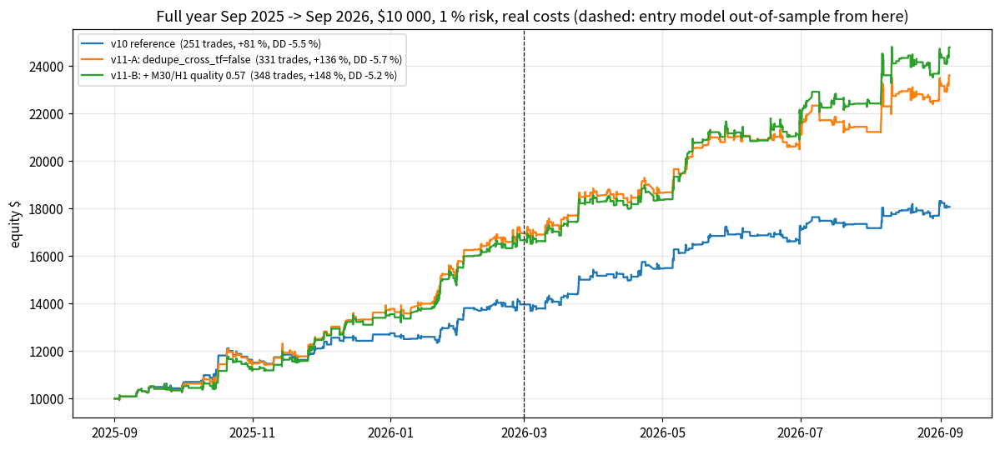
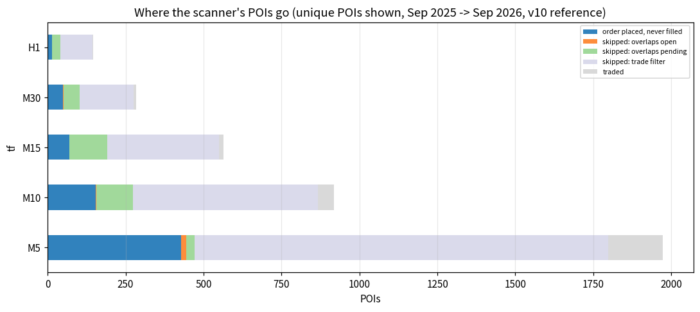
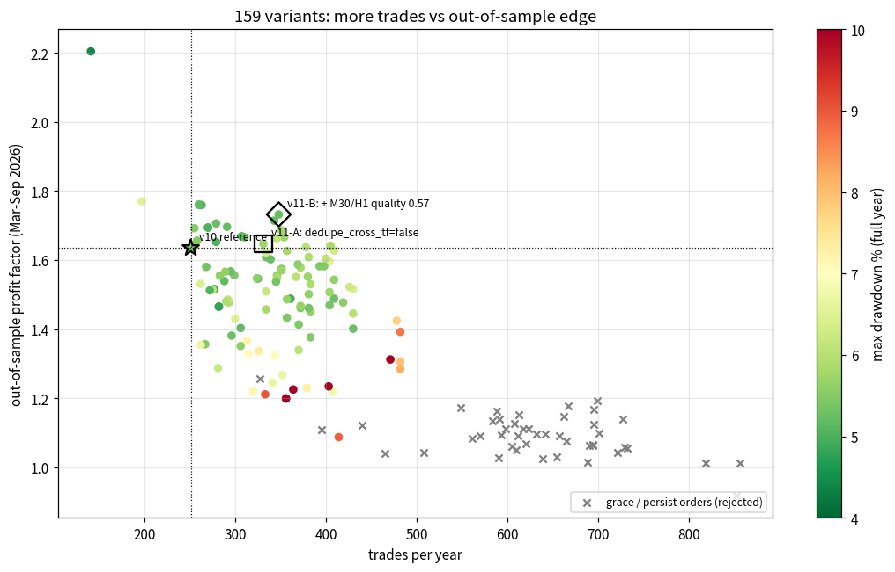
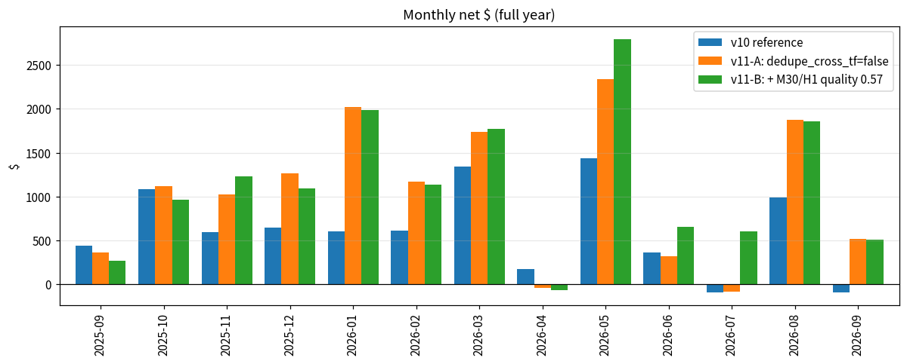

# MORE TRADES AT THE SAME LOSS PROFILE (v11) — how can the bot trade more without losing more?

**Question.**  The v10 trader (4-leg ladder, v8 filter, loss rules) takes **251 trades a year** (full year Sep 2025 → Sep 2026,
+80.7 %, max drawdown -5.5 %, PF 1.75, win 69 %, worst day -1.9 %).  Find a way to make
**more trades** while **keeping the loss percentage** (drawdown, stop-rate, worst day, profit factor) where it is.

**Answer in one line.**  The single biggest robust lever is not a looser filter but the **cross-timeframe de-duplication**: v10 refuses a zone
when another timeframe already has an order on the same level.  Those are *confluence* zones and they are among the best trades of the
year.  Trading them (`dedupe_cross_tf=false`, **v11-A**) gives **331 trades (+32 %), +136 % (v10 +81 %), max DD -5.7 %
(v10 -5.5 %), PF 1.89 (v10 1.75), win 72 %**, out-of-sample PF 1.65 (v10 1.64).  Adding a slightly lower quality bar
on the two slow timeframes (M30/H1 0.60 → 0.57; each held the loss profile alone) gives the recommendation **v11-B: 348 trades
(+39 %), +148 %, max DD -5.2 %, PF 1.91, win 72 %, 12/13 months positive, OOS PF 1.73**.
Everything that adds trades by *waiting longer for a fill* (persisting or grace-period orders), by *entering in front of the zone*, or by
*lowering the M5 / M10 quality bar* adds trades **and** losses — drawdown 7–16 %, out-of-sample PF 1.0–1.3 — and is rejected.  The price
of the extra trades is a worse worst-day (-2.3 % vs -1.9 %) and a deeper drawdown when the spread doubles (9.3 % vs 6.8 %): two plans on
the same level can now be stopped together.



---

## 0. Method (every number has a file behind it)

* **Reference** = the v10 trader exactly (`run_v11_funnel.py` reproduces the v10 full-year run byte for byte: 251 trades, +80.74 %,
  DD -5.49 %).  Full-year selection streams `sel_v10_<TF>.pkl` (Sep 2025 → Sep 2026), M1 portfolio simulator, real per-minute
  spread (imputed where missing), $7/lot commission, $0.10 stop slippage, swaps, 1 % risk on $10 000, ≤ 4 open positions, mirror order
  policy, G ladder 25 % × 4 @ 0.6/1.2/2.4/4.8R with BE after leg 1, loss rules 4.5 % / 9 % on.
* **Honesty.**  The entry (quality) model was trained until 2026-03-01, so Sep 2025 – Feb 2026 is **in-sample (IS)** for the entries and
  Mar – Sep 2026 is **out-of-sample (OOS)**.  Every variant is judged on the OOS half (`OOS_R`, `OOS_PF`); the IS half is shown but
  distrusted — the M10 quality relaxation below is the textbook example (IS +50 R, OOS collapses).
* **"Loss profile held"** (`hold_loss`): max DD not more than 0.5 pt deeper than the reference, PF ≥ ref − 0.05, win-rate ≥ ref − 3 pts,
  worst day ≥ ref − 0.5 pt.
* Steps: (1) funnel diagnosis `run_v11_funnel.py`; (2) grid A = 53 single existing levers `run_v11_levers.py`; (3) three new simulator
  levers (`dedupe_cross_tf`, `overlap_mode=allow|share`, `cancel_grace_min`; defaults byte-identical to v10, parity check exact, 4 tests)
  and grid B (16 singles) + 90 combinations `run_v11_combos.py`; (4) stress × 6 of the finalists + walk-forward check; (5) this report
  `make_v11_report.py`.  `dedupe_cross_tf` is ported to the live bot (`trader.py`, 2 fake-MT5 tests).  **97 tests pass.**  All runs are
  resumable (one json per run in `study_results/v11_levers/`).

---

## 1. Where do the trades get lost?  (funnel of the v10 reference)

The scanner showed **3882 unique POIs** in the year; **251 became trades (6.5 %)**.

| stage                      |   M5 |   M10 |   M15 |   M30 |   H1 |   all |
|:---------------------------|-----:|------:|------:|------:|-----:|------:|
| skipped: trade filter      | 1325 |   593 |   358 |   172 |  102 |  2550 |
| order placed, never filled |  429 |   155 |    69 |    49 |   14 |   716 |
| skipped: overlaps pending  |   27 |   117 |   121 |    52 |   26 |   343 |
| traded                     |  175 |    52 |    14 |     8 |    2 |   251 |
| skipped: overlaps open     |   16 |     2 |     1 |     2 |    1 |    22 |

Detailed reasons (unique POIs, top 14):

| tf   | reason                  |   pois |   pct_of_shown |
|:-----|:------------------------|-------:|---------------:|
| M5   | filter: M5: cost_r      |    958 |           48.6 |
| M10  | filter: M10: quality    |    593 |           64.5 |
| M15  | filter: M15: quality    |    358 |           63.6 |
| M5   | cancel: no longer shown |    310 |           15.7 |
| M5   | filter: M5: quality     |    295 |           15   |
| M5   | cancel: replaced        |    223 |           11.3 |
| M30  | filter: M30: quality    |    172 |           60.8 |
| M15  | skip: overlaps pending  |    121 |           21.5 |
| M10  | skip: overlaps pending  |    117 |           12.7 |
| H1   | filter: H1: quality     |    102 |           70.3 |
| M10  | cancel: no longer shown |     99 |           10.8 |
| M10  | cancel: replaced        |     95 |           10.3 |
| M5   | filter: M5: session     |     72 |            3.7 |
| M30  | skip: overlaps pending  |     52 |           18.4 |



Reading: two thirds of the POIs die in the v8 trade filter (M5 mostly on the cost gate — thin zones; the other timeframes on the
quality bar), 18 % had an order that was cancelled before the fill because the scanner stopped showing the POI (mirror policy), and
**9 % were refused because another timeframe already had an order on the same level** ("overlaps pending", mostly M10/M15/M30).  The
traded population has median quality 0.61 vs 0.54 for everything shown.  The fill rate of placed orders is 26 %.

---

## 2. Grid A — relax one existing gate at a time (53 variants)

| name               |   trades |   return_% |   max_dd_% |   profit_factor |   win_% |   worst_day_% |   OOS_R |   OOS_PF | hold_loss   |
|:-------------------|---------:|-----------:|-----------:|----------------:|--------:|--------------:|--------:|---------:|:------------|
| persist100         |      612 |      43.72 |     -15.89 |           1.157 |    64.7 |         -4.29 |   13.81 |    1.091 | False       |
| persist50          |      549 |      59.53 |     -13.96 |           1.235 |    66.1 |         -3.24 |   20.82 |    1.173 | False       |
| persist20          |      440 |      48.47 |     -15.09 |           1.253 |    65.5 |         -3.53 |   12.19 |    1.122 | False       |
| htf_all_q0.52      |      414 |      66.14 |      -8.92 |           1.342 |    66.4 |         -2.86 |    6.45 |    1.087 | False       |
| m10_qoff           |      407 |      85.66 |      -6.79 |           1.455 |    68.8 |         -2.78 |   15.26 |    1.218 | False       |
| entry_front0.3     |      403 |      52.51 |     -12.38 |           1.3   |    64.8 |         -2.79 |   19.33 |    1.234 | False       |
| m10_qoff_cost0.08  |      379 |      83.08 |      -7.3  |           1.484 |    68.9 |         -2.51 |   14.8  |    1.23  | False       |
| entry_front0.2     |      364 |      45.76 |     -10.55 |           1.3   |    64   |         -2.42 |   16.04 |    1.225 | False       |
| m5_q0.5            |      356 |      54.77 |     -10.79 |           1.315 |    63.5 |         -2.98 |   16.03 |    1.199 | False       |
| m5_qoff            |      356 |      54.77 |     -10.79 |           1.315 |    63.5 |         -2.98 |   16.03 |    1.199 | False       |
| m10_q0.52          |      352 |      85.07 |      -6.67 |           1.535 |    68.5 |         -2.22 |   15.52 |    1.267 | False       |
| htf_all_q0.55      |      344 |      77.57 |      -7.06 |           1.485 |    66.6 |         -2.92 |   19.42 |    1.323 | False       |
| m10_qoff_cost0.06  |      341 |      72.3  |      -6.67 |           1.48  |    68.3 |         -2.51 |   14.11 |    1.245 | False       |
| dedupe1.01         |      334 |     129.02 |      -6.32 |           1.836 |    71.3 |         -2.68 |   34.84 |    1.622 | False       |
| m15_qoff           |      333 |      47.64 |      -9.03 |           1.312 |    65.5 |         -6.18 |   14.62 |    1.211 | False       |
| persist10          |      327 |      33.3  |     -10.66 |           1.269 |    65.7 |         -2.03 |   16.72 |    1.255 | False       |
| m15_qoff_cost0.08  |      326 |      56.25 |      -7.34 |           1.392 |    65.3 |         -2.87 |   19.9  |    1.336 | False       |
| entry_front0.1     |      320 |      59.61 |      -7.17 |           1.425 |    66.9 |         -2.22 |   13.45 |    1.219 | False       |
| m15_qoff_cost0.06  |      315 |      53.38 |      -7.07 |           1.402 |    65.7 |         -2.49 |   18.88 |    1.329 | False       |
| m5_q0.52           |      313 |      69.85 |      -7.22 |           1.466 |    65.8 |         -2.91 |   22.57 |    1.366 | False       |
| m10_q0.55          |      306 |      87.43 |      -5.16 |           1.628 |    68.3 |         -2.13 |   19.86 |    1.403 | False       |
| m15_q0.52          |      306 |      67.87 |      -5.59 |           1.505 |    67.3 |         -2.68 |   19.1  |    1.351 | False       |
| m5_q0.53           |      300 |      87.91 |      -6.5  |           1.613 |    68.3 |         -2.86 |   25.44 |    1.43  | False       |
| m5_all_sessions    |      299 |      84.61 |      -5.44 |           1.663 |    69.9 |         -2.89 |   27.28 |    1.556 | False       |
| m10_q0.55_cost0.08 |      296 |      88.4  |      -5.26 |           1.642 |    68.2 |         -2.09 |   18.97 |    1.381 | False       |
| htf_all_q0.57      |      295 |      78.94 |      -5.25 |           1.588 |    66.8 |         -2.01 |   28.55 |    1.567 | False       |
| m5_costoff         |      293 |      68.1  |      -5.93 |           1.536 |    67.9 |         -2.08 |   25.07 |    1.477 | False       |
| m5_cost0.2         |      292 |      66.95 |      -6.1  |           1.532 |    67.8 |         -2.07 |   25.06 |    1.485 | False       |
| m5_cost0.15        |      290 |      66.05 |      -5.92 |           1.528 |    67.6 |         -2.06 |   24.79 |    1.48  | False       |
| m30_qoff           |      289 |      81.71 |      -5.63 |           1.626 |    67.5 |         -2    |   29.99 |    1.566 | False       |
| m5_cost0.12        |      283 |      73.86 |      -5.59 |           1.6   |    68.2 |         -2.04 |   27.04 |    1.555 | False       |
| m15_q0.55          |      282 |      74.44 |      -4.8  |           1.583 |    67.7 |         -2.66 |   23.96 |    1.465 | False       |
| m15_q0.55_cost0.08 |      282 |      74.44 |      -4.8  |           1.583 |    67.7 |         -2.66 |   23.96 |    1.465 | False       |
| m10_q0.55_cost0.06 |      281 |      68.06 |      -6.23 |           1.533 |    66.9 |         -2.18 |   14.32 |    1.287 | False       |
| m30_q0.52          |      279 |      87.15 |      -5.24 |           1.695 |    68.1 |         -1.98 |   36.47 |    1.706 | False       |
| m15_q0.55_cost0.06 |      277 |      70.84 |      -4.89 |           1.584 |    67.5 |         -2.76 |   25.04 |    1.516 | False       |
| m5_cost0.1         |      275 |      69.79 |      -6.09 |           1.581 |    67.6 |         -2.07 |   25.2  |    1.514 | False       |
| m10_q0.57          |      272 |      67.52 |      -5.05 |           1.575 |    67.3 |         -1.92 |   23.05 |    1.512 | False       |
| m30_q0.55          |      270 |      85.97 |      -5.02 |           1.719 |    68.1 |         -1.99 |   32.68 |    1.694 | True        |
| m15_q0.57          |      268 |      78.21 |      -5.33 |           1.649 |    67.9 |         -1.87 |   27.52 |    1.58  | False       |
| h1_qoff            |      267 |      70.02 |      -5.49 |           1.561 |    66.7 |         -1.91 |   18.36 |    1.356 | False       |
| h1_q0.52           |      262 |      65.05 |      -6.7  |           1.547 |    67.2 |         -1.96 |   18.2  |    1.354 | False       |
| dedupe0.9          |      262 |      76.19 |      -6.42 |           1.672 |    69.1 |         -2.5  |   24.71 |    1.531 | False       |
| m30_q0.57          |      260 |      90.36 |      -5.15 |           1.801 |    69.6 |         -1.96 |   33.13 |    1.76  | True        |
| h1_q0.55           |      258 |      82.85 |      -5.49 |           1.743 |    69   |         -1.95 |   29.06 |    1.656 | True        |
| dedupe0.75         |      256 |      80.78 |      -5.49 |           1.748 |    69.9 |         -1.94 |   26.94 |    1.643 | True        |
| h1_q0.57           |      255 |      86.34 |      -5.49 |           1.786 |    69.4 |         -1.93 |   29.86 |    1.692 | True        |
| ref                |      251 |      80.74 |      -5.49 |           1.747 |    69.3 |         -1.94 |   26.7  |    1.635 | True        |
| entry_deep0.1      |      197 |      47.8  |      -6.53 |           1.743 |    72.6 |         -1.95 |   20.9  |    1.77  | False       |
| entry_deep0.2      |      141 |      27.75 |      -4.4  |           1.675 |    72.3 |         -2.21 |   19.14 |    2.204 | False       |

* **Quality bars.**  M30 0.60 → 0.57/0.55/0.52 adds 9/19/28 trades with OOS +33/+33/+36 R (ref +26.7) and PF 1.80/1.72/1.70 → **holds**.
  H1 0.57 (+4 trades, OOS +30 R) holds.  M15 0.57 (+17) is neutral.  **M10** relaxation is the trap: +55…156 trades, in-sample +50 R, but
  **out-of-sample falls to +15…20 R** — lower-quality M10 POIs are exactly what the entry model learned on.  M5 below 0.55: OOS +16…23 R,
  DD 7–11 %.
* **M5 cost / session gates.**  cost 0.12 (+32 trades, OOS +27 R, PF 1.60) and all-sessions (+48, OOS +27 R, PF 1.66) are neutral OOS but
  raise the worst day to −2.9 %; the in-sample half likes them (that is where the nypm rule was chosen).  Not recommended.
* **Order handling.**  `persist` orders (keep waiting up to N bars): +76…361 trades, **DD 11–16 %, OOS PF 1.1–1.25** — the scanner drops a
  POI for a reason.  Entering in front of the zone (`entry_offset_frac` < 0): more fills, DD 7–12 %.  Entering deeper: fewer trades.
* **Never binding:** `max_open_positions` 6/8 and `one_trade_per_poi=false` change nothing (the scanner never re-shows a traded POI).
* **`dedupe_overlap` off** (`dedupe1.01`): 334 trades, +129 %, PF 1.84, OOS +34.8 R — the discovery that led to grid B.

---

## 3. Grid B — new levers (16 singles) and combinations (90)

New `TraderConfig` fields (all default to the v10 behaviour): `dedupe_cross_tf=false` — the overlap check only looks at plans of the
*same* timeframe, so a level shown on two timeframes is traded on both; `overlap_mode=allow|share` + `overlap_risk_frac` — trade the
overlapping plan at full or reduced risk; `cancel_grace_min=N` — keep a mirrored order N minutes after the scanner drops the POI.

| name              |   trades |   return_% |   max_dd_% |   profit_factor |   win_% |   worst_day_% |   OOS_R |   OOS_PF | hold_loss   |
|:------------------|---------:|-----------:|-----------:|----------------:|--------:|--------------:|--------:|---------:|:------------|
| ref               |      251 |      80.74 |      -5.49 |           1.747 |    69.3 |         -1.94 |   26.7  |    1.635 | True        |
| B_share25         |      324 |      77.1  |      -5.57 |           1.677 |    63.6 |         -1.91 |   35.82 |    1.547 | False       |
| B_xtf             |      331 |     136.17 |      -5.73 |           1.893 |    71.9 |         -2.75 |   35.22 |    1.647 | False       |
| B_share75         |      334 |     101.94 |      -6.2  |           1.717 |    68.6 |         -2.12 |   29.13 |    1.509 | False       |
| B_share50         |      334 |      87.49 |      -5.84 |           1.688 |    67.7 |         -1.94 |   28.14 |    1.457 | False       |
| B_allow           |      334 |     129.02 |      -6.32 |           1.836 |    71.3 |         -2.68 |   34.84 |    1.622 | False       |
| B_grace5          |      395 |      48.48 |     -12.19 |           1.266 |    65.6 |         -4.54 |    9.18 |    1.108 | False       |
| B_grace10         |      465 |      29.83 |     -16.39 |           1.148 |    64.5 |         -4.37 |    4.6  |    1.04  | False       |
| B_grace15         |      508 |      36.16 |     -16.36 |           1.161 |    65.2 |         -3.55 |    5.37 |    1.042 | False       |
| B_grace30         |      561 |      39.6  |     -16.3  |           1.161 |    65.2 |         -4.38 |   11.72 |    1.084 | False       |
| B_xtf_grace10     |      570 |      73.51 |     -13.61 |           1.265 |    67.5 |         -4.27 |   11.99 |    1.09  | False       |
| B_share50_grace10 |      590 |      38.55 |     -13.83 |           1.165 |    63.7 |         -4.7  |    7.93 |    1.028 | False       |
| B_grace60         |      591 |      40.95 |     -13.19 |           1.163 |    65.3 |         -4.13 |   18.43 |    1.14  | False       |
| B_allow_grace10   |      593 |      68.13 |     -13.79 |           1.24  |    66.9 |         -4.32 |   12.99 |    1.094 | False       |
| B_xtf_grace30     |      701 |      90.27 |     -14.55 |           1.249 |    67.5 |         -4.58 |   17.06 |    1.098 | False       |
| B_share50_grace30 |      729 |      49.49 |     -15.57 |           1.169 |    64.5 |         -4.56 |   10.76 |    1.059 | False       |
| B_allow_grace30   |      732 |      70.26 |     -16.5  |           1.194 |    66.7 |         -4.91 |   10.06 |    1.055 | False       |

* **`dedupe_cross_tf=false` is the lever.**  +80 trades; every loss metric inside the band except the worst day (−2.75 % vs −1.94 %).  The
  extra trades are M15 +31 (win 81 %, +0.67 R/trade), M10 +28, M30 +13, H1 +7 — confluence zones.  Max concurrent positions 2 → 4.
* **Sharing the risk** on the second plan (25/50/75 %) keeps the trade count but *lowers* return and PF: the confluence trades are the better
  half, cutting their size hurts.  `allow` (= dedupe fully off) ≈ `xtf` with a slightly deeper DD (same-TF overlaps are noise, not confluence).
* **Grace periods** 5–60 min: +144…+340 trades, DD 12–16 %, OOS PF 1.04–1.14 → rejected for the same reason as persisting orders.

Best combinations (max DD ≤ 6 %, sorted by OOS R, top 16):

| name                                  |   trades |   return_% |   max_dd_% |   profit_factor |   win_% |   worst_day_% |   OOS_R |   OOS_PF | hold_loss   |
|:--------------------------------------|---------:|-----------:|-----------:|----------------:|--------:|--------------:|--------:|---------:|:------------|
| C_m30q57+h1q57+m5sess__share25        |      398 |      91.33 |      -5.48 |           1.65  |    64.1 |         -2.7  |   51.52 |    1.582 | False       |
| C_m30q57+h1q57+m15q57+m5sess__share25 |      419 |      86.01 |      -5.57 |           1.559 |    63.5 |         -2.69 |   47.47 |    1.477 | False       |
| C_m30q57+m5sess__share25              |      393 |      91.04 |      -5.43 |           1.654 |    64.1 |         -2.7  |   47.05 |    1.582 | False       |
| C_m30q57+h1q57__xtf                   |      348 |     147.93 |      -5.22 |           1.909 |    71.6 |         -2.29 |   42.05 |    1.732 | True        |
| C_m30q57+h1q57+m5sess__xtf            |      405 |     165.87 |      -5.83 |           1.831 |    71.9 |         -3.07 |   41.95 |    1.641 | False       |
| C_m30q57+h1q57__share25               |      339 |      78.92 |      -5.19 |           1.666 |    62.5 |         -1.91 |   41.81 |    1.602 | False       |
| C_m30q57+h1q57__allow                 |      351 |     140.47 |      -5.8  |           1.849 |    70.9 |         -2.57 |   40.84 |    1.686 | False       |
| C_m30q57__xtf                         |      343 |     147.72 |      -5.18 |           1.914 |    71.7 |         -2.29 |   40.45 |    1.714 | True        |
| C_m30q55__xtf                         |      354 |     132.3  |      -5.73 |           1.806 |    70.9 |         -2.33 |   39.92 |    1.666 | True        |
| C_m30q57+m5c12__allow                 |      381 |     129.34 |      -5.91 |           1.719 |    70.6 |         -2.94 |   39.73 |    1.608 | False       |
| C_m30q57+h1q57+m5sess__share75        |      409 |     127.29 |      -5.63 |           1.695 |    69.4 |         -2.82 |   38.87 |    1.543 | False       |
| C_m30q55__allow                       |      357 |     128.17 |      -5.81 |           1.763 |    70.3 |         -2.62 |   38.53 |    1.626 | False       |
| C_m30q57__share25                     |      334 |      79.21 |      -5.23 |           1.675 |    62.6 |         -1.9  |   37.8  |    1.608 | False       |
| C_m30q57+h1q57+m15q57__allow          |      372 |     138    |      -5.81 |           1.744 |    69.9 |         -3.02 |   37.69 |    1.578 | False       |
| C_m30q57+h1q57+m15q57__share25        |      361 |      75.04 |      -4.98 |           1.569 |    61.8 |         -2.33 |   37.38 |    1.488 | False       |
| C_m30q55+h1q57+m15q57__xtf            |      380 |     133.42 |      -5.69 |           1.708 |    69.7 |         -3.05 |   37.35 |    1.552 | False       |



Walk-forward check: ranking the 114 non-grace variants on the **in-sample half only** puts `xtf` in 11 of the top 12; Spearman(IS R, OOS R)
= 0.54 (p = 6e-10).  The IS half also favours `m5sess` (all M5 sessions), whose OOS PF is 1.42–1.64 — an in-sample artefact, not recommended.

---

## 4. Stress of the finalists (full year; return / max DD / OOS PF)

| variant                      | base                   | spread_x2             | commission_x2          | slip_x3                | worst_intrabar         | risk0.5               | risk2                   |
|:-----------------------------|:-----------------------|:----------------------|:-----------------------|:-----------------------|:-----------------------|:----------------------|:------------------------|
| v10 reference                | +81 % / -5.5 % / 1.64  | +33 % / -6.8 % / 1.11 | +64 % / -5.1 % / 1.48  | +74 % / -5.7 % / 1.57  | +79 % / -5.5 % / 1.64  | +33 % / -3.1 % / 1.64 | +198 % / -10.6 % / 1.60 |
| v11-A: dedupe_cross_tf=false | +136 % / -5.7 % / 1.65 | +52 % / -7.0 % / 1.21 | +112 % / -5.6 % / 1.56 | +128 % / -5.8 % / 1.60 | +134 % / -5.7 % / 1.65 | +52 % / -3.1 % / 1.60 | +461 % / -10.7 % / 1.67 |
| v11-B: + M30/H1 quality 0.57 | +148 % / -5.2 % / 1.73 | +58 % / -9.3 % / 1.29 | +124 % / -6.2 % / 1.65 | +136 % / -5.9 % / 1.69 | +148 % / -5.1 % / 1.74 | +63 % / -2.4 % / 1.80 | +449 % / -10.8 % / 1.75 |
| M30/H1 quality 0.57 only     | +93 % / -5.1 % / 1.76  | +48 % / -5.1 % / 1.44 | +79 % / -4.7 % / 1.68  | +86 % / -5.3 % / 1.70  | +90 % / -5.1 % / 1.74  | +43 % / -2.2 % / 1.89 | +244 % / -9.5 % / 1.73  |

The recommendation stays ahead of the reference on return and OOS PF in every scenario.  Its weak point is the **drawdown at double
spread (9.3 % vs 6.8 %)**: with the spread doubled the small M5 zones lose their edge on every system, and two confluence plans can be
stopped in the same move (April 2026: −$673).  At half risk (0.5 %) v11-B makes +63 % at 2.4 % DD.

---

## 5. What the extra trades are (v11-B vs v10)

Per timeframe, full year (n / R):

| tf   |   v10 n |   v10 R |   v11-B n |   v11-B R |
|:-----|--------:|--------:|----------:|----------:|
| M5   |     175 |   37.55 |       176 |     33.12 |
| M10  |      52 |   30.59 |        80 |     39.84 |
| M15  |      14 |    1.27 |        45 |     23.32 |
| M30  |       8 |   -2.52 |        33 |      2.2  |
| H1   |       2 |   -0.89 |        14 |      1.59 |

The 99 trades v11-B takes and v10 does not:

| tf   |   trades |     R |   avg_R |   win_pct |
|:-----|---------:|------:|--------:|----------:|
| H1   |       12 |  2.46 |    0.21 |     75    |
| M10  |       28 |  8.38 |    0.3  |     75    |
| M15  |       31 | 21.85 |    0.7  |     80.65 |
| M30  |       25 |  5.11 |    0.2  |     72    |
| M5   |        3 |  0.34 |    0.11 |    100    |

Out-of-sample part of the extra trades: 54 trades, +18.2 R, win 74 %.  Outcomes of all 99 extra trades: {'partial_be': 63, 'sl': 22, 'tp2': 14}.



---

## 6. Recommendation

**v11-B** — `dedupe_cross_tf=false` + `M30|H1:min_quality=0.57` (everything else as v10): **348 trades / year (+39 %), +148 %,
max DD -5.2 %, PF 1.91, win 72 %, Sharpe 4.06, 12/13 months positive, OOS PF 1.73.**

```
python trader.py --symbol XAUUSD.t --risk 1.0 --commission 7 --timeframes M5,M10,M15,M30,H1 ^
  --trader "tp_levels=0.6|1.2|2.4|4.8,tp_fracs=1|1|1|1,ladder_fallback=merge,dedupe_cross_tf=false" ^
  --trade-filter "M5:max_cost_r=0.08;min_quality=0.55;sessions=asia|london|preny|ny|lclose/M10|M15:min_quality=0.60/M30|H1:min_quality=0.57"
```

**v11-A** (conservative: only the dedupe change, v8 filter untouched): 331 trades, +136 %, DD -5.7 %, PF 1.89.

Caveats, honestly: the worst single day moves from -1.9 % to -2.3 % (v11-A -2.8 %) and up to 4 positions can be open at once
on correlated levels — the 4.5 % daily limit is now closer (theoretical one-bar worst case 4 × 1 % + slippage).  Keep risk at 1 % or less;
the loss rules never triggered in the year at 1 %.  The M30/H1 relaxation rests on 33 + 14 trades — small samples; v11-A is the part that
is robust on both halves and in every stress scenario.  Do **not** add grace/persist orders, front entries or M10/M5 quality
relaxations — all of them add trades and losses.
