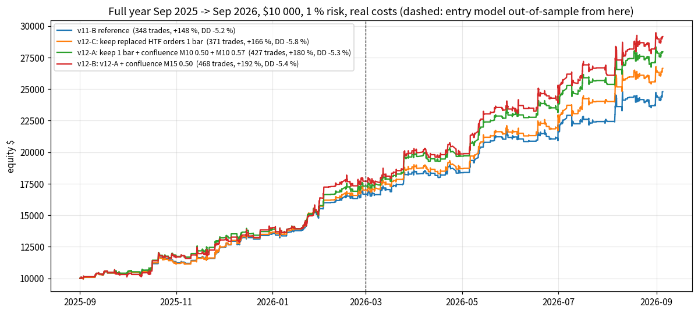
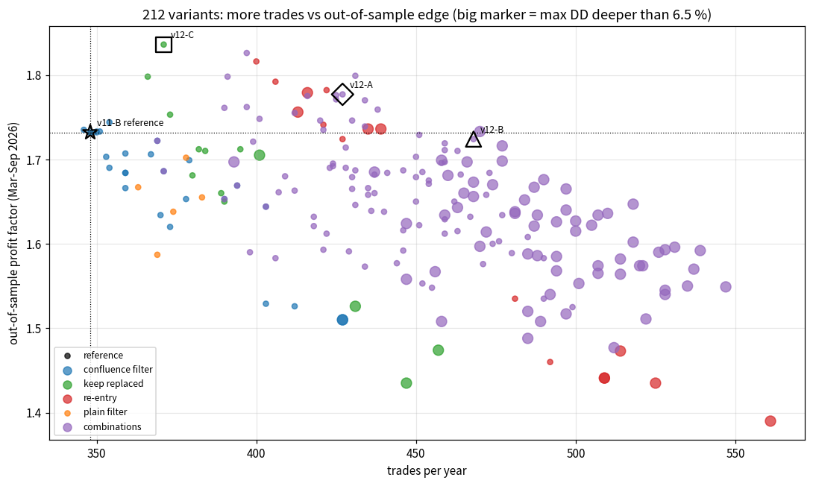
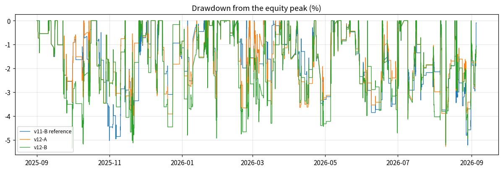
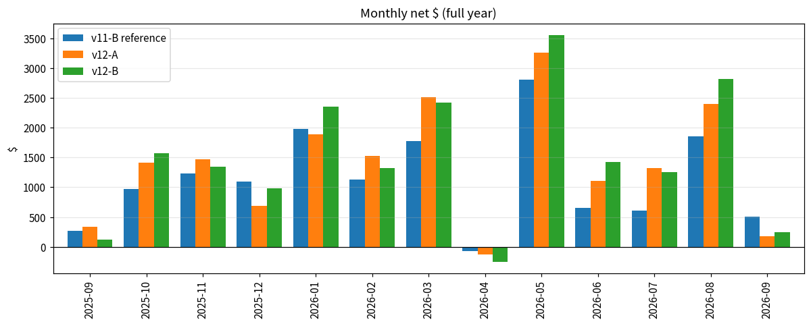

# MORE TRADES AT THE SAME LOSS PROFILE, round 2 (v12) — what is left after v11?

**Question.**  The v11-B trader (confluence zones traded on both timeframes, M30/H1 quality 0.57, 4-leg ladder, v8 M5 filter, loss
rules) takes **348 trades a year** (Sep 2025 → Sep 2026: +147.9 %, max drawdown -5.22 %, PF
1.91, win 71.6 %, stop-rate 27.9 %, worst day -2.29 %, out-of-sample PF
1.73).  Find a way to make **more trades** while **keeping the loss percentage** where it is.

**Answer in one line.**  Two mechanical levers add trades without touching the loss profile: (1) **do not cancel a pending order the
moment the scanner *replaces* its zone by a better one on the same slot — keep it one bar of its timeframe** (`keep_replaced_bars=1`,
higher timeframes only), and (2) **judge a zone that is already active on another timeframe by a looser M10 quality bar** (confluence
filter, M10 0.50 instead of 0.60).  Together with a plain M10 quality 0.57 this is **v12-A: 427 trades (+23 %),
+180 %, max DD -5.28 %, PF 1.87, win 72.6 %, stop-rate 26.9 %, worst
day -2.65 %, OOS PF 1.78, 12/13 months positive** — every loss metric inside the v11 band on the
full year *and* on the out-of-sample half, and **more robust than v11-B when the spread doubles** (DD 6.6 % vs 9.3 %).  The conservative
choice **v12-C** (keep-replaced alone) gives 371 trades (+7 %) at PF 1.99 / OOS PF 1.84; the
aggressive **v12-B** (+ M15 confluence 0.50) gives 468 trades (+34 %) but its full-year PF (1.80) and worst
day (-3.25 %) leave the band.  **Re-entering a zone after a break-even exit** adds many trades but *not* edge (the re-entries
are break-even as a group, worst day −4 %, DD 10 % at double spread) and is rejected; so is any relaxation of the M5 gates.



---

## 0. Method

* **Reference** = the v11-B trader exactly (`run_v12_funnel.py` reproduces the v11 study run byte for byte: 348 trades,
  +147.93 %, DD -5.22 %).  Full-year selection streams `sel_v10_<TF>.pkl` (Sep 2025 → Sep 2026), M1 portfolio
  simulator, real per-minute spread (imputed where missing), $7/lot commission, $0.10 stop slippage, swaps, 1 % risk on $10 000, ≤ 4 open
  positions, mirror order policy, G ladder 25 % × 4 @ 0.6/1.2/2.4/4.8R with BE after leg 1, loss rules 4.5 % / 9 %, `dedupe_cross_tf=false`,
  filter `M5:cost 0.08 / q 0.55 / no NY-pm; M10|M15 q 0.60; M30|H1 q 0.57`.
* **Honesty.**  The entry model was trained until 2026-03-01: Sep 2025 – Feb 2026 is **in-sample (IS)**, Mar – Sep 2026 **out-of-sample
  (OOS)**.  Every variant is judged on the OOS half; the IS half is shown but distrusted (section 5 shows why, again).
* **Loss profile held** (`hold_loss`, full year): max DD not more than 0.5 pt deeper (0.7 pt used in the tables), PF ≥ ref − 0.05, win ≥
  ref − 3 pts, worst day ≥ ref − 0.5 pt.  `hold_oos`: the same on the OOS half (PF, win, stop-rate + 2 pts) plus the DD condition.
* Steps: (1) funnel `run_v12_funnel.py`; (2) three new simulator levers, defaults byte-identical to v11 (parity exact), 6 unit tests;
  (3) grid `run_v12_levers.py`: 61 singles + 151 combinations = 212 full-year runs, resumable (one json per run in
  `study_results/v12_levers/`); (4) stress × 6 + walk-forward `run_v12_stress.py`; (5) this report `make_v12_report.py`.  Both winning
  levers are ported to the live bot (`trader.py`, 2 fake-MT5 tests).  **104 tests pass.**  The whole pipeline ran unattended
  (`run_v12_all.sh`, autosave every 4 minutes) and survived seven sandbox migrations without losing a run.

---

## 1. Where do the trades get lost now?  (funnel of the v11-B reference)

The scanner showed **3882 unique POIs** in the year; **348 became trades (184 of them out-of-sample)**.

| stage                      |   M5 |   M10 |   M15 |   M30 |   H1 |   all |
|:---------------------------|-----:|------:|------:|------:|-----:|------:|
| skipped: trade filter      | 1344 |   650 |   414 |   164 |   94 |  2666 |
| order placed, never filled |  441 |   186 |   101 |    86 |   35 |   849 |
| traded                     |  176 |    80 |    45 |    33 |   14 |   348 |
| skipped: overlaps open     |   11 |     3 |     3 |     0 |    2 |    19 |

Top reasons (unique POIs):

| tf   | reason                  |   pois |   pct_of_shown |
|:-----|:------------------------|-------:|---------------:|
| M5   | filter: M5: cost_r      |    976 |           49.5 |
| M10  | filter: M10: quality    |    650 |           70.7 |
| M15  | filter: M15: quality    |    414 |           73.5 |
| M5   | cancel: no longer shown |    323 |           16.4 |
| M5   | filter: M5: quality     |    295 |           15   |
| M5   | cancel: replaced        |    232 |           11.8 |
| M30  | filter: M30: quality    |    164 |           58   |
| M10  | cancel: no longer shown |    120 |           13.1 |
| M10  | cancel: replaced        |    113 |           12.3 |
| H1   | filter: H1: quality     |     94 |           64.8 |
| M15  | cancel: no longer shown |     74 |           13.1 |
| M5   | filter: M5: session     |     73 |            3.7 |

What the funnel says about the remaining levers:

* **'price already at/through entry' skips: 2** in the whole year → deferring the entry is *not* a lever.
* **323 POIs had an order that was cancelled because the scanner *replaced* the zone by another one** on the same slot —
  and **165 of them were shown again later**, i.e. the zone was still valid.  In v11 the *grace period* lever
  (keep every cancelled order N minutes) failed because it also kept orders of zones the scanner had *dropped*; keeping only the *replaced*
  ones, and only on the slow timeframes, is the new lever `keep_replaced_bars`.
* **324 quality-rejected POIs overlapped (≥ 50 %) a zone that another timeframe actually
  traded** within ± 2 days (M10 126, M15 101, M5 55,
  M30 29, H1 13; median quality 0.531).  v11 showed
  that confluence zones are the best trades of the year → a *confluence-conditional* quality bar is lever #2 (`confluence_filter`).
* **A traded POI is never re-shown by the scanner** (0 cases) → a re-entry after a break-even exit
  must be driven by the trader itself (`reentry_bars`, tested and rejected below).
* Winners and losers have the **same median quality per timeframe** (M5 0.60 vs 0.59, M10 0.63 vs 0.63) — above 0.55 the quality bar has
  little ranking power, which is why relaxing it *where extra evidence exists* is defensible and relaxing it blindly is not.

---

## 2. New levers (all default to the v11 behaviour)

`TraderConfig` / `--trader` keys, simulator and live bot share the code:

* `keep_replaced_bars=N` + `keep_replaced_tfs=M10|M15|M30|H1` — mirror policy: an order whose POI was *replaced* on its slot stays N bars
  of its timeframe (re-shown in time → kept for good); a *cleared* slot ('no longer shown') still cancels at once.
* `confluence_filter=<filter string>` (CLI `--confluence-filter`) — used *instead of* `--trade-filter` when the plan's zone overlaps
  (≥ `dedupe_overlap`) an active order/position of *another* timeframe.
* `reentry_bars=N`, `reentry_max`, `reentry_tfs`, `reentry_outcomes` — after a break-even exit the same plan is re-armed as a fresh limit
  order for N bars (tested, **not recommended**).

## 3. Single levers (212 − 151 runs)

| name                  |   trades |   return_% |   max_dd_% |   profit_factor |   win_% |   sl_% |   worst_day_% |   OOS_R |   OOS_PF |   OOS_win_% | hold_loss   | hold_oos   |
|:----------------------|---------:|-----------:|-----------:|----------------:|--------:|-------:|--------------:|--------:|---------:|------------:|:------------|:-----------|
| RE_b3_max2            |      561 |     133.31 |     -10.56 |           1.461 |    66.7 |   32.8 |         -5.69 |   40.61 |    1.39  |        66.6 | False       | False      |
| RE_b12                |      525 |     130.87 |      -8.84 |           1.495 |    66.5 |   33.1 |         -4.78 |   41.06 |    1.435 |        65.9 | False       | False      |
| RE_b6                 |      514 |     139.96 |      -7.15 |           1.536 |    67.3 |   32.3 |         -4.41 |   44.31 |    1.473 |        66.8 | False       | False      |
| RE_b3                 |      509 |     140.44 |      -7.15 |           1.53  |    67.4 |   32.2 |         -4.41 |   41.2  |    1.441 |        66.5 | False       | False      |
| RE_b3_tpbe            |      509 |     140.44 |      -7.15 |           1.53  |    67.4 |   32.2 |         -4.41 |   41.2  |    1.441 |        66.5 | False       | False      |
| RE_b2                 |      492 |     137.12 |      -6.33 |           1.54  |    67.7 |   31.7 |         -4.32 |   42.47 |    1.46  |        67.2 | False       | False      |
| RE_b1                 |      481 |     141.14 |      -5.81 |           1.592 |    68.6 |   31   |         -3.7  |   44.71 |    1.535 |        67.7 | False       | False      |
| KR_b6                 |      457 |     134.4  |      -8.35 |           1.602 |    70.2 |   29.3 |         -3.42 |   39.43 |    1.474 |        69.3 | False       | False      |
| KR_b3                 |      447 |     128.2  |      -8.94 |           1.587 |    70   |   29.5 |         -3.48 |   35.82 |    1.435 |        68.6 | False       | False      |
| RE_htf_b6             |      439 |     148.89 |      -6.75 |           1.723 |    69   |   30.5 |         -4.43 |   52.14 |    1.736 |        69.6 | False       | False      |
| RE_htf_b3             |      435 |     146.35 |      -6.75 |           1.718 |    69   |   30.6 |         -4.43 |   51.06 |    1.736 |        69.6 | False       | False      |
| KR_b2                 |      431 |     127.46 |      -8.89 |           1.63  |    70.3 |   29.2 |         -3.49 |   40.16 |    1.526 |        69.5 | False       | False      |
| CF_htf_off            |      427 |     151.89 |      -7.34 |           1.691 |    70.3 |   29.3 |         -3.17 |   39.38 |    1.51  |        69   | False       | False      |
| CF_htf_q0.5           |      427 |     151.89 |      -7.34 |           1.691 |    70.3 |   29.3 |         -3.17 |   39.38 |    1.51  |        69   | False       | False      |
| RE_htf_b2             |      427 |     140.5  |      -5.75 |           1.71  |    69.3 |   30.2 |         -4.07 |   50.26 |    1.724 |        70   | False       | True       |
| RE_m10m15_b2_max2     |      422 |     154.32 |      -6.31 |           1.77  |    69.9 |   29.6 |         -4.07 |   53.03 |    1.782 |        70.8 | False       | False      |
| RE_htf_b1             |      421 |     152.04 |      -5.75 |           1.763 |    70.1 |   29.5 |         -4.03 |   50.77 |    1.741 |        70.1 | False       | True       |
| RE_m10m15_b6          |      416 |     149.1  |      -6.75 |           1.767 |    69.2 |   30.3 |         -4.43 |   50.17 |    1.779 |        69.8 | False       | False      |
| RE_m10m15_b3          |      413 |     143.82 |      -6.75 |           1.749 |    69.2 |   30.3 |         -4.43 |   48.62 |    1.756 |        70   | False       | False      |
| CF_all_q0.52_cost0.12 |      412 |     162.78 |      -5.77 |           1.762 |    71.1 |   28.4 |         -3    |   37.23 |    1.526 |        69.5 | False       | False      |
| RE_m10m15_b2          |      406 |     143.85 |      -5.75 |           1.77  |    69.7 |   29.8 |         -4.04 |   50.2  |    1.792 |        70.5 | False       | True       |
| CF_htf_q0.52          |      403 |     150.87 |      -5.63 |           1.746 |    71   |   28.5 |         -2.92 |   37.08 |    1.529 |        69.2 | False       | False      |
| CF_m10m15_q0.5        |      403 |     168.37 |      -5.53 |           1.832 |    71.2 |   28.3 |         -3.17 |   42.37 |    1.644 |        70   | False       | False      |
| KR_b1                 |      401 |     141.4  |      -6.67 |           1.774 |    71.1 |   28.4 |         -3.5  |   45.5  |    1.705 |        70.7 | False       | False      |
| RE_m10m15_b1          |      400 |     156.93 |      -5.5  |           1.834 |    70.5 |   29   |         -3.99 |   51.6  |    1.816 |        70.7 | False       | True       |
| KR_htf_b6             |      395 |     161.58 |      -5.87 |           1.871 |    72.7 |   26.8 |         -2.5  |   46.72 |    1.712 |        71.6 | True        | True       |
| CF_m10q0.5_m15q0.52   |      394 |     169.28 |      -5.63 |           1.872 |    71.8 |   27.7 |         -3.04 |   41.66 |    1.669 |        70.6 | False       | False      |
| CF_m10m15_q0.52       |      390 |     159.81 |      -5.63 |           1.85  |    71.8 |   27.7 |         -2.92 |   40.53 |    1.653 |        70.5 | False       | False      |
| KR_htf_b3             |      390 |     154.66 |      -5.87 |           1.847 |    72.6 |   26.9 |         -2.56 |   42.61 |    1.65  |        71.1 | False       | False      |
| KR_m10m15m30_b3       |      389 |     155.13 |      -5.87 |           1.855 |    72.5 |   27   |         -2.58 |   42.39 |    1.66  |        71   | False       | False      |
| KR_m10m15_b6          |      384 |     157.44 |      -5.71 |           1.878 |    72.1 |   27.3 |         -2.58 |   44.48 |    1.71  |        71.2 | True        | True       |
| F_m5_cost0.12         |      383 |     138.15 |      -5.93 |           1.766 |    71   |   28.5 |         -2.97 |   42.34 |    1.655 |        70.4 | False       | False      |
| KR_htf_b2             |      382 |     157.94 |      -5.83 |           1.894 |    72.8 |   26.7 |         -2.68 |   44.45 |    1.712 |        71.7 | True        | True       |
| KR_m10m15_b3          |      380 |     155.19 |      -5.71 |           1.874 |    72.1 |   27.4 |         -2.6  |   42.2  |    1.681 |        70.7 | True        | False      |
| CF_m15_q0.5           |      379 |     155.56 |      -5.5  |           1.84  |    70.4 |   29   |         -3.17 |   44.34 |    1.699 |        69.7 | False       | True       |
| F_m10_q0.57           |      378 |     144.3  |      -6.34 |           1.807 |    70.9 |   28.6 |         -2.28 |   44.02 |    1.702 |        70.7 | False       | False      |
| CF_m10q0.52_m15q0.55  |      378 |     168.06 |      -5.51 |           1.892 |    72.2 |   27.2 |         -3.02 |   39.75 |    1.653 |        70.9 | False       | False      |
| F_m5_cost0.10         |      374 |     135.88 |      -5.96 |           1.764 |    70.6 |   28.9 |         -3    |   41.77 |    1.638 |        70.1 | False       | False      |
| CF_htf_q0.55          |      373 |     156.5  |      -5.86 |           1.851 |    71.6 |   27.9 |         -2.92 |   37.86 |    1.62  |        70.1 | False       | False      |
| KR_m10m15_b2          |      373 |     156.82 |      -5.85 |           1.919 |    72.4 |   27.1 |         -2.59 |   44.99 |    1.753 |        71.5 | True        | True       |
| CF_m15_q0.52          |      371 |     157.28 |      -5.51 |           1.872 |    71.2 |   28.3 |         -2.93 |   41.87 |    1.686 |        69.9 | False       | True       |
| KR_htf_b1             |      371 |     166.38 |      -5.83 |           1.987 |    73   |   26.4 |         -2.5  |   47.65 |    1.836 |        72.4 | True        | True       |
| CF_m10m15_q0.55       |      370 |     158.14 |      -5.99 |           1.87  |    71.9 |   27.6 |         -2.91 |   38.23 |    1.634 |        70.3 | False       | False      |
| CF_m10_q0.5           |      369 |     157.71 |      -6    |           1.904 |    72.1 |   27.4 |         -2.29 |   41.67 |    1.722 |        71.4 | False       | False      |
| F_m15_q0.57           |      369 |     141.35 |      -5.59 |           1.775 |    70.5 |   29   |         -2.97 |   37.19 |    1.587 |        69.4 | False       | False      |
| CF_m10_q0.52          |      367 |     158.13 |      -5.99 |           1.908 |    72.2 |   27.2 |         -2.29 |   41.17 |    1.706 |        71.2 | False       | False      |
| KR_m10m15_b1          |      366 |     159.55 |      -5.85 |           1.949 |    72.4 |   27   |         -2.55 |   46.6  |    1.798 |        71.8 | True        | True       |
| F_m30h1_q0.55         |      363 |     134.51 |      -5.67 |           1.792 |    70.5 |   28.9 |         -2.33 |   41.36 |    1.667 |        70.5 | False       | False      |
| CF_m10_q0.55          |      359 |     152.57 |      -6.01 |           1.903 |    71.9 |   27.6 |         -2.29 |   41.11 |    1.707 |        70.6 | False       | False      |
| CF_m15_q0.55          |      359 |     154.49 |      -5.55 |           1.885 |    71.6 |   27.9 |         -2.96 |   39.67 |    1.666 |        70.4 | False       | False      |
| CF_m10m15_q0.57       |      359 |     151.5  |      -6.04 |           1.892 |    71.9 |   27.6 |         -2.99 |   40.38 |    1.684 |        70.4 | False       | False      |
| CF_htf_q0.57          |      359 |     151.5  |      -6.04 |           1.892 |    71.9 |   27.6 |         -2.99 |   40.38 |    1.684 |        70.4 | False       | False      |
| CF_m5_q0.52_cost0.12  |      354 |     147.99 |      -5.13 |           1.897 |    71.5 |   28   |         -2.29 |   42.94 |    1.744 |        71   | True        | True       |
| CF_m10_q0.57          |      354 |     145.19 |      -5.65 |           1.884 |    71.8 |   27.7 |         -2.29 |   40.59 |    1.69  |        70.6 | True        | True       |
| CF_m15_q0.57          |      353 |     151.82 |      -5.51 |           1.902 |    71.7 |   27.8 |         -2.98 |   41.34 |    1.703 |        70.4 | False       | True       |
| CF_m5_q0.5            |      351 |     153.56 |      -5.46 |           1.921 |    71.5 |   27.9 |         -2.29 |   42.15 |    1.733 |        70.7 | True        | True       |
| CF_m5_cost0.12        |      350 |     148.1  |      -5.3  |           1.909 |    71.7 |   27.7 |         -2.29 |   42.19 |    1.732 |        70.8 | True        | True       |
| CF_m5_q0.52           |      350 |     148.01 |      -5.13 |           1.903 |    71.4 |   28   |         -2.29 |   42.26 |    1.733 |        70.7 | True        | True       |
| CF_m5_q0.55           |      348 |     147.93 |      -5.22 |           1.909 |    71.6 |   27.9 |         -2.29 |   42.05 |    1.732 |        70.7 | True        | True       |
| ref                   |      348 |     147.93 |      -5.22 |           1.909 |    71.6 |   27.9 |         -2.29 |   42.05 |    1.732 |        70.7 | True        | True       |
| CF_m5_q0.57           |      346 |     150.53 |      -5.59 |           1.927 |    71.7 |   27.7 |         -2.29 |   42.19 |    1.735 |        70.5 | True        | True       |

* **Keep replaced (KR).**  All timeframes: +53 … +109 trades but the extra M5 orders lose (−11 R on 36 trades) and the DD goes to 6.7–8.9 %.
  **Higher timeframes only** (`KR_htf_b1`): +23 trades, PF 1.99, win 73 %, stop-rate 26 %, OOS PF 1.84 — better than the reference on every
  loss metric except a 0.6-pt deeper DD.  Longer keeps (2–6 bars) add trades but dilute (OOS PF 1.65–1.75).
* **Confluence filter (CF).**  M10 quality 0.50 for zones active on another TF: +21 trades, PF 1.90, OOS PF 1.72 (neutral).  M15 0.50/0.52:
  +23…31 trades, OOS PF 1.69/1.70 (slightly negative OOS).  Both M10+M15 at 0.50: +55 trades, PF 1.83, OOS PF 1.64.  Dropping the HTF bar
  completely for confluence zones (+79): DD 7.3 %.  H1 confluence extras lose (−5.7 R / 10).  M5 variants change nothing (M5 is rarely the
  *second* timeframe on a level).
* **Re-entry (RE).**  All TFs, 1 bar: +134 trades of which 69 BE / 52 SL / 13 TP = −1.8 R.  M10/M15 only: +52 trades, OOS PF 1.82, but
  worst day −4.0 % and (section 4) DD 10.6 % at double spread.  Wider windows only add stops.
* **Plain relaxations re-checked on v11-B:** M10 0.57 (+30, OOS PF 1.70, neutral), M5 cost 0.12 (+35, DD 5.9, worst day −3.0).

## 4. Combinations (151 runs) — those holding the OOS band (max DD ≤ 6 %), by trades

| name                                        |   trades |   return_% |   max_dd_% |   profit_factor |   win_% |   sl_% |   worst_day_% |   OOS_R |   OOS_PF |   OOS_win_% | hold_loss   | hold_oos   |
|:--------------------------------------------|---------:|-----------:|-----------:|----------------:|--------:|-------:|--------------:|--------:|---------:|------------:|:------------|:-----------|
| X_CF_m10m15_q0.5+KR_htf_b1+F_m10_q0.57      |      468 |     191.54 |      -5.36 |           1.803 |    71.6 |   28   |         -3.25 |   52.99 |    1.724 |        71.9 | False       | True       |
| X_CF_m10m15_q0.5+KR_m10m15_b1+F_m10_q0.57   |      459 |     186.39 |      -5.46 |           1.796 |    71   |   28.5 |         -3.26 |   51.78 |    1.719 |        71.4 | False       | True       |
| X_CF_m10q0.5_m15q0.52+KR_htf_b1+F_m10_q0.57 |      459 |     193.79 |      -5.48 |           1.83  |    72.3 |   27.2 |         -2.96 |   49.37 |    1.697 |        72.2 | False       | True       |
| X_CF_m10m15_q0.52+KR_m10m15_b1+F_m10_q0.57  |      446 |     184.04 |      -5.3  |           1.817 |    71.7 |   27.8 |         -2.98 |   48.26 |    1.687 |        71.6 | False       | True       |
| X_CF_m10_q0.5+KR_htf_b1+F_m5_cost0.12       |      434 |     169.98 |      -5.75 |           1.828 |    72.4 |   27.2 |         -3.68 |   49.35 |    1.739 |        72.2 | False       | True       |
| X_CF_m10_q0.5+RE_m10m15_b1                  |      431 |     169.18 |      -5.79 |           1.817 |    70.5 |   29   |         -3.12 |   51.91 |    1.799 |        71   | False       | True       |
| X_CF_m10_q0.5+KR_m10m15_b1+F_m5_cost0.12    |      428 |     166.03 |      -5.75 |           1.809 |    71.7 |   27.8 |         -3.52 |   48.22 |    1.714 |        71.6 | False       | True       |
| X_CF_m10_q0.5+KR_htf_b1+F_m10_q0.57         |      427 |     179.51 |      -5.28 |           1.874 |    72.6 |   26.9 |         -2.65 |   50.66 |    1.777 |        72.8 | True        | True       |
| X_CF_m15_q0.52+KR_m10m15_b1+F_m10_q0.57     |      423 |     173.6  |      -5.33 |           1.82  |    71.4 |   28.1 |         -3.07 |   46.99 |    1.69  |        71.2 | False       | True       |
| X_CF_m10_q0.5+KR_m10m15_b1+F_m10_q0.57      |      421 |     172.82 |      -5.26 |           1.841 |    72   |   27.6 |         -2.62 |   48.56 |    1.735 |        72.2 | False       | True       |
| X_CF_m10_q0.5+KR_m10m15_b2                  |      399 |     166.73 |      -5.88 |           1.896 |    72.7 |   26.8 |         -2.5  |   44.88 |    1.721 |        71.8 | True        | True       |
| X_CF_m10_q0.5+KR_htf_b1                     |      397 |     177.72 |      -5.87 |           1.975 |    73.6 |   25.9 |         -2.6  |   48.93 |    1.826 |        73.1 | True        | True       |
| X_CF_m10_q0.5+KR_m10m15_b1                  |      391 |     172.84 |      -5.88 |           1.951 |    72.9 |   26.6 |         -2.64 |   47.24 |    1.798 |        72.5 | True        | True       |
| X_CF_m15_q0.52                              |      371 |     157.28 |      -5.51 |           1.872 |    71.2 |   28.3 |         -2.93 |   41.87 |    1.686 |        69.9 | False       | True       |
| ref                                         |      348 |     147.93 |      -5.22 |           1.909 |    71.6 |   27.9 |         -2.29 |   42.05 |    1.732 |        70.7 | True        | True       |

Most trades regardless of the loss profile (all contain re-entry):

| name                                          |   trades |   return_% |   max_dd_% |   profit_factor |   win_% |   sl_% |   worst_day_% |   OOS_R |   OOS_PF |   OOS_win_% | hold_loss   | hold_oos   |
|:----------------------------------------------|---------:|-----------:|-----------:|----------------:|--------:|-------:|--------------:|--------:|---------:|------------:|:------------|:-----------|
| X_CF_m10m15_q0.5+RE_htf_b2+F_m5_cost0.12      |      547 |     139.72 |      -8.56 |           1.518 |    67.5 |   32.2 |         -4.19 |   49.85 |    1.549 |        68.2 | False       | False      |
| X_CF_m10m15_q0.5+RE_htf_b1+F_m5_cost0.12      |      539 |     155.15 |      -8.87 |           1.572 |    68.3 |   31.4 |         -4.02 |   51.81 |    1.592 |        68.9 | False       | False      |
| X_CF_m10m15_q0.5+RE_htf_b2+F_m10_q0.57        |      537 |     134.62 |      -7.81 |           1.519 |    67.2 |   32.4 |         -4.35 |   50.22 |    1.57  |        68.6 | False       | False      |
| X_CF_m10q0.5_m15q0.52+RE_htf_b2+F_m5_cost0.12 |      535 |     138.98 |      -8.88 |           1.535 |    67.9 |   31.8 |         -4.09 |   47.77 |    1.55  |        68.4 | False       | False      |
| X_CF_m10m15_q0.5+RE_htf_b1+F_m10_q0.57        |      531 |     147.65 |      -8.85 |           1.561 |    68   |   31.6 |         -4.1  |   51.92 |    1.596 |        69.3 | False       | False      |
| X_CF_m10m15_q0.52+RE_htf_b2+F_m5_cost0.12     |      528 |     134.42 |      -8.64 |           1.531 |    68   |   31.6 |         -4.11 |   45.82 |    1.54  |        68.4 | False       | False      |
| X_CF_m10q0.5_m15q0.52+RE_htf_b2+F_m10_q0.57   |      528 |     131.39 |      -8.64 |           1.517 |    67.6 |   32   |         -4.11 |   46.88 |    1.545 |        68.7 | False       | False      |
| X_CF_m10q0.5_m15q0.52+RE_htf_b1+F_m5_cost0.12 |      528 |     160.78 |      -7.94 |           1.606 |    68.9 |   30.7 |         -3.51 |   49.37 |    1.593 |        69.1 | False       | False      |
| X_CF_m10m15_q0.5+RE_m10m15_b2+F_m5_cost0.12   |      526 |     144.09 |      -9.2  |           1.554 |    67.7 |   31.9 |         -4.19 |   50.11 |    1.59  |        68.5 | False       | False      |
| X_CF_m10m15_q0.52+RE_htf_b2+F_m10_q0.57       |      522 |     123.98 |      -8.68 |           1.499 |    67.6 |   32   |         -4.12 |   44.04 |    1.511 |        68.4 | False       | False      |



Every combination that contains re-entry blows the drawdown (7.8–10.6 %): a re-entry can stack with a confluence plan on the same
level and they stop together.  The keep-replaced + confluence family is the one that adds trades *and* keeps the profile.

### Stress of the finalists (full year; return / max DD / OOS PF)

| variant                                            | base                   | spread_x2              | commission_x2          | slip_x3                | worst_intrabar         | risk0.5               | risk2                   |
|:---------------------------------------------------|:-----------------------|:-----------------------|:-----------------------|:-----------------------|:-----------------------|:----------------------|:------------------------|
| v11-B reference                                    | +148 % / -5.2 % / 1.73 | +58 % / -9.3 % / 1.29  | +124 % / -6.2 % / 1.65 | +136 % / -5.9 % / 1.69 | +148 % / -5.1 % / 1.74 | +63 % / -2.4 % / 1.80 | +449 % / -10.8 % / 1.75 |
| v12-C: keep replaced HTF orders 1 bar              | +166 % / -5.8 % / 1.84 | +81 % / -5.7 % / 1.58  | +140 % / -5.8 % / 1.77 | +157 % / -6.0 % / 1.80 | +166 % / -5.8 % / 1.84 | +74 % / -2.5 % / 1.92 | +500 % / -13.2 % / 1.81 |
| keep 1 bar + confluence M10 0.50                   | +178 % / -5.9 % / 1.83 | +87 % / -6.7 % / 1.57  | +157 % / -5.8 % / 1.78 | +164 % / -6.1 % / 1.78 | +177 % / -5.9 % / 1.83 | +74 % / -2.6 % / 1.88 | +670 % / -11.0 % / 1.84 |
| v12-A: keep 1 bar + confluence M10 0.50 + M10 0.57 | +180 % / -5.3 % / 1.78 | +80 % / -6.6 % / 1.48  | +145 % / -5.7 % / 1.71 | +167 % / -5.4 % / 1.72 | +176 % / -5.3 % / 1.76 | +72 % / -3.1 % / 1.77 | +658 % / -10.2 % / 1.74 |
| v12-B: v12-A + confluence M15 0.50                 | +192 % / -5.4 % / 1.72 | +84 % / -6.9 % / 1.44  | +154 % / -5.5 % / 1.67 | +175 % / -5.6 % / 1.65 | +186 % / -5.4 % / 1.71 | +74 % / -4.0 % / 1.65 | +533 % / -15.4 % / 1.70 |
| re-entry M10/M15 1 bar (rejected)                  | +157 % / -5.5 % / 1.82 | +61 % / -10.6 % / 1.37 | +132 % / -5.2 % / 1.73 | +145 % / -5.7 % / 1.77 | +157 % / -5.5 % / 1.82 | +69 % / -3.5 % / 1.87 | +555 % / -9.5 % / 1.80  |

v12-A and v12-C are **more robust than the reference at double spread** (DD 6.6 / 5.7 % vs 9.3 %): the kept orders are on wide
higher-timeframe zones that pay little spread per R.  Re-entry collapses at double spread (DD 10.6 %, OOS PF 1.37).



---

## 5. Walk-forward — can the in-sample half pick the winner?

Spearman(IS R, OOS R) = -0.29 (p = 1e-05); Spearman(IS PF, OOS PF) = 0.37 (p = 4e-08) over 212 variants.  **No.**  The 12 variants with the best in-sample R are *all* heavy confluence relaxations (M15 0.50/0.52 + keep 2–3 bars):

| name                                                |   trades |   IS_R |   IS_PF |   OOS_R |   OOS_PF |   max_dd_% |   IS_rank |   OOS_rank |
|:----------------------------------------------------|---------:|-------:|--------:|--------:|---------:|-----------:|----------:|-----------:|
| X_CF_m10q0.5_m15q0.52+KR_m10m15m30_b3               |      451 |  77.05 |   2.477 |   44.17 |    1.622 |      -6.18 |         1 |        141 |
| X_CF_m10q0.5_m15q0.52+KR_m10m15m30_b3+F_m5_cost0.12 |      490 |  74.85 |   2.163 |   42.73 |    1.535 |      -6.33 |         2 |        152 |
| X_CF_m10q0.5_m15q0.52+KR_m10m15m30_b3+F_m10_q0.57   |      489 |  74.16 |   2.147 |   42.94 |    1.508 |      -6.83 |         3 |        150 |
| X_CF_m10m15_q0.5+KR_m10m15m30_b3                    |      459 |  73.89 |   2.325 |   45.24 |    1.612 |      -6.24 |         4 |        125 |
| X_CF_m10q0.5_m15q0.52+KR_htf_b2                     |      441 |  73.69 |   2.4   |   47.12 |    1.684 |      -6.35 |         5 |         88 |
| X_CF_m10m15_q0.52+KR_m10m15m30_b3                   |      447 |  73.62 |   2.397 |   41.24 |    1.558 |      -7.07 |         6 |        182 |
| X_CF_m10q0.5_m15q0.52+KR_m10m15_b2                  |      428 |  72.14 |   2.353 |   45.47 |    1.69  |      -6.5  |         7 |        120 |
| X_CF_m10m15_q0.52+KR_m10m15m30_b3+F_m5_cost0.12     |      485 |  72.13 |   2.13  |   41.06 |    1.52  |      -6.78 |         8 |        189 |
| X_CF_m10m15_q0.5+KR_m10m15m30_b3+F_m5_cost0.12      |      499 |  71.37 |   2.062 |   43.77 |    1.525 |      -6.28 |         9 |        145 |
| X_CF_m10q0.5_m15q0.52+KR_htf_b1                     |      425 |  71.1  |   2.356 |   48.41 |    1.776 |      -6.39 |        10 |         60 |
| X_CF_m10m15_q0.52+KR_m10m15m30_b3+F_m10_q0.57       |      485 |  70.77 |   2.089 |   41.14 |    1.488 |      -6.72 |        11 |        186 |
| X_CF_m10q0.5_m15q0.52+KR_htf_b2+F_m5_cost0.12       |      480 |  70.6  |   2.087 |   45.4  |    1.589 |      -6.19 |        12 |        121 |

They rank 60th–190th out-of-sample — exactly the in-sample trap v11 found with the M10 relaxation.  The finalists:

| name                                   |   trades |   IS_R |   IS_PF |   OOS_R |   OOS_PF |   max_dd_% |   IS_rank |   OOS_rank |
|:---------------------------------------|---------:|-------:|--------:|--------:|---------:|-----------:|----------:|-----------:|
| X_CF_m10m15_q0.5+KR_htf_b1+F_m10_q0.57 |      468 |  68.69 |   1.956 |   52.99 |    1.724 |      -5.36 |        33 |          4 |
| X_CF_m10_q0.5+KR_htf_b1                |      397 |  64.92 |   2.293 |   48.93 |    1.826 |      -5.87 |        73 |         52 |
| X_CF_m10_q0.5+KR_htf_b1+F_m10_q0.57    |      427 |  64.07 |   2.066 |   50.66 |    1.777 |      -5.28 |        82 |         24 |
| KR_htf_b1                              |      371 |  59.91 |   2.315 |   47.65 |    1.836 |      -5.83 |       119 |         74 |
| ref                                    |      348 |  58.03 |   2.29  |   42.05 |    1.732 |      -5.22 |       136 |        165 |
| RE_m10m15_b1                           |      400 |  52.4  |   1.868 |   51.6  |    1.816 |      -5.5  |       176 |         16 |

**Honest reading.**  The finalists were *chosen* on the OOS half, so their OOS numbers carry selection bias.  What survives that caveat:
the **keep-replaced lever is mechanical** (it does not depend on the entry model's scores) and is positive on both halves and in every stress
scenario — that is the robust core.  The M10 confluence bar (0.50) and the plain M10 0.57 are *neutral* out-of-sample (PF 1.72 / 1.70 vs
1.73) and add ~50 trades between them; the M15 relaxations (v12-B) are slightly negative OOS (1.65–1.69) — v12-B's weak link.

---

## 6. What the extra trades are

Per timeframe, full year (n / R):

| tf   |   v11-B n |   v11-B R |   v12-A n |   v12-A R |   v12-B n |   v12-B R |
|:-----|----------:|----------:|----------:|----------:|----------:|----------:|
| M5   |       176 |     33.12 |       176 |     34.35 |       176 |     33.85 |
| M10  |        80 |     39.84 |       148 |     51.36 |       149 |     53.4  |
| M15  |        45 |     23.32 |        51 |     22.71 |        91 |     27.53 |
| M30  |        33 |      2.2  |        38 |      3.84 |        38 |      4.08 |
| H1   |        14 |      1.59 |        14 |      2.48 |        14 |      2.83 |

**v12-A vs v11-B.**  83 trades this variant takes and the reference does not (+15.2 R, win 76 %); out-of-sample part 41 trades / +8.5 R / win 80 %; outcomes {'partial_be': 58, 'sl': 20, 'tp2': 5}.  4 reference trades are displaced (-1.1 R).

| tf   |   trades |     R |   avg_R |   win_pct |   OOS_trades |   OOS_R |
|:-----|---------:|------:|--------:|----------:|-------------:|--------:|
| H1   |        1 |  0.15 |    0.15 |    100    |            1 |    0.15 |
| M10  |       69 | 12.24 |    0.18 |     72.46 |           34 |    7.66 |
| M15  |        7 |  1.49 |    0.21 |     85.71 |            5 |    0.51 |
| M30  |        6 |  1.32 |    0.22 |    100    |            1 |    0.15 |

| how                           |   trades |     R |   win_pct |
|:------------------------------|---------:|------:|----------:|
| confluence filter             |       38 | 10.83 |     84.21 |
| kept order / M10 quality 0.57 |       45 |  4.37 |     68.89 |

**v12-B vs v11-B.**  124 trades this variant takes and the reference does not (+22.3 R, win 71 %); out-of-sample part 59 trades / +9.9 R / win 75 %; outcomes {'partial_be': 76, 'sl': 36, 'tp2': 12}.  4 reference trades are displaced (-1.1 R).

| tf   |   trades |     R |   avg_R |   win_pct |   OOS_trades |   OOS_R |
|:-----|---------:|------:|--------:|----------:|-------------:|--------:|
| H1   |        1 |  0.15 |    0.15 |    100    |            1 |    0.15 |
| M10  |       70 | 14.79 |    0.21 |     72.86 |           34 |    7.74 |
| M15  |       47 |  6.02 |    0.13 |     63.83 |           23 |    1.89 |
| M30  |        6 |  1.32 |    0.22 |    100    |            1 |    0.15 |



---

## 7. Recommendation

**v12-A** — v11-B + `keep_replaced_bars=1,keep_replaced_tfs=M10|M15|M30|H1` + confluence filter with M10 quality 0.50 + plain M10
quality 0.57: **427 trades / year (+23 %), +180 %, max DD -5.28 %, PF 1.87,
win 72.6 %, stop-rate 26.9 %, Sharpe 4.33, 12/13 months positive, OOS PF 1.78.**

```
python trader.py --symbol XAUUSD.t --risk 1.0 --commission 7 --timeframes M5,M10,M15,M30,H1 ^
  --trader "tp_levels=0.6|1.2|2.4|4.8,tp_fracs=1|1|1|1,ladder_fallback=merge,dedupe_cross_tf=false,keep_replaced_bars=1,keep_replaced_tfs=M10|M15|M30|H1" ^
  --trade-filter "M5:max_cost_r=0.08;min_quality=0.55;sessions=asia|london|preny|ny|lclose/M10:min_quality=0.57/M15:min_quality=0.60/M30|H1:min_quality=0.57" ^
  --confluence-filter "M5:max_cost_r=0.08;min_quality=0.55;sessions=asia|london|preny|ny|lclose/M10:min_quality=0.50/M15:min_quality=0.60/M30|H1:min_quality=0.57"
```

**v12-C** (conservative — only the mechanical lever): v11-B + `keep_replaced_bars=1,keep_replaced_tfs=M10|M15|M30|H1`:
371 trades (+7 %), +166 %, DD -5.83 %, PF 1.99, OOS PF 1.84.

**v12-B** (aggressive): v12-A with M15 also at 0.50 in the confluence filter: 468 trades (+34 %), +192 %, DD
-5.36 %, PF 1.80, worst day -3.25 %, OOS PF 1.72 — outside the band on PF and worst day.

Caveats: the extra trades are concentrated on M10/M15 and sit on levels already traded by another timeframe, so up to 4 correlated
positions can be open; keep risk at 1 % or less (at 2 % the DD is 10–15 %).  The worst day moves from −2.3 % to −2.65 %.  Do **not** add
re-entries, grace/persist orders, M5 relaxations or the M15 confluence bar below 0.57 — every one of them adds trades *and* losses.
