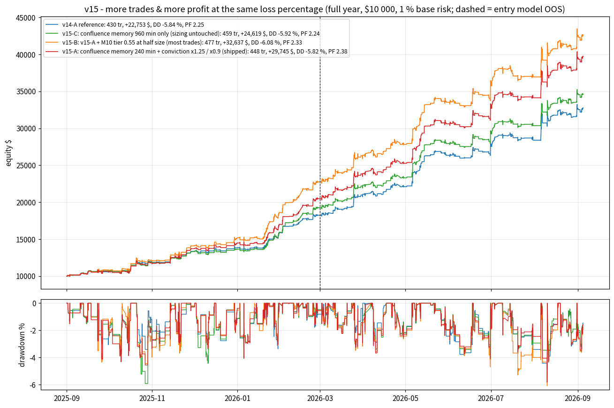
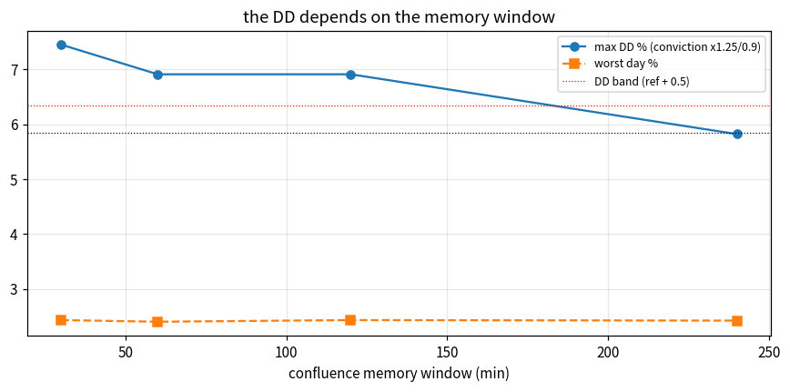
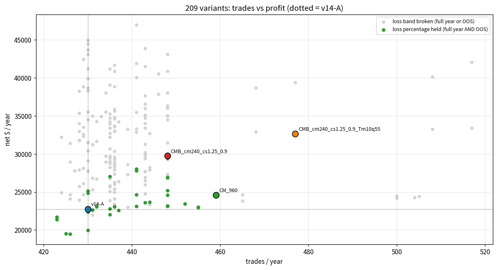
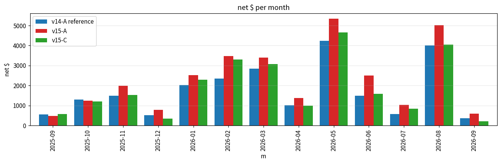

# MORE TRADES & MORE PROFIT AT THE SAME LOSS PERCENTAGE (v15) — for the v14-A trader

**Question.**  The v14-A trader (run_trader.bat: regime ladder + asymmetric martingale) takes **430 trades a year** (Sep 2025 -> Sep 2026: net **+22,753 $**, +227.5 %, max DD -5.84 %, PF 2.249, win 74.7 %, stop-outs 24.9 %, worst day -1.99 %, OOS PF 2.15).  Make it take **more trades** and earn **more profit** while **keeping the loss percentage** (stop-out rate, win rate, max DD, worst day, PF) where it is.

**Answer in one line.**  Two levers, both built on the one signal the diagnosis found (plans whose zone is CONFLUENT with another timeframe win 82 % vs 71 % for the rest, in-sample AND out-of-sample): (1) **confluence memory** - a zone counts as confluent when a plan of another timeframe on that level was active within the last N minutes, not only right now, so more zones are judged by the looser confluence bar (`confluence_memory_min`); (2) **conviction sizing** - confluent plans x1.25, plain plans x0.9 (`confluent_risk_scale` / `plain_risk_scale`).  Together = **v15-A: 448 trades (+18), net +29,745 $ (+31 %), OOS net +19,264 $ (+33 %), max DD -5.82 % (ref -5.84), PF 2.375, win 74.8 %, stop-outs 24.8 %, worst day -2.42 % (ref -1.99), OOS PF 2.26, 13/13 months** - every loss metric inside the band on the full year and on the OOS half, and ahead of v14-A on net $ and OOS PF in 6/6 stress scenarios.  **v15-B** adds an M10 second tier (quality 0.55-0.57 at half size): 477 trades, +32,637 $, DD -6.08 %, OOS PF 2.12.  **v15-C** (memory 960 min alone, sizing untouched): 459 trades, +24,619 $, worst day unchanged - the choice when the worst-day rise of the sizing (-1.99 -> -2.42 %) is not acceptable.  Tiered admission of quality / cost rejects, re-arming after a stop and entering in front of the zone were measured and rejected (sections 1 and 3).

---

## 0. Method

* **Reference** = v14-A exactly as shipped (`run_v15_diag.py` reproduces FINAL_BACKTEST_V14 byte for byte: 430 trades, +227.53 %, DD -5.84).  Full-year selection streams `sel_v10_<TF>.pkl`, M1 portfolio simulator, real per-minute spread, $7/lot commission, $0.10 stop slippage, swaps, 1 % base risk on $10 000, mirror orders, v13 regime ladder, v14 per-TF martingale, loss rules 4.5 % / 9 %.
* **Honesty.**  The entry model was trained until 2026-03-01: Sep 2025 - Feb 2026 is in-sample, Mar - Sep 2026 out-of-sample.  Every variant is judged on both halves.
* **Loss percentage held** (`hold_loss`, full year): stop-out rate <= ref + 2 pt, win rate >= ref - 3 pt, max DD <= ref + 0.5 pt, worst day >= ref - 0.5 pt, PF >= ref - 0.10; `hold_oos`: stop rate / win rate / PF on the OOS half + the DD condition.  `more_trades`: n > ref.  `more_profit`: net $ AND OOS net $ > ref.  score = the four together.
* Steps: (1) diagnosis `run_v15_diag.py`; (2) four new simulator levers, defaults byte-identical to v14 (parity exact), 7 unit tests + 2 fake-MT5 tests; (3) grid `run_v15_levers.py`: 209 full-year runs, resumable (one json per run), autosaved to GitHub every 4 min (survived three sandbox resets); (4) stress x6 + walk-forward; (5) `backtest_v15_final.py` from the bat strings; this report `make_v15_report.py`.  **140 tests pass.**

---

## 1. Diagnosis — where are the trades, and what is left outside?

Funnel of the v14-A reference (unique POIs shown by the scanner -> the last stage reached):

| stage                      |   H1 |   M10 |   M15 |   M30 |   M5 |
|:---------------------------|-----:|------:|------:|------:|-----:|
| order placed, never filled |   33 |   320 |    94 |    78 |  439 |
| skipped: overlaps open     |    1 |     2 |     3 |     0 |   11 |
| skipped: overlaps pending  |    2 |     5 |     0 |     2 |    0 |
| skipped: trade filter      |   95 |   444 |   415 |   164 | 1344 |
| traded                     |   14 |   148 |    51 |    39 |  178 |

Would-be outcome of the POIs the trade filter rejects (stand-alone plan replayer, order live while the slot shows the POI; the same replayer agrees with the simulator on 95.6 % of the traded population's signs):

| tf   | reason   |   pois |   filled |   fill_% |   win % |   avg_R |   sum_R |   oos_sum_R |
|:-----|:---------|-------:|---------:|---------:|--------:|--------:|--------:|------------:|
| H1   | quality  |    123 |        7 |      5.7 |    42.9 |  -0.235 |   -1.64 |       -2.85 |
| M10  | quality  |    626 |       59 |      9.4 |    72.9 |   0.102 |    6.02 |        0.62 |
| M15  | quality  |    478 |       50 |     10.5 |    46   |  -0.363 |  -18.14 |       -9.95 |
| M30  | quality  |    216 |       11 |      5.1 |    54.5 |  -0.083 |   -0.92 |        1.25 |
| M5   | cost_r   |    981 |       73 |      7.4 |    58.9 |  -0.109 |   -7.95 |       -3.8  |
| M5   | quality  |    489 |       26 |      5.3 |    50   |  -0.252 |   -6.56 |       -3.66 |
| M5   | session  |    156 |       22 |     14.1 |    72.7 |   0.147 |    3.23 |       -0.31 |

* Only **M10 quality 0.50-0.57** carries a (thin) positive edge (+0.10 R, OOS +0.6 R on 24 fills); M15 / M5 / H1 quality rejects lose 0.24-0.36 R per fill; the M5 cost band 0.08-0.12 is flat.  **Admission relaxation is exhausted** (as v11 / v12 found) - a tier can add trades, not profit.
* **Re-arming a zone after a stop-out is dead**: 106 of 107 stopped plans have the price through the entry at the stop -> 1 re-fill in the year.
* **Entering in front of the zone** (0.1-0.3 of the zone height) fills 4-15 % of the never-filled orders at -0.04..+0.09 R -> dead (as v11).
* **The signal**: plans whose zone overlaps an active plan of another timeframe (CONFLUENT, judged by the looser confluence filter since v12):

| population                                     |   trades |   win % |   stop % |   avg R |   net $ |   OOS win % |
|:-----------------------------------------------|---------:|--------:|---------:|--------:|--------:|------------:|
| v14-A confluent (active now)                   |      153 |    81.7 |     17.6 |   0.469 |   13349 |        84   |
| v14-A plain                                    |      277 |    70.8 |     28.9 |   0.177 |    9404 |        72.5 |
| v15-A confluent (active now or within 240 min) |      210 |    79.5 |     20   |   0.373 |   21962 |        82.4 |
| v15-A plain                                    |      238 |    70.6 |     29   |   0.2   |    7783 |        71.5 |

  It holds in-sample and out-of-sample (IS confluent: n 78 win 79.5 % sl 19.2 % avg R +0.492 sum R +38.4 net +4793 $; OOS confluent: n 75 win 84.0 % sl 16.0 % avg R +0.445 sum R +33.4 net +8556 $).  Hence the two levers: widen the confluent population (memory) and size by conviction.

---

## 2. New levers (all default to the v14 behaviour; simulator and live bot share the code)

* `confluence_memory_min=N` (+ `confluence_memory_kind=all|open|pending`) - a plan of ANOTHER timeframe (same side, zone overlap >= 50 %) that left the books within the last N minutes still counts as confluence evidence.  The live bot persists the memory in `trader_state.json` (restored on restart).
* `confluent_risk_scale` / `plain_risk_scale` - sizing multipliers on confluent / plain plans (on top of the regime and martingale scales).
* `tier_filter=<filter string>` + `tier_risk_scale` - a plan that fails the trade / confluence filter but passes this bar is traded at the reduced size (only the TFs listed).
* `mart_confluent_only` - martingale step-ups only for confluent plans (tested: -3 k$, rejected).

---

## 3. Grid (209 runs)

Scores: {1: 47, 2: 127, 3: 11, 4: 24}.  All 24 variants with score 4/4 (more trades, more profit, loss band held on the full year AND OOS):

| variant                      |   trades |   net $ |   OOS net $ |   max DD % |    PF |   win % |   stop % |   worst day % |   OOS PF |   OOS stop % |   months + |   max risk % |   ret/DD |   score |
|:-----------------------------|---------:|--------:|------------:|-----------:|------:|--------:|---------:|--------------:|---------:|-------------:|-----------:|-------------:|---------:|--------:|
| CMB_cm240_cs1.25_0.9_Tm10q55 |      477 | 32636.7 |     19891.7 |      -6.08 | 2.327 |    74.6 |     24.7 |         -2.33 |    2.116 |         25.2 |         13 |         2.81 |    53.68 |       4 |
| CMB_cm240_cs1.25_1.0         |      448 | 29697.7 |     19432.7 |      -5.96 | 2.28  |    74.8 |     24.8 |         -2.43 |    2.188 |         23.7 |         13 |         2.81 |    49.83 |       4 |
| CMB_cm240_cs1.25_0.9         |      448 | 29745   |     19264.3 |      -5.82 | 2.375 |    74.8 |     24.8 |         -2.42 |    2.259 |         23.7 |         13 |         2.81 |    51.11 |       4 |
| CMB_cm240_cs1.25_1.0_mc2     |      448 | 29431.8 |     19172.7 |      -5.99 | 2.273 |    74.8 |     24.8 |         -2.43 |    2.178 |         23.7 |         13 |         1.99 |    49.14 |       4 |
| CMB_cm240_cs1.25_0.9_mc2     |      448 | 29589.2 |     19108.6 |      -5.84 | 2.369 |    74.8 |     24.8 |         -2.42 |    2.25  |         23.7 |         13 |         1.99 |    50.67 |       4 |
| CMB_cm240_cs1.25_1.0_mo3     |      441 | 28039.4 |     17881.2 |      -6.01 | 2.228 |    74.6 |     24.9 |         -2.44 |    2.102 |         24.1 |         13 |         2.79 |    46.65 |       4 |
| CMB_cm240_cs1.25_0.9_mo3     |      441 | 27819.3 |     17515.8 |      -5.73 | 2.308 |    74.6 |     24.9 |         -2.44 |    2.157 |         24.1 |         13 |         2.8  |    48.55 |       4 |
| CMB_cm240o_cs1.25_0.9        |      435 | 27044.7 |     17324.7 |      -5.76 | 2.377 |    74.7 |     24.8 |         -2.46 |    2.245 |         23.8 |         13 |         2.73 |    46.95 |       4 |
| CMB_cm240_cs1.25_0.8         |      448 | 26954.8 |     17191.8 |      -5.47 | 2.365 |    74.3 |     25.2 |         -2.46 |    2.253 |         24.1 |         13 |         2.81 |    49.28 |       4 |
| CMB_cm240_cs1.25_0.8_mc2     |      448 | 26901.3 |     17138.2 |      -5.48 | 2.363 |    74.3 |     25.2 |         -2.46 |    2.249 |         24.1 |         13 |         1.97 |    49.09 |       4 |
| CMB_cm240_cs1.25_1.0_rr75    |      448 | 25175.1 |     16443.9 |      -5.99 | 2.379 |    74.8 |     24.8 |         -2.31 |    2.344 |         23.7 |         13 |         2.8  |    42.03 |       4 |
| CMB_cm240_cs1.25_0.9_rr75    |      448 | 24607.8 |     15808.6 |      -5.89 | 2.443 |    74.8 |     24.8 |         -2.31 |    2.391 |         23.7 |         13 |         2.79 |    41.78 |       4 |
| CM_960                       |      459 | 24618.9 |     15377.1 |      -5.92 | 2.236 |    74.7 |     24.8 |         -2.01 |    2.128 |         23.3 |         13 |         2.23 |    41.59 |       4 |
| CMB_cm240_cs1.25_0.8_mo3     |      441 | 24666.6 |     15124.1 |      -5.91 | 2.279 |    74.1 |     25.4 |         -2.49 |    2.122 |         24.6 |         13 |         2.8  |    41.74 |       4 |
| CMB_cm240_cs1.25_0.8_rr75    |      448 | 23192.2 |     15078   |      -5.38 | 2.48  |    74.1 |     25.4 |         -2.26 |    2.469 |         24.1 |         13 |         2.8  |    43.11 |       4 |
| CM_120                       |      443 | 23618.6 |     15005.3 |      -5.95 | 2.243 |    74.5 |     25.1 |         -1.97 |    2.141 |         23.6 |         13 |         2.24 |    39.7  |       4 |
| CM_240_pend                  |      444 | 23674   |     14966.2 |      -5.79 | 2.238 |    74.5 |     25   |         -2    |    2.138 |         23.6 |         13 |         2.25 |    40.89 |       4 |
| CM_120_open                  |      432 | 23062   |     14814.2 |      -5.82 | 2.263 |    74.8 |     24.8 |         -1.99 |    2.173 |         23.6 |         13 |         2.24 |    39.63 |       4 |
| CM_60                        |      436 | 23072.9 |     14794.9 |      -5.95 | 2.257 |    74.5 |     25   |         -1.95 |    2.171 |         23.5 |         13 |         2.25 |    38.78 |       4 |
| CM_60_pend                   |      436 | 23072.9 |     14794.9 |      -5.95 | 2.257 |    74.5 |     25   |         -1.95 |    2.171 |         23.5 |         13 |         2.25 |    38.78 |       4 |
| CM_960_open                  |      441 | 23098.6 |     14681   |      -5.45 | 2.255 |    75.1 |     24.5 |         -1.99 |    2.15  |         23.4 |         13 |         2.24 |    42.38 |       4 |
| CM_480                       |      452 | 23457.8 |     14580.5 |      -5.92 | 2.212 |    74.6 |     25   |         -2.01 |    2.104 |         23.6 |         13 |         2.25 |    39.62 |       4 |
| TIER_m5c12_0.35              |      455 | 23012.8 |     14576.9 |      -5.81 | 2.186 |    73.8 |     25.7 |         -2    |    2.092 |         24.8 |         13 |         2.25 |    39.61 |       4 |
| CM_30                        |      435 | 22805   |     14527.1 |      -5.95 | 2.245 |    74.5 |     25.1 |         -1.95 |    2.153 |         23.6 |         13 |         2.25 |    38.33 |       4 |

Best three per family by OOS net $ (any score):

| family            | variant                 |   trades |   net $ |   OOS net $ |   max DD % |    PF |   win % |   stop % |   worst day % |   OOS PF |   OOS stop % |   months + |   max risk % |   ret/DD |   score |
|:------------------|:------------------------|---------:|--------:|------------:|-----------:|------:|--------:|---------:|--------------:|---------:|-------------:|-----------:|-------------:|---------:|--------:|
| DD buy-back       | DD_mc2                  |      430 | 22369.3 |     14148.9 |      -5.62 | 2.234 |    74.7 |     24.9 |         -1.99 |    2.132 |         23.7 |         13 |         2    |    39.8  |       2 |
| DD buy-back       | DD_mo3                  |      423 | 21684.5 |     13481.5 |      -5.89 | 2.205 |    74.5 |     25.1 |         -1.99 |    2.076 |         24.1 |         13 |         2.25 |    36.82 |       2 |
| DD buy-back       | DD_mo3_mc2              |      423 | 21359.8 |     13151.7 |      -5.66 | 2.195 |    74.5 |     25.1 |         -1.99 |    2.059 |         24.1 |         13 |         2    |    37.74 |       2 |
| combination       | CMB_cm120_cs2.0_0.6     |      441 | 46987.9 |     33245.6 |      -9.95 | 2.805 |    75.1 |     24.5 |         -3.94 |    2.738 |         24   |         12 |         3.02 |    47.22 |       2 |
| combination       | CMB_cm120_cs1.75_0.75   |      443 | 43852.4 |     29786.1 |      -8.92 | 2.676 |    75.6 |     23.9 |         -3.46 |    2.542 |         23.6 |         13 |         3    |    49.16 |       2 |
| combination       | CMB_cm120_cs2.0_0.6_mc2 |      441 | 41923.2 |     28928.4 |      -9.33 | 2.708 |    75.1 |     24.5 |         -3.84 |    2.624 |         24   |         12 |         2.01 |    44.93 |       2 |
| confluence memory | CM_960                  |      459 | 24618.9 |     15377.1 |      -5.92 | 2.236 |    74.7 |     24.8 |         -2.01 |    2.128 |         23.3 |         13 |         2.23 |    41.59 |       4 |
| confluence memory | CM_120                  |      443 | 23618.6 |     15005.3 |      -5.95 | 2.243 |    74.5 |     25.1 |         -1.97 |    2.141 |         23.6 |         13 |         2.24 |    39.7  |       4 |
| confluence memory | CM_240_pend             |      444 | 23674   |     14966.2 |      -5.79 | 2.238 |    74.5 |     25   |         -2    |    2.138 |         23.6 |         13 |         2.25 |    40.89 |       4 |
| conviction sizing | CS_2.0_1.0              |      430 | 44933.5 |     32175.2 |      -8.69 | 2.478 |    75.1 |     23.7 |         -4.56 |    2.418 |         23.2 |         13 |         2.99 |    51.71 |       1 |
| conviction sizing | CS_2.0_0.9              |      430 | 43112.7 |     30482.8 |      -8.65 | 2.545 |    74.9 |     24   |         -4.59 |    2.472 |         23.7 |         13 |         3.01 |    49.84 |       1 |
| conviction sizing | CS_2.0_0.75             |      430 | 44475   |     30329.9 |      -8.26 | 2.759 |    75.3 |     24.2 |         -3.95 |    2.587 |         23.7 |         13 |         3    |    53.84 |       1 |
| ref               | ref                     |      430 | 22753   |     14524   |      -5.84 | 2.249 |    74.7 |     24.9 |         -1.99 |    2.154 |         23.7 |         13 |         2.24 |    38.96 |       2 |
| tier              | TIER_m5c12_0.35         |      455 | 23012.8 |     14576.9 |      -5.81 | 2.186 |    73.8 |     25.7 |         -2    |    2.092 |         24.8 |         13 |         2.25 |    39.61 |       4 |
| tier              | TIER_m10q55_0.5         |      465 | 24646.6 |     14510.6 |      -6.41 | 2.175 |    74.4 |     24.9 |         -2    |    1.976 |         25.1 |         13 |         2.25 |    38.45 |       1 |
| tier              | TIER_m5c12_0.5          |      455 | 22932.7 |     14449.7 |      -5.82 | 2.163 |    73.8 |     25.7 |         -1.99 |    2.062 |         24.8 |         13 |         2.24 |    39.4  |       3 |

What the families say:

* **Confluence memory alone** adds 5-29 trades (30-960 min) with the loss profile untouched (win 74.5-75.1 %, stop 24.5-25.1 %, worst day -1.95..-2.01 %) and +0.1..+1.9 k$.
* **Conviction sizing alone** at x1.25 (plain 0.75-0.8) adds +2-2.4 k$ at PF 2.45-2.51 but DD 6.2 %; x1.5 and above pushes the DD to 7.2-8.7 % and the worst day to -2.8..-4.6 % -> out.
* **Tiers** (M10 0.55 / 0.53, HTF 0.55, M5 cost 0.12): +25-75 trades, PF 2.07-2.19, DD 5.8-6.7 %, OOS PF 1.9-2.1 -> trades without profit; only `M10:min_quality=0.55` x0.5 survives as the v15-B add-on.
* **DD buy-backs** (max_open 3, range risk x0.75, martingale cap 2 %) cost 0.4-2.8 k$ each; the cap only binds at 2 % base risk.
* **Combination memory 240 + x1.25/0.9** is the only sizing variant whose DD stays inside the band; with 30/60/120-min windows the same sizing reaches DD 6.8-7.4 % (chart below) - the 240-min window is where the extra confluent plans dilute the clustered losers.  The worst day rises from -1.99 to -2.42 % in every x1.25 combination.

---

## 4. Robustness

**Walk-forward** (`walkforward_v15.py`, trade lists split at 2026-03-01, worst day in R): Spearman IS->OOS of the deltas vs ref - trades +0.90, net $ +0.84, PF +0.27; 126/208 variants pass the band on both halves; of the 12 variants one would have chosen on the first half, 10 pass on the second.  The extra trades and the extra dollars are population properties.

| variant                      |   IS_n |   IS_net_$ |   IS_PF |   IS_sl_% | IS_pass   |   OOS_n |   OOS net $ |   OOS PF |   OOS stop % |   OOS_win_% | OOS_pass   |
|:-----------------------------|-------:|-----------:|--------:|----------:|:----------|--------:|------------:|---------:|-------------:|------------:|:-----------|
| ref                          |    206 |       8229 |   2.461 |      26.2 | False     |     224 |       14524 |    2.154 |         23.7 |        76.3 | False      |
| CMB_cm240_cs1.25_0.9         |    216 |      10481 |   2.655 |      25.9 | True      |     232 |       19264 |    2.259 |         23.7 |        76.3 | True       |
| CMB_cm240_cs1.25_0.9_Tm10q55 |    239 |      12745 |   2.881 |      24.3 | True      |     238 |       19892 |    2.116 |         25.2 |        74.4 | True       |
| CM_960                       |    223 |       9242 |   2.469 |      26.5 | True      |     236 |       15377 |    2.128 |         23.3 |        76.7 | True       |
| CS_1.25_0.8                  |    206 |       8870 |   2.672 |      27.2 | False     |     224 |       16267 |    2.355 |         24.1 |        75.9 | False      |
| CM_240                       |    216 |       8724 |   2.461 |      26.4 | True      |     232 |       14381 |    2.097 |         23.7 |        76.3 | False      |

**Stress x6** (spread x2, commission x2, SL slippage x3, worst-case intrabar path, 0.5 % and 2 % base risk):

| scenario       | variant                      |   trades |   net $ |   OOS net $ |   max DD % |    PF |   win % |   stop % |   worst day % |   OOS PF |   months + |
|:---------------|:-----------------------------|---------:|--------:|------------:|-----------:|------:|--------:|---------:|--------------:|---------:|-----------:|
| spread_x2      | v14-A                        |      315 |   12234 |        5579 |      -6.15 | 1.998 |    71.7 |     27.6 |         -1.95 |    1.683 |         12 |
| spread_x2      | CMB_cm240_cs1.25_0.9         |      327 |   15746 |        7128 |      -6.3  | 2.108 |    72.2 |     26.6 |         -4.55 |    1.746 |         11 |
| spread_x2      | CMB_cm240_cs1.25_0.9_Tm10q55 |      362 |   16406 |        6715 |      -8.33 | 2.026 |    72.1 |     26.5 |         -4.68 |    1.61  |         11 |
| spread_x2      | CM_960                       |      337 |   14090 |        6209 |      -7.18 | 2.067 |    72.1 |     27.3 |         -2.17 |    1.721 |         12 |
| commission_x2  | v14-A                        |      411 |   19775 |       11867 |      -6.03 | 2.17  |    74.2 |     25.3 |         -1.98 |    2.007 |         13 |
| commission_x2  | CMB_cm240_cs1.25_0.9         |      429 |   25182 |       15463 |      -6.08 | 2.276 |    74.6 |     24.9 |         -2.44 |    2.112 |         13 |
| commission_x2  | CMB_cm240_cs1.25_0.9_Tm10q55 |      459 |   28421 |       16937 |      -6.2  | 2.278 |    74.5 |     24.8 |         -2.47 |    2.048 |         13 |
| commission_x2  | CM_960                       |      439 |   22257 |       13110 |      -5.82 | 2.208 |    74.5 |     25.1 |         -1.99 |    2.034 |         13 |
| slip_x3        | v14-A                        |      430 |   20958 |       13072 |      -5.56 | 2.161 |    74.7 |     24.9 |         -2.06 |    2.057 |         13 |
| slip_x3        | CMB_cm240_cs1.25_0.9         |      448 |   27508 |       17665 |      -5.65 | 2.287 |    74.8 |     24.8 |         -2.48 |    2.181 |         13 |
| slip_x3        | CMB_cm240_cs1.25_0.9_Tm10q55 |      477 |   31057 |       18791 |      -6.11 | 2.263 |    74.6 |     24.7 |         -2.43 |    2.061 |         13 |
| slip_x3        | CM_960                       |      459 |   23159 |       14197 |      -6.13 | 2.169 |    74.7 |     24.8 |         -2.09 |    2.061 |         13 |
| worst_intrabar | v14-A                        |      430 |   23054 |       15124 |      -5.87 | 2.275 |    74.7 |     24.9 |         -2    |    2.212 |         13 |
| worst_intrabar | CMB_cm240_cs1.25_0.9         |      448 |   29824 |       19699 |      -5.86 | 2.388 |    74.8 |     24.8 |         -2.38 |    2.297 |         13 |
| worst_intrabar | CMB_cm240_cs1.25_0.9_Tm10q55 |      477 |   33457 |       20839 |      -6.1  | 2.35  |    74.4 |     24.9 |         -2.33 |    2.165 |         13 |
| worst_intrabar | CM_960                       |      459 |   25277 |       16142 |      -5.95 | 2.265 |    74.7 |     24.8 |         -2.01 |    2.183 |         13 |
| risk0.5        | v14-A                        |      422 |    8791 |        4699 |      -3.86 | 2.213 |    71.1 |     28.4 |         -1.68 |    2.022 |         13 |
| risk0.5        | CMB_cm240_cs1.25_0.9         |      440 |    9634 |        5142 |      -3.19 | 2.225 |    71.4 |     28.2 |         -1.87 |    2.045 |         13 |
| risk0.5        | CMB_cm240_cs1.25_0.9_Tm10q55 |      468 |   11172 |        5804 |      -3.14 | 2.371 |    72   |     27.4 |         -1.14 |    2.135 |         13 |
| risk0.5        | CM_960                       |      450 |    9124 |        4716 |      -3.78 | 2.189 |    71.6 |     28   |         -1.7  |    2.004 |         13 |
| risk2          | v14-A                        |      430 |   79751 |       58499 |      -9.87 | 2.053 |    76.3 |     23.3 |         -4.01 |    1.956 |         13 |
| risk2          | CMB_cm240_cs1.25_0.9         |      444 |   84467 |       62180 |     -14.07 | 1.984 |    74.5 |     23.4 |         -5.85 |    1.882 |         13 |
| risk2          | CMB_cm240_cs1.25_0.9_Tm10q55 |      474 |   94365 |       65815 |     -14.81 | 1.925 |    74.5 |     23.4 |         -5.82 |    1.77  |         13 |
| risk2          | CM_960                       |      459 |   76837 |       57721 |     -12.01 | 2.054 |    75.6 |     23.3 |         -4.52 |    1.998 |         13 |

* v15-A beats v14-A on net $ and OOS PF in 6/6 scenarios; the DD stays within +0.5 pt in 5/6 (2 % base risk: 14.1 vs 9.9 % - x1.25 on 2 % is 2.5 % per confluent plan, outside the spec; at 2 % risk use v15-C).  Weak point: at double spread the worst day is -4.55 % vs -1.95 % (one day of clustered confluent losers at the bigger size) and 11/13 months are positive (ref 12/13).
* v15-C (memory only) keeps the worst day of v14-A in 6/6 scenarios and adds trades and dollars in 6/6 - the robust floor.

---

## 5. Final backtest of the shipped strings (`backtest_v15_final.py`, read from `run_trader.bat`)

v15-A: **448 trades, net +29,745 $ (+297.45 %), max DD -5.82 %, PF 2.375, win 74.8 %, stop-outs 24.8 %, worst day -2.42 %, OOS net +19,264 $, OOS PF 2.26, 13/13 months** (v14-A reference from the same strings minus the v15 keys: 430 / +22,753 $ / DD -5.84 / PF 2.249).  Identical to the study json; details, month table and the five worst trades in `FINAL_BACKTEST_V15.md`.

---

## 6. Recommendation and honest reading

* **Ship v15-A** (done in `run_trader.bat`): +18 trades, +31 % net, OOS PF 2.15 -> 2.26, the stop-out and win rates unchanged to the decimal, max DD unchanged.  The price is a worst day of -2.42 % instead of -1.99 % and a max single-plan risk of 2.81 % of equity (martingale step x conviction) instead of 2.24 %.
* **If the worst-day / per-plan risk rise is not wanted**: v15-C (`confluence_memory_min=960`, drop the two scale keys) - more trades, +8 % net, loss profile byte-for-byte.
* **If more trades matter more than OOS PF**: v15-B (+ `tier_filter=M10:min_quality=0.55,tier_risk_scale=0.5`).
* The gains are modest in R terms (avg R per trade is unchanged at 0.28): v15 earns more because it puts more money on the plans that were already winning and lets a few more of them through, not because it found a new edge.  The next real step up needs new information for the entry model (bearish gold months, sells OOS), not more admission rules.

## Files

`study_results/v15_levers.csv` (grid), `v15_levers/*.json|_trades.csv|_equity.csv` (every run), `v15_stress.csv` / `v15_stress_table.csv`, `v15_walkforward.csv|json`, `v15_diag/*` (funnel, rejected-POI replay, re-arm, front offset), `final_v15/*` + `FINAL_BACKTEST_V15.md`, charts `charts/v15_*.png`, scripts `run_v15_diag.py`, `run_v15_levers.py`, `run_v15_all.sh`, `walkforward_v15.py`, `backtest_v15_final.py`, `verify_bat_v15.py`, `smoke_v15.py`, `v15_common.py`.
