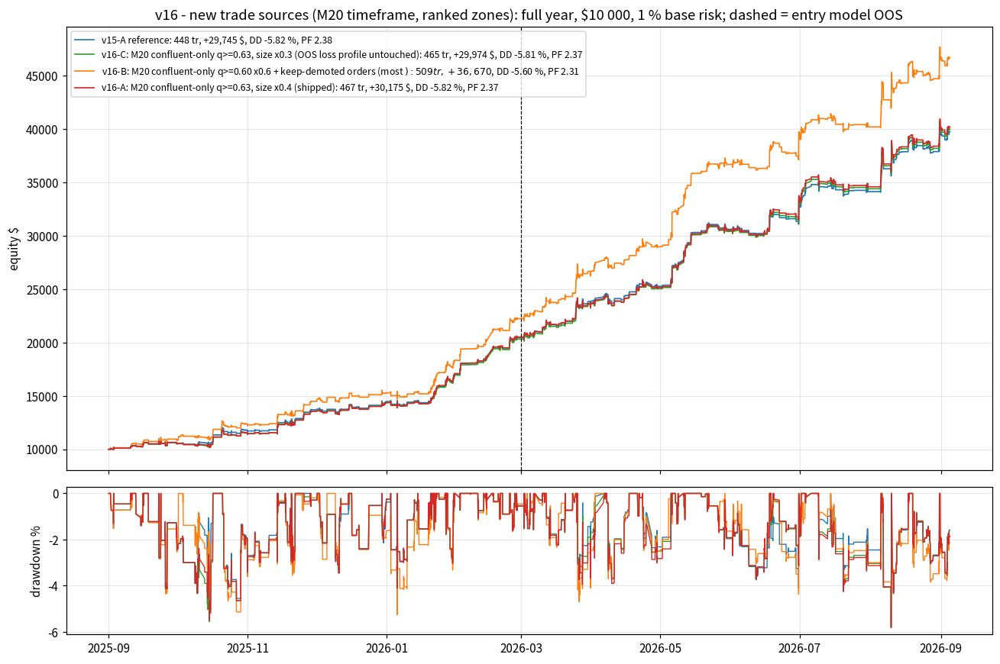
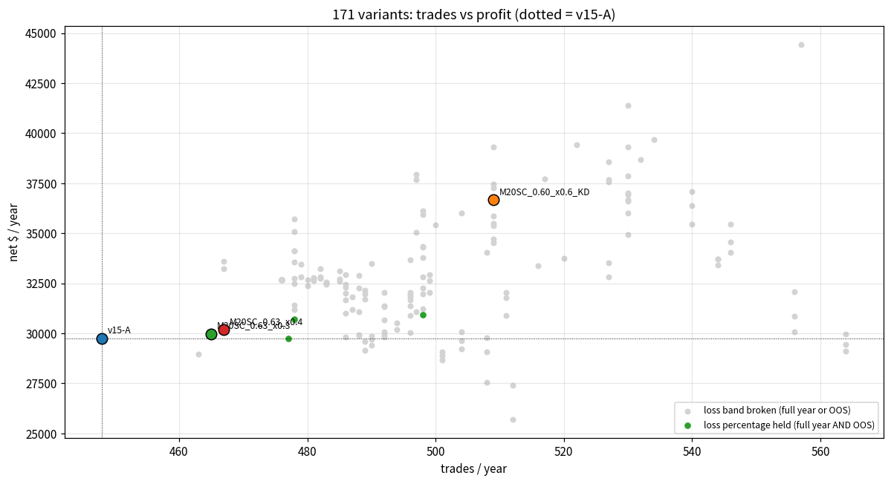
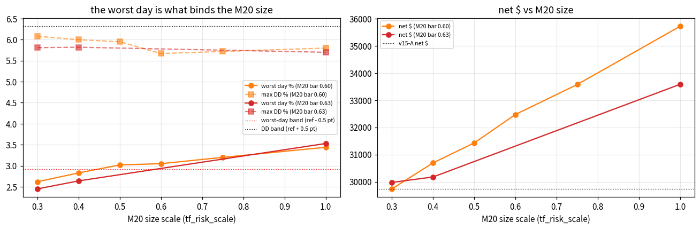
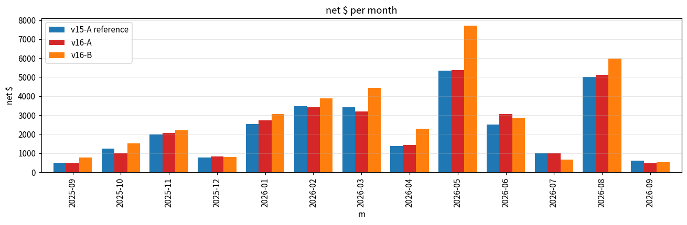

# MORE TRADES & MORE PROFIT AT THE SAME LOSS PERCENTAGE (v16) — NEW TRADE SOURCES for the v15-A trader

**Question.**  The v15-A trader (run_trader.bat: regime ladder + asymmetric martingale + confluence memory + conviction sizing) takes **448 trades a year** (Sep 2025 -> Sep 2026: net **+29,745 $**, +297.4 %, max DD -5.82 %, PF 2.375, win 74.8 %, stop-outs 24.8 %, worst day -2.42 %, OOS net +19,264 $, OOS PF 2.26).  Make it take **more trades** and earn **more profit** while **keeping the loss percentage** (stop-out rate, win rate, max DD, worst day, PF) where it is.  v11 / v12 / v15 had shown that every admission relaxation (quality bars, cost bars, sessions, tiers, re-entry, re-arm, front offset) is exhausted - so v16 looked for trades the trader had **never been shown**.

**Answer in one line.**  Two new sources were recorded over the whole year: (A) the scanner's **2nd- and 3rd-ranked zones** per slot (the trader only ever saw the winner) and (B) a **new M20 timeframe** between M15 and M30.  (A) is dead: genuine rank-2 fills lose money at every quality bar (section 3).  (B) pays only when the M20 zone **confirms a level another timeframe already trades** (confluent) - plain M20 zones lose - and its size has to stay small because every M20 leg joins the same clustered confluent stop-outs that define the worst day.  Shipped = **v16-A: M20 confluent-only at quality >= 0.63, sized x0.4: 467 trades (+19), net +30,175 $ (+1.4 %), OOS net +19,661 $ (+2.1 %), max DD -5.82 % (ref -5.82), PF 2.365, win 75.2 %, stop-outs 24.4 %, worst day -2.64 % (ref -2.42), OOS PF 2.25, 13/13 months** - every loss metric inside the band on the full year and on the OOS half, ahead of v15-A on trades AND net $ AND OOS net $ in 6/6 stress scenarios.  The gain is **small and robust, not big**: 21 M20 trades, 86 % win, +1,052 $.  **v16-B** (most money, loss bands 0.02-0.15 pt outside): M20 at 0.60 x0.6 plus keep-demoted orders = 509 trades, +36,670 $ (+23 %), DD -5.60, worst day -2.94 %, OOS PF 2.19.  **v16-C** (x0.3): 465 trades, +29,974 $, worst day -2.45 % - the OOS loss profile untouched to the trade.

---

## 0. Method

* **Reference** = v15-A exactly as shipped: the v16 streams' rank-1 rows reproduce FINAL_BACKTEST_V15 byte for byte (448 trades, +297.45 %, DD -5.82).  M1 portfolio simulator, real per-minute spread, $7/lot commission, $0.10 stop slippage, swaps, 1 % base risk on $10 000, mirror orders, v13 regime ladder, v14 per-TF martingale, v15 confluence memory + conviction sizing, loss rules 4.5 % / 9 %.
* **New streams** `record_selections_v16.py` -> `sel_v16_<TF>.pkl`: the scanner re-run over the whole year keeping the **top-3 qualified candidates per side per slot** (`rank` column; rank-1 rows identical to the v10 streams) for M5 / M10 / M15 / **M20** / M30 / H1 (171 full-year replays in the grid, 51 monthly chunks, every chunk committed as it finished - the recording survived 4 sandbox resets).
| tf   |   set events rank 1 |   rank 2 |   rank 3 |   unique POIs rank 1 |   unique POIs only ever rank 2/3 |
|:-----|--------------------:|---------:|---------:|---------------------:|---------------------------------:|
| M5   |                9334 |     4527 |     1294 |                 1972 |                              413 |
| M10  |                4317 |     2109 |      535 |                  919 |                              171 |
| M15  |                2851 |     1124 |      199 |                  563 |                               86 |
| M20  |                2040 |      902 |      198 |                  408 |                               81 |
| M30  |                1524 |      640 |      157 |                  283 |                               53 |
| H1   |                 774 |      286 |       90 |                  145 |                               29 |

* **Honesty.**  The entry model was trained until 2026-03-01: Sep 2025 - Feb 2026 is in-sample, Mar - Sep 2026 out-of-sample.  Every variant is judged on both halves.  M20 uses the SAME quality model (tf_minutes is a model feature: 20 lies between the trained 15 and 30 - interpolation, not extrapolation).
* **Loss percentage held** (`hold_loss`, full year): stop-out rate <= ref + 2 pt, win rate >= ref - 3 pt, max DD <= ref + 0.5 pt, worst day >= ref - 0.5 pt, PF >= ref - 0.10; `hold_oos`: the same on the OOS half.  `more_trades`: n > ref.  `more_profit`: net $ AND OOS net $ > ref.  score = the four together.
* Steps: (1) recorder + M20 timeframe; (2) simulator levers with byte-identical defaults (`max_rank`, `rank2_filter`, `rank2_risk_scale`, `rank2_tfs`, `rank2_confluent_only`, `tf_risk_scale`, M20 in every TF-scoped key), 7 + 2 unit tests, parity exact; (3) grid `run_v16_levers.py` (resumable, autosaved to GitHub every 4 min, 9 sandbox resets, nothing lost); (4) stress x6 + walk-forward; (5) port to `trader.py` / `run_trader.bat`, fake-MT5 tests; (6) `backtest_v16_final.py` from the bat strings; this report `make_v16_report.py`.  **157 tests pass.**

---

## 1. New levers (all default to the v15 behaviour; simulator and live bot share the code)

* `max_rank=K` - the trader may place the zones ranked 2..K of a slot too (same-TF overlap with a higher rank is deduped as before); `rank2_filter=<filter string>`, `rank2_risk_scale`, `rank2_tfs=M10|M15`, `rank2_confluent_only` gate them.  A POI that is DEMOTED from rank 1 to rank 2 keeps its pending order instead of being cancelled as 'replaced' (the **keep-demoted** effect, isolated as `KD` = max_rank 2 with an unreachable rank-2 bar).
* **M20 timeframe** - `--timeframes` may carry M20; it has its own rule in the trade filter (plain bar) and the confluence filter (confluent bar); `tf_risk_scale=M20:0.4` sizes one timeframe's plans; M20 may join `keep_replaced_tfs` and `mart_tfs`.
* **Live bot** (`trader.py`): `MultiTimeframeScanner.scan(top_k)` returns the ranked lists, a POI shown on any rank slot keeps its order, rank is persisted in `trader_state.json`.  A live/sim discrepancy was found and fixed by the fake-MT5 tests: the live bot marked a POI *traded* at order placement, the simulator at fill - a cancelled, unfilled order whose POI was shown again was never re-placed live.  Now `traded` is set on fill.

---

## 2. Grid (171 runs)

Scores: {1: 24, 2: 113, 3: 30, 4: 4}.  All 4 variants with score 4/4 (more trades, more profit, loss band held on the full year AND OOS) are the same family - M20 confluent-only at a reduced size:

| variant         |   trades |   net $ |   OOS net $ |   max DD % |    PF |   win % |   stop % |   worst day % |   OOS PF |   rank-2 tr |   rank-2 net $ |   M20 tr |   M20 net $ |   M20 win % |   score |
|:----------------|---------:|--------:|------------:|-----------:|------:|--------:|---------:|--------------:|---------:|------------:|---------------:|---------:|------------:|------------:|--------:|
| M20SC_0.55_x0.4 |      498 |   30913 |       20413 |      -6.32 | 2.338 |    74.9 |     24.5 |         -2.83 |    2.251 |           0 |              0 |       52 |        1807 |        76.9 |       4 |
| M20SC_0.60_x0.4 |      478 |   30693 |       20278 |      -6    | 2.359 |    74.7 |     24.9 |         -2.83 |    2.257 |           0 |              0 |       33 |        1643 |        75.8 |       4 |
| M20SC_0.63_x0.4 |      467 |   30175 |       19661 |      -5.82 | 2.365 |    75.2 |     24.4 |         -2.64 |    2.247 |           0 |              0 |       21 |        1052 |        85.7 |       4 |
| M20SC_0.63_x0.3 |      465 |   29974 |       19645 |      -5.81 | 2.369 |    75.1 |     24.5 |         -2.45 |    2.262 |           0 |              0 |       19 |         748 |        84.2 |       4 |

Best two per family by OOS net $ (any score):

| family                            | variant              |   trades |   net $ |   OOS net $ |   max DD % |    PF |   win % |   stop % |   worst day % |   OOS PF |   rank-2 tr |   rank-2 net $ |   M20 tr |   M20 net $ |   M20 win % |   score |
|:----------------------------------|:---------------------|---------:|--------:|------------:|-----------:|------:|--------:|---------:|--------------:|---------:|------------:|---------------:|---------:|------------:|------------:|--------:|
| M20 confluent-only                | M20C_0.50_KD         |      557 |   44434 |       30464 |      -8.08 | 2.238 |    75   |     24.4 |         -3.67 |    2.189 |           0 |              0 |       73 |        8252 |        80.8 |       2 |
| M20 confluent-only                | M20C_0.55_KD         |      530 |   41380 |       28472 |      -6.39 | 2.313 |    75.5 |     24   |         -3.64 |    2.243 |           0 |              0 |       54 |        5636 |        81.5 |       2 |
| M20 confluent-only, no martingale | M20N_0.55_KD         |      530 |   39294 |       26470 |      -5.93 | 2.267 |    75.1 |     24.3 |         -3.42 |    2.176 |           0 |              0 |       54 |        4392 |        81.5 |       3 |
| M20 confluent-only, no martingale | M20N_0.57_KD         |      517 |   37722 |       25577 |      -5.85 | 2.28  |    74.9 |     24.6 |         -3.42 |    2.198 |           0 |              0 |       42 |        3524 |        81   |       3 |
| M20 confluent-only, reduced size  | M20SC_0.55_x0.75_KD  |      530 |   37864 |       25493 |      -5.8  | 2.27  |    74.9 |     24.5 |         -3.04 |    2.185 |           0 |              0 |       54 |        3764 |        79.6 |       3 |
| M20 confluent-only, reduced size  | M20SC_0.60_x0.75_KD  |      509 |   37287 |       24880 |      -5.76 | 2.303 |    75   |     24.6 |         -3.08 |    2.187 |           0 |              0 |       34 |        3382 |        85.3 |       3 |
| M20 plain bar                     | M20_q55              |      527 |   33540 |       22609 |      -6.84 | 2.073 |    73.2 |     26   |         -4.65 |    2.002 |           0 |              0 |       80 |        2779 |        65   |       2 |
| M20 plain bar                     | M20_q60              |      490 |   33502 |       22147 |      -6.87 | 2.193 |    74.5 |     25.1 |         -3.54 |    2.052 |           0 |              0 |       45 |        2848 |        73.3 |       2 |
| M20 x rank-2 combination          | CMB_m20q60_r2q60_1.0 |      527 |   38572 |       25503 |      -6.37 | 2.143 |    74.8 |     24.9 |         -4.56 |    1.992 |          15 |            -65 |       44 |        3409 |        75   |       2 |
| M20 x rank-2 combination          | CMB_m20q60_r2q60_0.5 |      527 |   37670 |       24712 |      -6.08 | 2.152 |    74.8 |     24.9 |         -3.86 |    1.998 |          14 |            -57 |       44 |        3355 |        75   |       2 |
| keep-demoted only                 | KD_htf               |      476 |   32670 |       20872 |      -5.7  | 2.269 |    74.4 |     25.2 |         -2.91 |    2.125 |           0 |              0 |        0 |           0 |       nan   |       2 |
| keep-demoted only                 | KD                   |      476 |   32670 |       20872 |      -5.7  | 2.269 |    74.4 |     25.2 |         -2.91 |    2.125 |           0 |              0 |        0 |           0 |       nan   |       2 |
| rank-2 and 3 zones                | R3_q60_1.0           |      494 |   30505 |       18747 |      -6.1  | 2.125 |    74.1 |     25.5 |         -2.95 |    1.957 |          15 |           -425 |        0 |           0 |       nan   |       1 |
| rank-2 and 3 zones                | R3_q60_0.5           |      494 |   30177 |       18634 |      -6.26 | 2.155 |    74.1 |     25.5 |         -2.47 |    1.992 |          15 |           -171 |        0 |           0 |       nan   |       1 |
| rank-2 confluent-only             | R2C_q60_1.0_htf      |      479 |   33467 |       21599 |      -5.83 | 2.289 |    74.5 |     25.1 |         -2.97 |    2.152 |           6 |            310 |        0 |           0 |       nan   |       2 |
| rank-2 confluent-only             | R2C_q60_0.75_htf     |      479 |   32812 |       21199 |      -5.7  | 2.279 |    74.5 |     25.1 |         -2.9  |    2.143 |           6 |            245 |        0 |           0 |       nan   |       3 |
| rank-2 zones                      | R2_q60_1.0_htf       |      482 |   33221 |       21352 |      -6.38 | 2.264 |    74.5 |     25.1 |         -2.93 |    2.12  |          10 |           -256 |        0 |           0 |       nan   |       2 |
| rank-2 zones                      | R2_q55_0.5_htf       |      499 |   32947 |       21291 |      -6.36 | 2.213 |    73.1 |     26.5 |         -4.14 |    2.112 |          29 |           -786 |        0 |           0 |       nan   |       2 |
| ref                               | ref                  |      448 |   29745 |       19264 |      -5.82 | 2.375 |    74.8 |     24.8 |         -2.42 |    2.259 |           0 |              0 |        0 |           0 |       nan   |       2 |

---

## 3. Source A — the scanner's 2nd-ranked zones LOSE

Rank-2 admission at full size, by quality bar (`r2_n` = genuine rank-2 fills; the rest of the trade delta is the keep-demoted effect):

| variant     |   trades |   net $ |   OOS net $ |   max DD % |    PF |   win % |   stop % |   worst day % |   OOS PF |   rank-2 tr |   rank-2 net $ |   M20 tr |   M20 net $ |   M20 win % |   score |
|:------------|---------:|--------:|------------:|-----------:|------:|--------:|---------:|--------------:|---------:|------------:|---------------:|---------:|------------:|------------:|--------:|
| R2_q55_1.0  |      511 |   30893 |       19764 |      -7.1  | 2.067 |    72.6 |     27   |         -4.4  |    1.987 |          49 |          -1999 |        0 |           0 |         nan |       2 |
| R2_q57_1.0  |      496 |   30902 |       19692 |      -7.06 | 2.118 |    73.4 |     26.2 |         -3.09 |    1.996 |          31 |          -2782 |        0 |           0 |         nan |       2 |
| R2_q60_1.0  |      485 |   33106 |       21273 |      -6.25 | 2.237 |    74.4 |     25.2 |         -2.94 |    2.09  |          13 |           -238 |        0 |           0 |         nan |       2 |
| R2_q65_1.0  |      476 |   32670 |       20872 |      -5.7  | 2.269 |    74.4 |     25.2 |         -2.91 |    2.125 |           0 |              0 |        0 |           0 |         nan |       2 |
| R2_same_1.0 |      504 |   29230 |       18951 |      -6.77 | 2.087 |    72.8 |     26.8 |         -2.95 |    2.015 |          42 |          -1261 |        0 |           0 |         nan |       1 |

* The scanner's ranking is right: the 2nd zone is worse than the 1st at every bar - rank-2 fills win 48-62 % with 40-58 % stop-outs and lose -2,782..0 $; rank 3 is worse still (R3_*: PF 1.9-2.2).  Confluent-only rank-2 (R2C_*) is neutral at best (+0.3 k$ on 6 fills).
* What the R2 rows DO add is **keep-demoted** (`KD`: 476 tr, +32,670 $, OOS +20,872 $, DD -5.70, PF 2.269, OOS PF 2.12): 28 extra trades from orders that are no longer cancelled when their POI slips to rank 2.  It passes more_trades / more_profit / hold_loss but misses the OOS PF band (2.13 vs 2.16) and, in the stress, PF / OOS PF in 3 of 6 scenarios -> offered only inside v16-B.

---

## 4. Source B — the M20 timeframe pays ONLY when confluent, and only small

Plain M20 bar (every M20 zone above the bar is traded):

| variant   |   trades |   net $ |   OOS net $ |   max DD % |    PF |   win % |   stop % |   worst day % |   OOS PF |   rank-2 tr |   rank-2 net $ |   M20 tr |   M20 net $ |   M20 win % |   score |
|:----------|---------:|--------:|------------:|-----------:|------:|--------:|---------:|--------------:|---------:|------------:|---------------:|---------:|------------:|------------:|--------:|
| M20_q55   |      527 |   33540 |       22609 |      -6.84 | 2.073 |    73.2 |     26   |         -4.65 |    2.002 |           0 |              0 |       80 |        2779 |        65   |       2 |
| M20_q57   |      508 |   29081 |       20252 |      -8.56 | 2.058 |    72.8 |     25.8 |         -5.2  |    2.048 |           0 |              0 |       62 |        2091 |        64.5 |       1 |
| M20_q60   |      490 |   33502 |       22147 |      -6.87 | 2.193 |    74.5 |     25.1 |         -3.54 |    2.052 |           0 |              0 |       45 |        2848 |        73.3 |       2 |
| M20_q65   |      463 |   28961 |       18381 |      -6.91 | 2.248 |    74.7 |     24.8 |         -3.68 |    2.09  |           0 |              0 |       17 |         102 |        76.5 |       1 |

Confluent-only M20 (plain bar unreachable 0.99, confluence bar q) at full size:

| variant   |   trades |   net $ |   OOS net $ |   max DD % |    PF |   win % |   stop % |   worst day % |   OOS PF |   rank-2 tr |   rank-2 net $ |   M20 tr |   M20 net $ |   M20 win % |   score |
|:----------|---------:|--------:|------------:|-----------:|------:|--------:|---------:|--------------:|---------:|------------:|---------------:|---------:|------------:|------------:|--------:|
| M20C_0.50 |      522 |   39406 |       26930 |      -7.95 | 2.32  |    74.7 |     24.7 |         -3.57 |    2.308 |           0 |              0 |       69 |        7450 |        79.7 |       2 |
| M20C_0.55 |      498 |   36105 |       24907 |      -6.6  | 2.369 |    75.1 |     24.3 |         -3.44 |    2.33  |           0 |              0 |       52 |        5188 |        78.8 |       2 |
| M20C_0.57 |      486 |   29812 |       21306 |      -9.88 | 2.292 |    74.3 |     24.3 |         -5.25 |    2.352 |           0 |              0 |       41 |        3531 |        78   |       2 |
| M20C_0.60 |      478 |   35725 |       24340 |      -5.8  | 2.415 |    75.3 |     24.3 |         -3.44 |    2.32  |           0 |              0 |       33 |        4689 |        84.8 |       3 |
| M20C_0.63 |      467 |   33587 |       22259 |      -5.7  | 2.414 |    75.4 |     24.2 |         -3.53 |    2.29  |           0 |              0 |       21 |        2952 |        90.5 |       3 |

* Plain M20 zones lose (27 plain-only trades at 0.60: 37 % win) and push the DD to 6.8-8.6 %.  **Confluent** M20 zones win 79-90 % and add +2.9..+4.7 k$ at full size; the stop rate, win rate, DD and PF all stay inside the band - **the only metric that breaks is the worst day** (-3.4..-3.5 % vs the -2.92 band): the M20 leg is one more position on the days when 2-3 confluent plans are stopped within the same minute.
* Hence `tf_risk_scale`: the chart shows how the worst day falls with the M20 size while the net $ gain shrinks with it.  At x0.4 (bar 0.63) the worst day is back inside the band with the DD unchanged; x0.5-0.75 earns +1.3..+3.4 k$ but fails the worst day by 0.1-0.3 pt.  Without martingale on M20 (M20N) nothing improves; a 2 % martingale cap changes nothing.

Who trades in v16-A (from the final backtest's trade list):

| population                             |   trades |   win % |   stop % |   avg R |   net $ |   avg risk $ |   OOS trades |   OOS net $ |
|:---------------------------------------|---------:|--------:|---------:|--------:|--------:|-------------:|-------------:|------------:|
| v15-A (all)                            |      448 |    74.8 |     24.8 |   0.281 |   29745 |          226 |          232 |       19264 |
| v16-A: the five old timeframes         |      446 |    74.7 |     24.9 |   0.277 |   29123 |          226 |          231 |       19016 |
| v16-A: M20 confluent-only plans (x0.4) |       21 |    85.7 |     14.3 |   0.502 |    1052 |          113 |           12 |         645 |

---

## 5. Robustness

**Walk-forward** (`walkforward_v16.py`, trade lists split at 2026-03-01, worst day in R): Spearman IS->OOS of the deltas vs ref - trades +0.95, net $ +0.52, PF +0.39: the extra trades are a population property, the extra dollars carry over moderately.  0/170 variants pass the band on both halves and 2 on the OOS half alone, because the OOS half is judged in R, where one extra -1 R leg on the clustered day counts fully (in $ the M20 leg at x0.4 is -49 $ of that day's -640 $).

| variant            |   IS_n |   IS_net_$ |   IS_PF |   IS_worst_day_R | IS_pass   |   OOS_n |   OOS net $ |   OOS PF |   OOS stop % |   OOS_worst_day_R | OOS_pass   |
|:-------------------|-------:|-----------:|--------:|-----------------:|:----------|--------:|------------:|---------:|-------------:|------------------:|:-----------|
| ref                |    216 |      10481 |   2.655 |            -2.04 | False     |     232 |       19264 |    2.259 |         23.7 |             -2.1  | False      |
| M20SC_0.63_x0.4    |    224 |      10513 |   2.659 |            -2.04 | True      |     243 |       19661 |    2.247 |         23.9 |             -3.04 | False      |
| M20SC_0.60_x0.4    |    230 |      10415 |   2.613 |            -2.04 | False     |     248 |       20278 |    2.257 |         23.8 |             -3.04 | False      |
| M20SC_0.55_x0.4    |    241 |      10501 |   2.549 |            -3.06 | False     |     257 |       20413 |    2.251 |         23.3 |             -3.04 | False      |
| M20SC_0.60_x0.6_KD |    248 |      12241 |   2.616 |            -2.04 | True      |     261 |       24430 |    2.191 |         24.1 |             -2.98 | False      |
| M20SC_0.60_x0.6    |    230 |      10844 |   2.661 |            -2.04 | True      |     248 |       21631 |    2.282 |         23.4 |             -3.04 | False      |
| M20SC_0.63_x0.3    |    223 |      10330 |   2.629 |            -2.04 | False     |     242 |       19645 |    2.262 |         23.6 |             -2.1  | True       |
| KD                 |    232 |      11797 |   2.641 |            -2.04 | True      |     244 |       20872 |    2.125 |         25   |             -2.93 | False      |

The worst day of v16-A (2026-04-08, -3.04 R / -640 $; v15-A's worst day 2026-04-27 -2.10 R / -392 $):

| tf   | side   | entry_time   | close_time   | outcome   |     net |   r_net | confluent   |
|:-----|:-------|:-------------|:-------------|:----------|--------:|--------:|:------------|
| M10  | sell   | 04-08 01:36  | 04-08 01:54  | sl        | -289.65 |  -1.009 | True        |
| M20  | sell   | 04-08 01:00  | 04-08 01:54  | sl        |  -48.76 |  -0.994 | True        |
| M30  | sell   | 04-07 22:45  | 04-08 01:54  | sl        | -287.24 |  -0.996 | True        |
| M15  | buy    | 04-08 04:20  | 04-08 05:44  | trail     |  141.94 |   0.487 | True        |
| M5   | buy    | 04-08 17:33  | 04-08 17:46  | trail     |  143.12 |   0.482 | True        |
| M15  | buy    | 04-08 17:31  | 04-08 17:56  | sl        | -299.52 |  -1.007 | True        |

**Stress x6** (spread x2, commission x2, SL slippage x3, worst-case intrabar path, 0.5 % and 2 % base risk; v15-A rows from `v15_stress.csv`):

| variant            |   more trades & more $ (of 6) |   loss bands held (of 6) |   OOS net above & OOS PF in band (of 6) |   sum of net $ deltas |
|:-------------------|------------------------------:|-------------------------:|----------------------------------------:|----------------------:|
| M20SC_0.55_x0.4    |                             6 |                        3 |                                       6 |                 19878 |
| M20SC_0.60_x0.4    |                             6 |                        4 |                                       6 |                  9771 |
| M20SC_0.63_x0.4    |                             6 |                        5 |                                       6 |                  5360 |
| M20SC_0.60_x0.6_KD |                             6 |                        1 |                                       6 |                 57399 |
| M20SC_0.60_x0.6    |                             6 |                        1 |                                       6 |                 20446 |
| KD                 |                             6 |                        4 |                                       3 |                 24323 |

| scenario       | variant            |   trades |   net $ |   OOS net $ |   max DD % |    PF |   win % |   stop % |   worst day % |   OOS PF |   months + | band misses              |
|:---------------|:-------------------|---------:|--------:|------------:|-----------:|------:|--------:|---------:|--------------:|---------:|-----------:|:-------------------------|
| spread_x2      | v15-A              |      327 |   15746 |        7128 |      -6.3  | 2.108 |    72.2 |     26.6 |         -4.55 |    1.746 |         11 |                          |
| spread_x2      | M20SC_0.63_x0.4    |      345 |   16899 |        8404 |      -5.61 | 2.192 |    73   |     26.4 |         -2.71 |    1.876 |         12 | none                     |
| spread_x2      | M20SC_0.60_x0.6_KD |      374 |   19894 |       10822 |      -5.63 | 2.174 |    73.3 |     26.2 |         -2.9  |    1.926 |         13 | none                     |
| commission_x2  | v15-A              |      429 |   25182 |       15463 |      -6.08 | 2.276 |    74.6 |     24.9 |         -2.44 |    2.112 |         13 |                          |
| commission_x2  | M20SC_0.63_x0.4    |      448 |   25880 |       16140 |      -6.06 | 2.287 |    75   |     24.6 |         -2.35 |    2.128 |         13 | none                     |
| commission_x2  | M20SC_0.60_x0.6_KD |      487 |   29985 |       19841 |      -6.04 | 2.229 |    74.1 |     25.5 |         -3.06 |    2.132 |         13 | worst day -3.06 vs -2.44 |
| slip_x3        | v15-A              |      448 |   27508 |       17665 |      -5.65 | 2.287 |    74.8 |     24.8 |         -2.48 |    2.181 |         13 |                          |
| slip_x3        | M20SC_0.63_x0.4    |      467 |   28823 |       18673 |      -5.82 | 2.302 |    75.2 |     24.4 |         -2.67 |    2.187 |         13 | none                     |
| slip_x3        | M20SC_0.60_x0.6_KD |      509 |   34252 |       22329 |      -5.89 | 2.227 |    75   |     24.6 |         -3.05 |    2.104 |         13 | worst day -3.05 vs -2.48 |
| worst_intrabar | v15-A              |      448 |   29824 |       19699 |      -5.86 | 2.388 |    74.8 |     24.8 |         -2.38 |    2.297 |         13 |                          |
| worst_intrabar | M20SC_0.63_x0.4    |      467 |   30567 |       20297 |      -5.82 | 2.387 |    75.2 |     24.4 |         -2.58 |    2.288 |         13 | none                     |
| worst_intrabar | M20SC_0.60_x0.6_KD |      509 |   36866 |       24855 |      -5.62 | 2.317 |    75   |     24.6 |         -2.9  |    2.217 |         13 | worst day -2.90 vs -2.38 |
| risk0.5        | v15-A              |      440 |    9634 |        5142 |      -3.19 | 2.225 |    71.4 |     28.2 |         -1.87 |    2.045 |         13 |                          |
| risk0.5        | M20SC_0.63_x0.4    |      459 |    9648 |        5292 |      -3.94 | 2.197 |    71   |     28.5 |         -1.9  |    2.061 |         13 | DD -3.94 vs -3.19        |
| risk0.5        | M20SC_0.60_x0.6_KD |      498 |   11542 |        6787 |      -4    | 2.29  |    70.9 |     28.7 |         -1.43 |    2.229 |         13 | DD -4.00 vs -3.19        |
| risk2          | v15-A              |      444 |   84467 |       62180 |     -14.07 | 1.984 |    74.5 |     23.4 |         -5.85 |    1.882 |         13 |                          |
| risk2          | M20SC_0.63_x0.4    |      460 |   85904 |       63921 |     -14.02 | 1.986 |    75   |     22.4 |         -6.3  |    1.89  |         13 | none                     |
| risk2          | M20SC_0.60_x0.6_KD |      500 |  117223 |       90637 |     -14.04 | 1.939 |    74.2 |     22.6 |         -6.9  |    1.861 |         13 | worst day -6.90 vs -5.85 |

* **v16-A** is ahead of v15-A on trades AND net $ in 6/6 scenarios and on OOS net $ with the OOS PF inside the band in 6/6; the loss bands hold in 5/6 - the one miss is the max DD at 0.5 % base risk (3.94 vs 3.19 %, band 3.69): at half size the M20 lots round to the broker minimum and the loss cluster is relatively bigger.
* **v16-B** (x0.6 + keep-demoted) earns far more in every scenario (+57 k$ summed over the six) but breaks the worst-day band in 5/6 - it is a different risk profile, not the same one.
* **v16-C** (x0.3) was not stressed separately; on the full year it is the only finalist whose OOS worst day equals v15-A's (-2.10 R) - its M20 legs are too small to be the third stop that matters.

---

## 6. Final backtest of the shipped strings (`backtest_v16_final.py`, read from `run_trader.bat`)

v16-A: **467 trades, net +30,175 $ (+301.75 %), max DD -5.82 %, PF 2.365, win 75.2 %, stop-outs 24.4 %, worst day -2.64 %, OOS net +19,661 $, OOS PF 2.25, 13/13 months, 21 M20 trades, 0 rank-2 trades** (v15-A reference from the same strings minus M20 / tf_risk_scale: 448 / +29,745 $ / DD -5.82 / PF 2.375 = FINAL_BACKTEST_V15).  Identical to the study json `M20SC_0.63_x0.4.json` and to `verify_bat_v16.py`; details, month table and the worst trades in `FINAL_BACKTEST_V16.md`.

---

## 7. Recommendation and honest reading

* **Ship v16-A** (done in `run_trader.bat`): +19 trades, +1.4 % net, +2.1 % OOS net, max DD unchanged, stop-out rate 24.8 -> 24.4 %, win rate 74.8 -> 75.2 %, PF -0.01, worst day -2.42 -> -2.64 %.
* **If more money matters more than the exact loss profile**: v16-B (M20 bar 0.60, `tf_risk_scale=M20:0.6`, `max_rank=2,rank2_filter=M5|M10|M15|M20|M30|H1:min_quality=0.99`) - +23 % net, DD lower than v15-A, but a worst day of -2.94 % and OOS PF 2.19.
* **If the worst day must not move at all**: v16-C (`tf_risk_scale=M20:0.3`).
* **What v16 settles.**  The scanner's slot winner IS the best zone - there is no money in its runner-ups.  A 6th timeframe adds information only as *confirmation* of the five, and the confirmation is already priced by the v15 confluence sizing, so the increment is +1-4 %.  Every variant that earns more (bigger M20 size, keep-demoted orders) does so by adding one more leg to the same clustered confluent stop-outs - exactly what the worst-day / PF bands measure.  More trades at the same loss percentage now requires a better **entry model** (new features, e.g. the bearish-gold months and sells OOS), not more trade sources or admission rules.

## Files

`study_results/v16_levers.csv` (grid), `v16_levers/*.json|_trades.csv|_equity.csv` (every run incl. the 36 stress runs `*__<scenario>`), `v16_stress.csv`, `v16_walkforward.csv|json`, `sel_v16_<TF>.pkl` + `parts_v16/` (top-3 streams, monthly chunks), `final_v16/*` + `FINAL_BACKTEST_V16.md`, charts `charts/v16_*.png`, scripts `record_selections_v16.py`, `run_v16_record.sh`, `run_v16_levers.py`, `run_v16_all.sh`, `run_v16_stress.sh`, `walkforward_v16.py`, `backtest_v16_final.py`, `verify_bat_v16.py`, `smoke_v16.py`, `v16_common.py`, tests `tests/test_v16_levers.py`, `tests/test_trader_v16.py`, `tests/test_bat_v16.py`.
