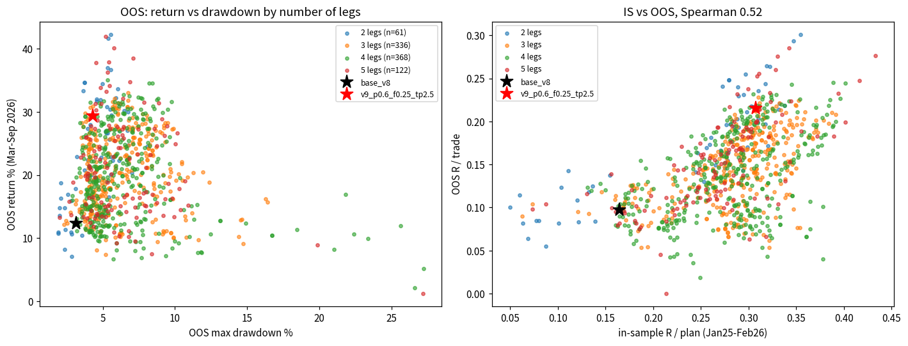
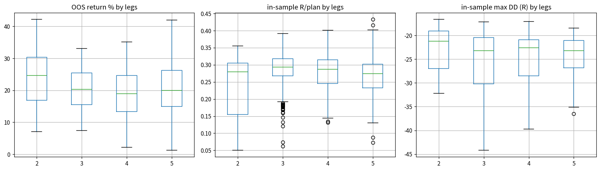
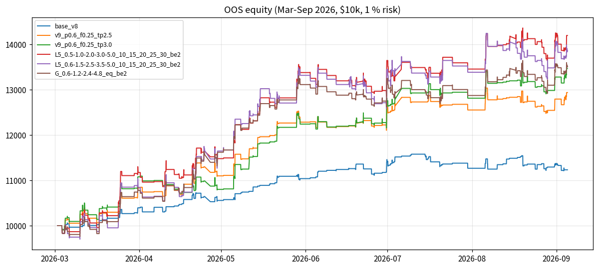
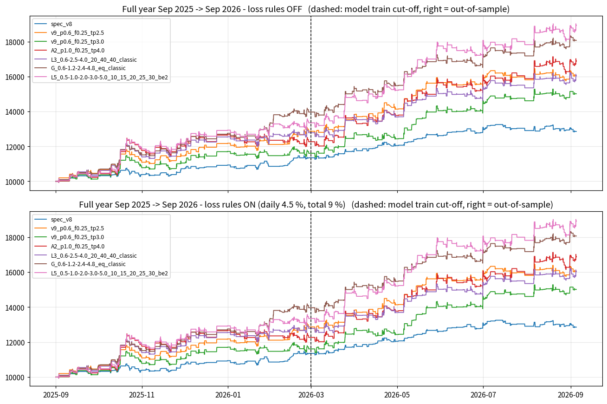
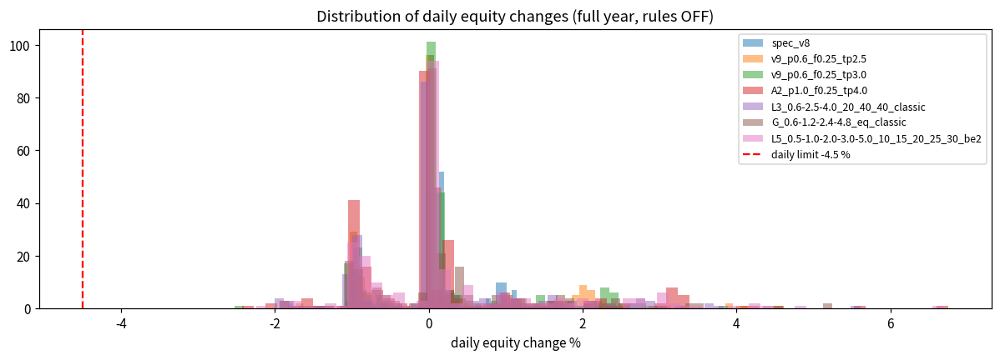

# MULTI-TP STUDY + FULL-YEAR BACKTEST (v10) — do more than two take-profits raise profitability?

**Questions.** (1) Does closing a trade in **more than two** take-profit legs (3, 4, 5 targets, ladders, runners,
ATR-based targets, geometric spacing, different stop schedules) make the LU-POI trader more profitable than the
two-leg systems of v8 (current spec) and v9 (recommendation)?  (2) Add the account-protection rules — **max 4.5 % loss
per day, max 9 % loss overall (bot stops)** — to the bot.  (3) Give a **full-year** backtest, not six months.

**Answer in one line.**  Yes, modestly — **a 4-leg geometric ladder, 25 % each at +0.6R / +1.2R / +2.4R / +4.8R, stop to
break-even after the first leg** (`tp_levels=0.6|1.2|2.4|4.8,tp_fracs=1|1|1|1`) is the best robust system of 887 tested:
**full year Sep 2025 → Sep 2026: +80.7 % vs +60.5 % (v9) vs +28.6 % (current spec)** on $10 000 at 1 % risk with real costs,
at the **lowest drawdown of the three (5.5 % vs 6.8 % vs 4.4 %)**, PF 1.75, 11 of 13 months positive, same 69 % win-rate as
v9.  In-sample per plan it is a tie with v9 (+0.301 vs +0.308 R, drawdown −17.8 vs −20.9 R) and out-of-sample it is
slightly better (+31.5 % vs +29.4 %, DD 4.1 vs 4.3 %) — the extra return over a full year comes from the fourth leg catching
the three big gold runs (Oct 2025, Mar 2026, May 2026) while the first three legs keep the win-rate and drawdown of a
two-leg system.  **More legs is not automatically better**: the median 3/4/5-leg system is *worse* than the median
two-leg system (OOS +19–20 % vs +25 %); what matters is *where* the legs are (first leg ≥ 0.6R, last leg ≥ 3R) and the stop
schedule (break-even after leg 1).  The loss rules are implemented in the simulator and the live bot; **at 1 % risk they
never trigger in the whole year** (worst day −2.5 %, worst intraday dip −2.6 %) — they are pure insurance and cost nothing;
at 3 % risk they trigger 5–12 times a year.

---

## 0. Method (every number has a file behind it)

* **Entries fixed** = v8 recommended trader: v8 M5 filter (cost ≤ 0.08 R, quality ≥ 0.55, no NY-pm), `min_quality 0.60` on
  M10/M15/M30/H1, 1 % risk, $10 000, split legs with server-side TPs, real per-minute spread (imputed where missing), $7/lot
  commission, $0.10 stop slippage, swaps, ≤ 4 open positions, mirror order policy.  Only the exit management changes.
  R = zone height.  Ladders whose legs would fall below 0.01 lot are merged into a neighbour (`ladder_fallback=merge`;
  8 of 251 full-year plans), so every system trades the same population.
* **Grid** — `run_v10_study.py`: **887 managements**: L3 306 three-leg / L4 330 four-leg / L5 112 five-leg ladders (level sets ×
  fraction splits × stop schedules *classic* = BE after leg 1, *be2* = BE only after leg 2, *ratchet* = stop → previous target,
  *be2ratchet*, *lock* = +0.5R after leg 2), **R** 28 runner ladders (last leg trailed after k legs), **ATR** 42 ladders in ATR
  units, **G** 30 geometric / fibonacci ladders, **A2** 36 two-leg references around the v9 optimum, + current spec + v9.
* **Two evaluations, same simulator code as v9** (results for the two-leg references are byte-identical to the v9 study):
  * OOS **portfolio** 2026-03-02 → 2026-09-04 (the quality model never saw it) → `v10_study_grid.csv`, `v10_study/`.
  * **In-sample replay** of the 1 270 plans the trader would have taken Jan 2025 → Feb 2026 → `v10_insample.csv`, `v10_insample/`.
  * Spearman rank correlation of R/trade between the two over 887 systems: **0.52 (p < 1e-60)** — the ranking is real.
* **Full year** — `run_v10_year.py`: new selection streams recorded for **Sep 2025 → Sep 2026** for all five timeframes
  (`sel_v10_<TF>.pkl`, 30 monthly chunks) and replayed through the portfolio simulator for 7 systems × with/without the loss
  rules × 7 stress scenarios (112 runs) → `v10_year_summary.csv`, `v10_year_monthly.csv`, `v10_year/`.
  **Honesty note:** the entry model was trained on data until 2026-03-01, so **Sep 2025–Feb 2026 is in-sample for the entry
  model** and Mar–Sep 2026 is out-of-sample; both halves are reported separately.
* Simulator mechanics: `tests/test_rm_systems.py` (+7 v10 scenarios: per-leg stop schedule, trail-after-leg, ATR targets,
  merge sizing, 5-leg ladder, ratchet); live bot: `tests/test_trader_live.py` (+2: 4-leg ladder with stop schedule, 3-leg
  ladder with ratchet); **91 tests pass**.  `make_v10_report.py` produces every table and chart below.

---

## 1. Does the NUMBER of legs matter?  (887 systems)

| legs | n | OOS return median / best | OOS max DD median | OOS PF median | OOS win % | OOS ret/DD median / best | IS R/plan median / best | IS PF | IS max DD (R) |
|---|---|---|---|---|---|---|---|---|---|
| 2 | 61 | **+24.7 %** / 42.2 | −4.6 % | **1.59** | 70 | **5.6** / 9.3 | 0.28 / 0.35 | 1.94 | −21.2 |
| 3 | 336 | +20.3 % / 33.1 | −5.9 % | 1.40 | 66 | 3.4 / 7.9 | 0.29 / 0.39 | 1.96 | −23.2 |
| 4 | 368 | +19.0 % / 35.1 | −5.5 % | 1.38 | 64 | 3.5 / 8.2 | 0.29 / 0.40 | 1.96 | −22.7 |
| 5 | 122 | +20.0 % / **41.9** | −5.7 % | 1.43 | 64 | 3.6 / **8.4** | 0.27 / **0.43** | 1.96 | −23.2 |

**Splitting the position into more pieces is not, by itself, an edge.**  The median multi-leg system earns *less* OOS than the
median two-leg system at a higher drawdown; in-sample the medians are identical (0.27–0.29 R/plan).  The best systems of each
family are close (OOS +33–42 %, IS +0.35–0.43 R/plan) — the extra legs widen the range of outcomes rather than shift it.
What separates good ladders from bad ones (`v10_by_stop.csv`, `v10_by_fracs.csv`, and the level tables in `make_v10_report.py`):

* **First target ≥ 0.6R** (3+ legs, OOS median return: first leg 0.3R +15 %, 0.4R +15 %, 0.5R +15 %, **0.6R +20 %**, 0.8R +21 %,
  1.0R +29 %; but IS drawdown jumps from −21 R at 0.6R to −28/−31 R at 0.8/1.0R) — the same knee v9 found for two legs.
* **Last target ≥ 3R** (OOS median: 1.5R +14 %, 2.0R +15 %, 2.5R +16 %, 3.0R +22 %, 4.0R +25 %, 4.8R +25 %, 5.0R +26 %).  The
  far leg is where the extra R comes from: 31–34 % of fills reach +3R (v9 study), and a 4–5R leg catches the big runs.
* **Stop schedule: break-even after the first leg stays the right choice** (3+ legs, OOS median / DD / IS DD):
  *classic* +20 % / −4.9 % / −21 R · *be2* (BE only after leg 2) +23 % / **−7.1 %** / **−30 R** · *ratchet* +17 % / −4.9 % / −21 R ·
  *lock* +14 % / −4.8 % / −22 R.  Waiting for the second leg before protecting the trade adds ~+0.04 R/plan in-sample but costs
  +2 pts OOS drawdown and +9 R in-sample drawdown, and drops the win-rate from 68 % to 46–55 %.  Ratcheting the stop to the
  previous target costs 3–5 pts OOS (it stops runners in noise) — same as v9 found.  Locking +0.5R is worse still.
* **Fractions**: front-loaded (≥ 45 % on the first leg) is worst (OOS +19 %, IS −24 R); 15–30 % on the first leg is the sweet spot;
  putting only 10 % on the first leg gives the highest best-case (+42 %) but the deepest median drawdown (−6.8 %).
* **Runner legs (R family)** — a trailed final leg never beats a fixed 4–5R target: best +25.7 % OOS (0.6/2.5 + 0.5R trail after
  2 legs) vs +31–42 % for fixed ladders; in-sample +0.29–0.31 R/plan (same as v9).  A tight trail gives back too much; a wide
  trail behaves like a fixed target with extra slippage.
* **ATR-based targets** — the lowest drawdowns of the study (OOS −2 to −3 %) with 78–88 % win-rates, but only +13–19 % OOS and
  **+0.11–0.18 R/plan in-sample (worse than the current spec)**: ATR targets are tiny relative to the small M5 zones, so the trade
  pays the spread for 0.3 ATR of profit.  Not recommended.
* **Geometric spacing (G family)** is the best-behaved family: median OOS +22.7 % at −4.6 % DD, IS −22 R; its best member is the
  recommendation below.




---

## 2. Finalists

OOS = portfolio Mar–Sep 2026 (127–132 trades).  IS = replay of 1 270 in-sample plans Jan 2025–Feb 2026.  Net of costs.

| management | legs | OOS return | OOS DD | OOS PF | OOS R/tr | OOS win | OOS H1/H2 R | OOS +months | IS R/plan | IS PF | IS win | IS DD (R) | IS +months | IS t |
|---|---|---|---|---|---|---|---|---|---|---|---|---|---|---|
| current spec 50 % @ 0.4R → BE, TP2 1.5R | 2 | +12.3 % | −3.2 % | 1.46 | +0.098 | 81 | 10.6 / 2.2 | 5/7 | +0.165 | 1.88 | 81 | −20.1 | 11/14 | 9.0 |
| v9: 25 % @ 0.6R → BE, TP2 2.5R | 2 | +29.4 % | −4.3 % | 1.68 | +0.215 | 71 | 21.8 / 5.6 | 6/7 | **+0.308** | **2.29** | 76 | −20.9 | 12/14 | 10.3 |
| v9 twin: TP2 3R | 2 | +34.6 % | −3.7 % | **1.81** | +0.248 | 71 | 21.5 / **10.0** | 6/7 | +0.279 | 2.17 | 76 | −22.8 | 13/14 | 8.9 |
| two-leg 25 % @ 1.0R → BE, TP2 4R (OOS two-leg best) | 2 | **+42.2 %** | −5.6 % | 1.68 | +0.301 | 60 | 27.4 / 10.5 | 6/7 | +0.351 | 1.94 | 64 | −31.0 | 12/14 | 9.6 |
| **★ G ladder 25 %×4 @ 0.6/1.2/2.4/4.8R → BE after leg 1** | 4 | +31.5 % | −4.1 % | 1.69 | +0.216 | 69 | 20.1 / 8.3 | 6/7 | +0.301 | 2.27 | 76 | **−17.8** | 12/14 | **10.9** |
| same ladder, BE only after leg 2 (be2) | 4 | +35.1 % | −5.3 % | 1.56 | +0.243 | 54 | 28.5 / 3.3 | 6/7 | +0.345 | 2.03 | 61 | −26.0 | 13/14 | 10.7 |
| L5 10/15/20/25/30 % @ 0.5/1/2/3/5R, be2 (OOS multi-leg best) | 5 | +41.9 % | −5.2 % | 1.63 | +0.285 | 57 | 30.2 / 7.2 | 6/7 | +0.343 | 2.01 | 64 | −25.5 | 12/14 | 9.3 |
| L5 10/15/20/25/30 % @ 0.6/1.5/2.5/3.5/5R, classic | 5 | +40.1 % | −5.8 % | 1.73 | +0.276 | 64 | 27.2 / 8.9 | 5/7 | +0.330 | **2.38** | 75 | −21.4 | 12/14 | 9.4 |
| L5 same levels, be2 (IS best of all 887) | 5 | +38.5 % | −7.1 % | 1.47 | +0.277 | 46 | 31.1 / 5.1 | 5/7 | **+0.433** | 2.02 | 55 | −34.8 | 13/14 | 9.8 |
| L3 20/40/40 % @ 0.6/2.5/4R, classic | 3 | +30.7 % | −4.1 % | 1.65 | +0.212 | 68 | 20.3 / 7.5 | 5/7 | +0.293 | 2.22 | 76 | −21.8 | 12/14 | 10.2 |
| L4 15/25/30/30 % @ 0.6/1.2/2/3R, classic (best OOS ret/DD 4-leg) | 4 | +28.2 % | −3.4 % | 1.60 | +0.190 | 67 | 19.7 / 5.3 | 5/7 | +0.287 | 2.20 | 76 | −21.0 | 12/14 | 10.6 |
| best runner: 25/50 % @ 0.6/2.5R + 25 % trailed 0.5R after leg 2 | 3 | +25.7 % | −4.0 % | 1.55 | +0.180 | 68 | — | — | +0.303 | 2.23 | 76 | −20.4 | 12/14 | — |
| best ATR: 25 % @ 0.5 ATR → BE, TP2 1.0 ATR | 2 | +18.8 % | **−2.1 %** | 1.82 | +0.143 | **83** | 12.4 / 5.7 | 6/7 | +0.176 | 1.78 | 83 | −18.4 | — | — |

**59 of 826 multi-leg systems beat the v9 recommendation on both in-sample R/plan and OOS return — but none of them
with a drawdown ≤ v9 on both evaluations.**  Every system that makes more than v9 per plan does it with a lower win-rate
(46–64 %) and a deeper in-sample drawdown (−25 to −35 R vs −21 R).  The G ladder is the exception in the other direction:
the same R/plan and OOS return as v9 with a *smaller* drawdown on both evaluations (−17.8 R IS, −4.1 % OOS) and the highest
in-sample t-statistic of the finalists (10.9).  That is why it is the recommendation, not the +42 % systems.



---

## 3. FULL-YEAR backtest — Sep 2025 → Sep 2026 ($10 000, 1 % risk, real costs, 4 open positions max)

Left of the dashed line (Sep 2025–Feb 2026) the entry model is in-sample; right of it out-of-sample.  All systems trade the
same ~245 plans (only the exits differ).  `v10_year_table.csv`, `v10_year_monthly_table.csv`.

| system | trades | **return** | max DD | PF | win % | Sharpe | Sep25–Feb26 R / $ (IS) | Mar–Sep26 R / $ (OOS) | +months | worst day | worst intraday dip | end balance |
|---|---|---|---|---|---|---|---|---|---|---|---|---|
| current spec 50 % @ 0.4R → BE, 1.5R | 248 | +28.6 % | **−4.4 %** | 1.49 | **79** | 2.39 | +13.3 / $1 351 | +13.0 / $1 505 | 10/13 | −1.8 % | −2.0 % | $12 856 |
| v9: 25 % @ 0.6R → BE, 2.5R | 243 | +60.5 % | −6.8 % | 1.63 | 70 | 2.86 | +27.2 / $2 865 | +23.6 / $3 189 | 10/13 | −1.8 % | −1.8 % | $16 054 |
| v9 twin: 3R | 241 | +50.1 % | −6.9 % | 1.57 | 70 | 2.52 | +16.3 / $1 609 | +27.5 / $3 405 | 10/13 | −2.5 % | −2.2 % | $15 014 |
| two-leg 25 % @ 1R → BE, 4R | 242 | +68.8 % | −8.1 % | 1.52 | 59 | 2.38 | +22.0 / $2 268 | **+34.3** / $4 608 | 10/13 | −2.4 % | −2.6 % | $16 877 |
| L3 20/40/40 @ 0.6/2.5/4R | 251 | +60.4 % | −7.2 % | 1.57 | 68 | 2.52 | +28.3 / $2 784 | +24.2 / $3 250 | 11/13 | −2.0 % | −1.9 % | $16 035 |
| **★ G ladder 25 %×4 @ 0.6/1.2/2.4/4.8R → BE** | 251 | **+80.7 %** | −5.5 % | **1.75** | 69 | **3.28** | **+39.3 / $3 966** | +26.7 / $4 107 | **11/13** | −1.9 % | −1.9 % | **$18 074** |
| L5 10/15/20/25/30 @ 0.5/1/2/3/5R, be2 | 251 | +89.2 % | −6.8 % | 1.62 | 58 | 2.91 | +33.1 / $3 352 | +37.1 / $5 571 | **12/13** | −2.3 % | −2.1 % | $18 923 |



Monthly net $ (loss rules on — identical to off at 1 % risk):

| month | current spec | v9 2.5R | ★ G ladder | L5 be2 |
|---|---|---|---|---|
| 2025-09 | 307 | 460 | 435 | 274 |
| 2025-10 | 83 | 632 | **1 079** | 1 578 |
| 2025-11 | 333 | 369 | 594 | 330 |
| 2025-12 | 211 | 720 | 643 | 748 |
| 2026-01 | −77 | −71 | **601** | 226 |
| 2026-02 | 493 | 755 | 615 | 196 |
| 2026-03 | 499 | 964 | **1 341** | 1 545 |
| 2026-04 | 199 | 307 | 172 | 316 |
| 2026-05 | 567 | 1 498 | 1 433 | 2 538 |
| 2026-06 | 462 | 421 | 365 | 320 |
| 2026-07 | −170 | −239 | −97 | −247 |
| 2026-08 | 54 | 357 | 989 | 919 |
| 2026-09 (4 days) | −104 | −120 | −96 | 180 |

Reading: the G ladder is positive in every month where v9 is positive, turns v9's January loss into +$601 (the 4.8R leg on
two M10 trades), and has the smallest losing month of all systems (−$97 in July, a month every system loses).  Its edge over
v9 is concentrated in Oct 2025, Jan/Mar 2026 and Aug 2026 — the trending months.  Per timeframe (full year, R): M5 +37.6,
M10 +30.6, M15 +1.3, M30 −2.5, H1 −0.9 (v9: 25.4 / 24.1 / 1.7 / −0.5 / 0.1) — the gain is entirely on M5/M10, the timeframes
with the most trades; M15/M30/H1 stay marginal on every system (few trades, wider zones).  Outcome mix: 55 % of plans end
partial→BE (at least one leg paid, rest at entry), 30 % full stop, 15 % reach the 4.8R leg.

**Stress (full year, `v10_year_stress.csv`):** the G ladder stays ahead of v9 in every scenario — commission ×2 +63.9 % (v9
+51.4 %), spread ×2 +33.0 % (v9 +26.8 %), worst intrabar path +79.4 %, 8 open positions +80.7 % (no extra trades — 4 is never
binding), risk 2 % +197.5 % / DD 10.6 % (v9 +150.7 % / 13.4 %).  Like every partial system it loses about half its edge at
double spread (+33 %) — spread is the bot's known weak spot (v8/v9 studies), not a property of the ladder.

---

## 4. The loss rules (user spec 2) — implemented, tested, and what they do

**Implementation.**  `TraderConfig.max_daily_loss_pct` (4.5) and `max_total_loss_pct` (9.0), default ON in `trader.py`
(`--max-daily-loss 4.5 --max-total-loss 9.0`, 0 = off) and in `run_trader.bat`.
* Every M1 bar (simulator) / every loop (live, equity = terminal balance + floating P/L):
  **daily**: equity ≤ day-start equity × (1 − 4.5 %) → close every position at market, cancel every pending order, accept no new
  order until the next *server* day (day-start equity = equity at the day change);
  **total**: equity ≤ start balance × (1 − 9 %) → flatten and **halt for good** (`state.risk.halted = true`, survives restarts;
  delete the state file to reset — at your own risk).
* Live: `Trader.check_risk_limits()` runs first and last in every loop; start balance, day anchor, day-start equity, halt flag
  and the list of daily halts are persisted in the crash-safe state file, so a restart cannot reset the limits.
  Tests: `tests/test_rm_systems.py` (4 simulator scenarios) and `tests/test_trader_live.py` (3 fake-MT5 scenarios incl. restart).

**What they do in the backtest.**  At **1 % risk the rules never trigger** in the whole year on any system: the worst single day
is −2.5 % (v9 3R) and the worst intraday dip versus the day start is −2.6 % (`worst_day_%`, `worst_intraday_vs_daystart_%` in
`v10_year_summary.csv`); the deepest peak-to-valley drawdown is −8.1 %, i.e. the 9 % total limit is also never reached.  The
results with and without the rules are therefore identical — the rules are free insurance at this risk level.  They start to
bite at higher risk: at **2 % risk** the v9/G systems dip to −3.9 % intraday (0 halts; the two-leg 1R/4R system: 2 halts), at
**3 % risk** every system hits the daily limit 4–12 times a year (G ladder 5 halts: +405 % vs +413 % without the rule, DD −15.6 %;
current spec 4 halts, +113 % vs +118 %).  The daily rule costs 1–7 pts of return per year at 3 % risk and, in the tested year,
does not reduce the maximum drawdown (the losing streaks are multi-day, not intraday).  **Recommendation: keep both rules on
(they are the specification) and keep risk at 1 %, where a 4.5 % day would require ~4 simultaneous full stops with slippage —
a genuine anomaly worth stopping for.**  With 4 positions × 1 % the theoretical worst case of one bar is about −4.4 % before
slippage, so the daily rule is effectively a "flash-crash / broker-problem" breaker at 1 % risk.



---

## 5. Recommendation

**Switch the management to the 4-leg geometric ladder: 25 % at +0.6R, 25 % at +1.2R, 25 % at +2.4R, 25 % at +4.8R,
stop to break-even after the first leg.**  Live (Windows, MT5 terminal open and logged in, hedging account):

```
python trader.py --symbol XAUUSD.t --risk 1.0 --commission 7 --trader tp_levels=0.6|1.2|2.4|4.8,tp_fracs=1|1|1|1,ladder_fallback=merge
```
(`run_trader.bat` ships this; the loss limits 4.5 % / 9 % are on by default.)

| | current spec | v9 (2.5R) | **★ G ladder** |
|---|---|---|---|
| full year Sep25–Sep26 return / max DD | +28.6 % / 4.4 % | +60.5 % / 6.8 % | **+80.7 % / 5.5 %** |
| full year PF / Sharpe / +months | 1.49 / 2.39 / 10 | 1.63 / 2.86 / 10 | **1.75 / 3.28 / 11** |
| OOS Mar–Sep26 (grid) return / DD / PF | +12.3 % / 3.2 % / 1.46 | +29.4 % / 4.3 % / 1.68 | +31.5 % / 4.1 % / 1.69 |
| in-sample R/plan (1 270 plans) / PF / DD (R) / t | +0.165 / 1.88 / −20.1 / 9.0 | +0.308 / 2.29 / −20.9 / 10.3 | +0.301 / 2.27 / **−17.8** / **10.9** |
| win-rate (IS / OOS / year) | 81 / 81 / 79 % | 76 / 71 / 70 % | 76 / 69 / 69 % |
| average hold | 39 min | 129 min | 207 min |
| legs / minimum tradeable volume | 2 / 0.02 lot | 2 / 0.04 lot (25 % leg) | 4 / 0.04 lot (merged below) |

*Why this one and not the +89 % five-leg system.*  The L5 be2 and the 1R/4R two-leg systems make more over the year (+89 / +69 %)
but with 58–59 % win-rates, −25 to −31 R in-sample drawdowns (vs −18 R), higher OOS drawdown (5.2–8.1 %) and the *be2* stop
schedule that leaves the whole position unprotected after the first leg pays — the property that produced the −7 to −10 %
drawdowns in the worst L5 variants.  The G ladder keeps the classic BE, matches v9 in-sample (the most data), beats it
OOS and over the year on both return and drawdown, is on a plateau (its *desc*-fraction and 3-leg 0.6/2.5/4 cousins are all
+23–31 % OOS / +0.28–0.30 IS), and needs nothing the live bot cannot already do: four limit legs with server-side targets and
one SL modification after leg 1 (`tests/test_trader_live.py::test_v10_four_leg_ladder_live_with_stop_schedule`).

**Aggressive alternative** (if you accept 58 % win-rate and ~7 % drawdowns): `tp_levels=0.5|1|2|3|5,tp_fracs=0.1|0.15|0.2|0.25|0.3,
sl_after_leg=x|0|x|x` (+89 % year, +42 % OOS, +0.343 IS).  **Conservative alternative** (lowest drawdown, 83 % win-rate, but no
in-sample edge over the current spec): `tp_unit=atr,partial_r=0.5,partial_frac=0.25,tp2_r=1.0`.

**Caveats.**  (1) The Sep 2025–Feb 2026 half of the year is in-sample for the *entry* model (the exits were never fitted to it, but
the entries were); the OOS half (+26.7 R / $4 107 for the G ladder) is the number to trust most.  (2) One year of one instrument;
the year contained three strong gold rallies that paid the 4.8R leg — in a range-bound year the ladder would earn closer to v9.
(3) Netting accounts fall back to a single position with the two-leg bot-side partial; the ladder needs a hedging account.
(4) 4 legs × 0.01 lot: with 1 % of $10 000 the ladder is fully split for zones up to ~$25; larger zones (rare on M5/M10) get
merged legs — the simulator did the same (8 of 251 plans).

---

## 6. Files

`run_v10_record.sh` (full-year streams) · `run_v10_study.py` (887-variant grid, `--mode oos|is`) · `run_v10_year.py` (full-year
portfolio + stress) · `make_v10_report.py` (tables, charts) · `run_v10_all.sh` (whole pipeline, resumable, autosave) ·
results: `v10_study_grid.csv`, `v10_insample.csv`, `v10_is_vs_oos.csv`, `v10_by_legs.csv`, `v10_by_stop.csv`, `v10_by_fracs.csv`,
`v10_finalists.csv`, `v10_year_summary.csv`, `v10_year_table.csv`, `v10_year_stress.csv`, `v10_year_monthly*.csv`, per-variant
trades/equity in `v10_study/`, `v10_insample/`, `v10_year/`; charts `charts/v10_*.png`.
