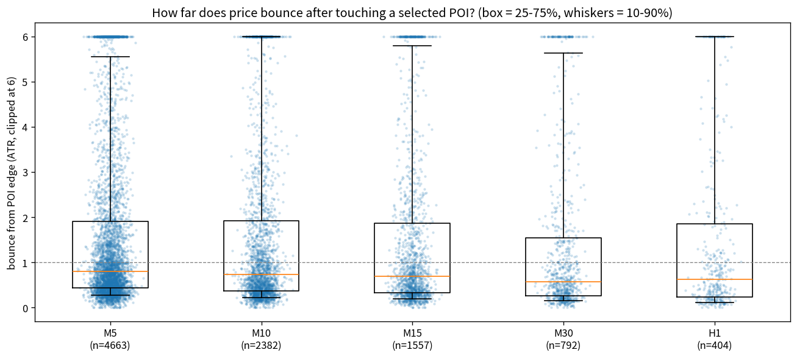
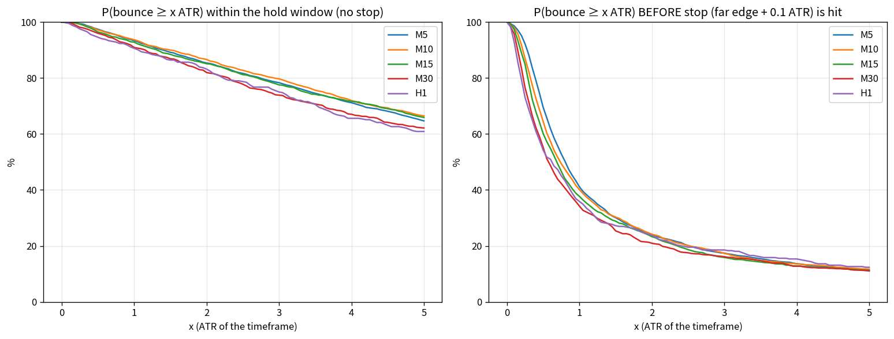
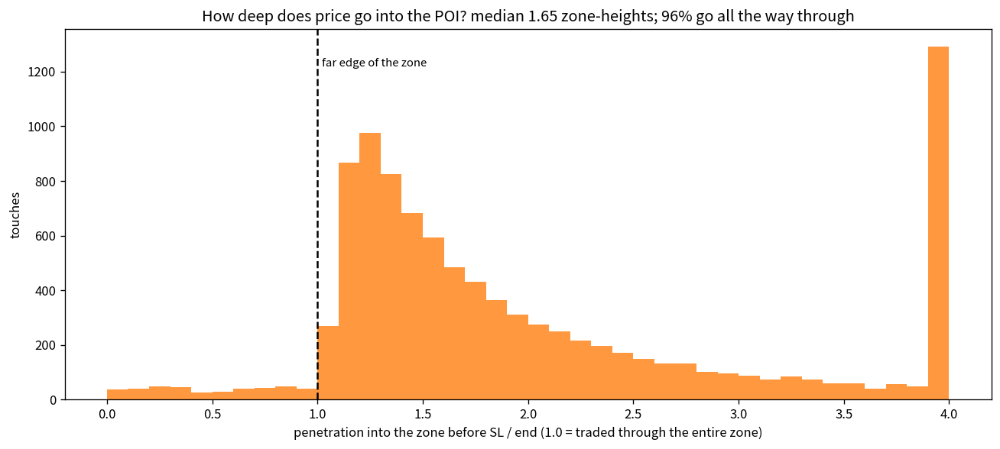
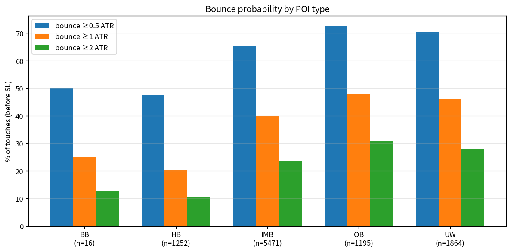
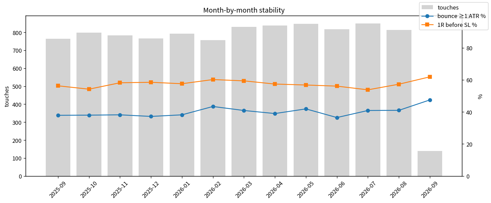
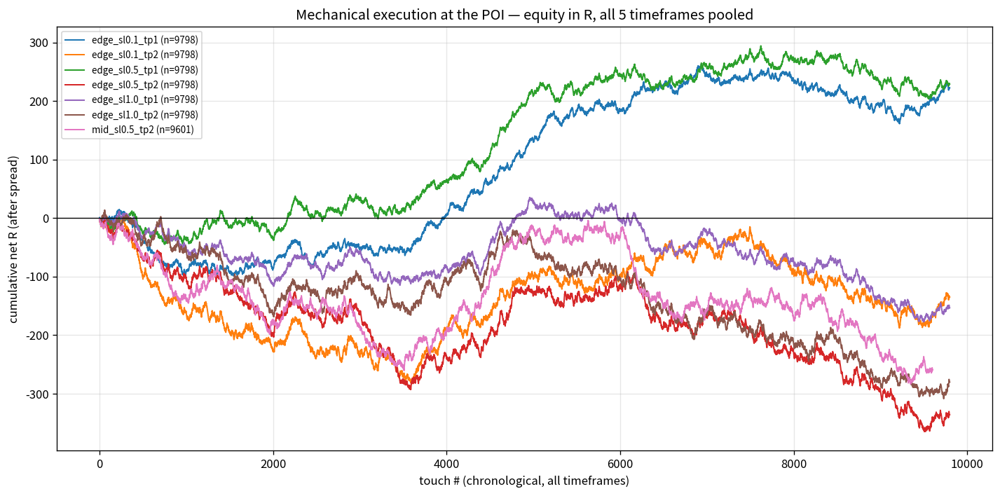
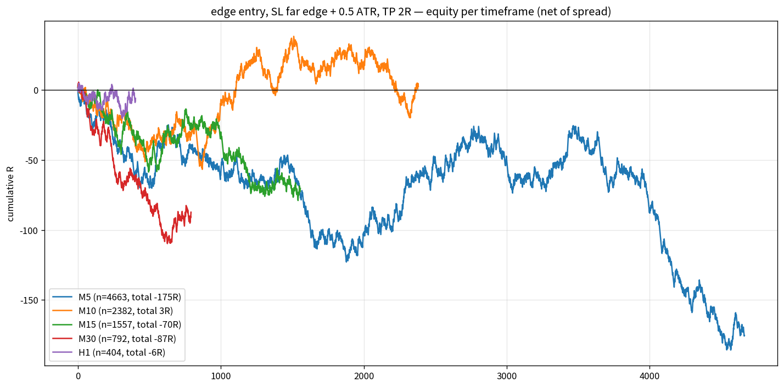

# How much does XAUUSD bounce when it reaches a Liquidity-University POI?
### Full-year walk-forward study — XAUUSD.t, 2025-09-01 → 2026-09-04

---

## 0. TL;DR

| Question | Answer (all 5 timeframes, 9,798 touches) |
|---|---|
| Does price reach the selected POIs? | **Yes — 89%** of the 11,068 selected POIs were tapped within 300 bars. |
| How deep does it go into the zone? | **Deep.** Median initial penetration ≈ **1.0 zone-height** (i.e. through the whole zone). Only **35%** of touches stop inside the first half of the zone before bouncing 0.5 ATR. |
| How far does it bounce before the zone is violated? | **Median 0.75 ATR** of the timeframe (≈ **$5** on M5, **$13** on H1). 40% bounce ≥ 1 ATR, 24% ≥ 2 ATR, 17% ≥ 3 ATR. |
| Bounce first, or stop first? | With SL just beyond the far edge (+0.1 ATR): **37% bounce 1 ATR first, 63% hit the stop first.** |
| Is it better than a random level? | Yes, but modestly: random levels give median 0.50 ATR / 34% ≥ 1 ATR / 52% reach 1R; POIs give **0.75 ATR / 40% / 57%**. |
| Can you fade every POI mechanically and make money? | **No.** Best mechanical scenario is +0.05 R/trade (PF 1.11) after spread; most are ±0.03 R. Break-even. |
| Where is the reaction strongest? | **Orderblocks and Unmitigated Wicks** (46–48% bounce ≥ 1 ATR, 46% bounce-first), **larger zones (≥1 ATR tall → 64% bounce-first)**, **bullish POIs** in this bull year, **London Close & Pre-NY** sessions. **Hidden Bases are the weakest** (20% ≥ 1 ATR — the zone is too thin). |

**Bottom line:** the POI rule set finds levels the market *reacts* to, but the reaction is typically a wick/partial retrace that sweeps the whole zone first. As the PDF says, the POI is *where* to look — not the entry. A confirmation entry (LTF QM / engulfing) after the sweep is where the money is, and this dataset is now set up to test exactly that.

---

## 1. Data & method

- **Data:** 359,813 M1 bars (MT5 export), broker time, 13 months. Gold ranged 3437 → 5598 (a very strong bull year).
- **Spread:** broker spread recorded Apr–Sep 2026 (median **$0.28**); for Sep 2025–Mar 2026 the export has no spread, so **$0.28 was assumed** for every fill.
- **Timeframes:** M5, M10, M15, M30, H1 — all resampled from M1 so they are perfectly aligned.
- **Selection (walk-forward, no look-ahead):** on every *closed* bar the bot ran the exact live logic:
  1. alive (unmitigated) POIs: Orderblock, Breaker, Imbalance, Hidden Base, Unmitigated Wick (zones = candle bodies, PDF author preference)
  2. liquidity (swing/equal highs–lows, PDH/PDL, PWH/PWL, Asia H/L) must rest **between** price and the POI
  3. ≥ 1 same-direction POI already mitigated & respected (order flow)
  4. keep the **closest above** and **closest below** price
  Every *newly selected* POI = one observation.
- **Scoring (only step that looks forward):** the first touch of the zone edge is found on **M1**; from that minute the path is followed for 300 HTF bars. Everything is measured from the **edge of the zone**, in **ATR(14) of the timeframe** (so timeframes are comparable) and in dollars.
  - *bounce* = max favourable excursion **before** the far edge + 0.1 ATR is violated
  - *penetration* = max adverse excursion into/through the zone
  - *initial penetration* = depth before price first bounced 0.5 ATR
  - trade scenarios: SL is checked **before** TP on the same minute (conservative); every fill pays spread
- **Baseline:** 4,000 random (time, direction) levels scored identically, to see what "normal" wick behaviour looks like.

---

## 2. Headline distribution

| percentile | bounce before SL (ATR) | bounce before SL ($) |
|---|---|---|
| 10% | 0.14 | — |
| 25% | 0.38 | $2.4 |
| **50%** | **0.75** | **$5.2** |
| 75% | 1.87 | $14.4 |
| 90% | 5.9 | — |

- The **right-hand curve** is the one that matters for trading: P(bounce ≥ x ATR **before** the stop). It falls off quickly — 65% reach 0.5 ATR, 40% reach 1 ATR, 24% reach 2 ATR — and is almost identical across timeframes (M5 slightly best, M30 slightly worst).
- The **left-hand curve** ("does it ever come back?", no stop) shows 80%+ of touches eventually see a ≥ 2 ATR move in the POI direction *at some point* in the next 300 bars. This is where the visual illusion of "POIs always work" comes from: given enough time, price almost always moves away again — but usually only after blowing through the zone.
- 36% of touches eventually retraced the **entire leg** that brought price to the POI.

### Random baseline (honesty check)

| | random level | POI touch |
|---|---|---|
| median bounce before SL | 0.50 ATR | **0.75 ATR** |
| bounce ≥ 1 ATR | 34% | **40%** |
| bounce ≥ 2 ATR | 22% | 24% |
| 1 ATR bounce before SL | 34% | **37%** |
| reach 1R before SL | 52% | **57%** |

The POI selection has a real but **modest** edge over random levels: +50% on the median bounce, +5–6 points on the hit rates. It is not noise (n ≈ 10k), but it is not a large edge on its own.

---

## 3. How deep does price go into the zone?

| initial penetration (before first 0.5 ATR bounce) | share |
|---|---|
| ≤ 0.25 zone (kissed the edge) | 22% |
| 0.25 – 0.5 | 13% |
| 0.5 – 1.0 (inside, past mid) | 15% |
| **> 1.0 (through the whole zone)** | **50%** |

- Median initial penetration = **0.99 zone-heights**; over the full path the median is 1.65 and **96% of touches trade through the entire body-zone at some point**.
- Why: body zones are thin (median IMB zone = 0.37 ATR, HB = 0.09 ATR, OB = 0.64 ATR). Price routinely wicks 0.5–1 ATR past any level; a 0.1-ATR zone has no chance.
- **Zone height is the strongest single predictor of "bounce first":**

| zone height (ATR) | n | bounce 1 ATR before SL |
|---|---|---|
| < 0.25 | 3042 | 21% |
| 0.25 – 0.5 | 2846 | 34% |
| 0.5 – 1 | 2987 | 48% |
| **1 – 2** | 855 | **64%** |
| 2+ | 68 | 72% |

Practical reading: with body zones, the **50% / far-edge / wick extreme** of the POI is where the reaction actually starts, not the near edge. Marking the full candle (PDF: "you can mark out the entire candle") or placing the stop beyond the *liquidity* that created the POI would avoid a large share of the premature stop-outs.

---

## 4. By timeframe

| TF | selected | reached % | median bounce ATR | median bounce $ | ≥1 ATR | ≥2 ATR | bounce-first % | 1R before SL | net R (TP 1R) | net R (TP 2R) | touches / day |
|---|---|---|---|---|---|---|---|---|---|---|---|
| M5 | 5247 | 88.9 | 0.80 | $4.3 | 41% | 24% | 38% | 58% | +0.003 | −0.016 | 17.9 |
| M10 | 2694 | 88.4 | 0.74 | $5.6 | 40% | 24% | 37% | 58% | +0.059 | +0.049 | 9.2 |
| M15 | 1770 | 88.0 | 0.69 | $6.3 | 38% | 23% | 36% | 58% | +0.078 | +0.006 | 6.0 |
| M30 | 904 | 87.6 | 0.57 | $8.0 | 34% | 21% | 32% | 53% | −0.002 | −0.132 | 3.4 |
| H1 | 453 | 89.2 | 0.63 | $12.9 | 36% | 24% | 36% | 51% | −0.017 | −0.014 | 2.0 |

- In ATR terms the behaviour is **fractal, exactly as the PDF claims** — every timeframe gives ~0.6–0.8 ATR median bounce and ~35–40% ≥ 1 ATR. In dollars the H1 bounce is 3× the M5 bounce, but so is the risk.
- Speed of the reaction: median time to the best bounce is **≈ 1 bar** of the timeframe; P(≥ 1 ATR within 3 bars) = 32%, within 12 bars = 40%. If it hasn't reacted within a handful of bars, it usually won't.
- M10/M15 are the only timeframes with a (small) positive net expectancy for both mechanical TP scenarios.

---

## 5. By POI type

| type | reached | median zone (ATR) | median bounce ATR | ≥1 ATR | ≥2 ATR | initial pen ≤ 0.5 zone | bounce-first % | net R TP1 | net R TP2 |
|---|---|---|---|---|---|---|---|---|---|
| **OB** Orderblock | 1195 | 0.64 | **0.94** | **48%** | **31%** | 45% | **46%** | +0.046 | +0.012 |
| **UW** Unmitigated Wick | 1864 | 0.56 | **0.89** | **46%** | **28%** | 44% | **44%** | +0.049 | +0.001 |
| IMB Imbalance | 5471 | 0.37 | 0.76 | 40% | 24% | 35% | 37% | +0.065 | +0.002 |
| HB Hidden Base | 1252 | 0.09 | 0.48 | 20% | 11% | 12% | 18% | −0.192 | −0.074 |
| BB Breaker | 16 | 0.11 | 0.52 | 25% | 13% | 25% | 25% | (n too small) | |

- **Orderblocks and Unmitigated Wicks are clearly the best POIs**: highest bounce, highest probability of reacting before the zone is violated, and they are also the widest zones.
- **Imbalances** dominate the count (56% of all selections) and behave averagely. Because they are the most frequent, they are usually "the closest POI" and crowd out OB/UW. A live filter that prefers OB/UW when an IMB is only marginally closer is worth testing.
- **Hidden Bases fail** under this scoring: the M1 orderblock inside the HTF impulse is ~0.1 ATR tall, price blows through it 88% of the time. The PDF uses HB as a *refinement* of a bigger POI — used stand-alone with a tight stop it does not work. Stop should sit beyond the parent HTF OB, not beyond the HB itself.
- Breaker Blocks were almost never selected (16) because the rule "must be closest + order-flow supported + unmitigated" rarely lands on one; no conclusion possible.

---

## 6. Direction, session, premium/discount, distance

**Bullish vs bearish** (bull year for gold):

| direction | reached | median bounce ATR | ≥1 ATR | 1R before SL | net R TP1 | net R TP2 |
|---|---|---|---|---|---|---|
| bullish (buy POIs) | 5175 | 0.81 | 42% | 59% | +0.063 | +0.045 |
| bearish (sell POIs) | 4623 | 0.66 | 37% | 55% | −0.013 | −0.064 |

Trend matters: buying discounts in an up-year works better than selling premiums. Expect this to flip in a bear year — a HTF-bias filter (only take POIs in the direction of the D1/H4 range) is the obvious upgrade.

**Session of the touch (New York time, PDF sessions):**

| session | touches | median bounce ATR | ≥1 ATR | 1R before SL | net R TP1 | net R TP2 |
|---|---|---|---|---|---|---|
| Asia 17–01 | 3041 | 0.78 | 41% | 56% | −0.009 | −0.028 |
| London 01–05 | 1727 | 0.71 | 38% | 57% | +0.021 | −0.017 |
| Pre-NY 05–07 | 698 | 0.79 | 42% | 58% | +0.043 | **+0.086** |
| New York 07–10 | 1865 | 0.73 | 38% | 57% | +0.020 | −0.042 |
| **London Close 10–12** | 900 | 0.68 | 36% | **63%** | **+0.160** | **+0.114** |
| NY PM 12–17 | 1567 | 0.75 | 41% | 57% | +0.031 | −0.018 |

London Close is the only session with a clearly positive mechanical expectancy — consistent with the PDF's note that London Close produces the retracement of the day (price reverses at POIs and *stays* reversed because volatility is drying up). Asia produces the most touches and the worst expectancy.

**Premium / discount of the POI in the current range:** discount POIs (buys in discount) 41% ≥ 1 ATR / +0.033 net TP2; premium POIs 38% / −0.036. Correct side of equilibrium helps a little, as the PDF suggests, but it is not decisive.

**Distance from price at selection:** POIs 1–4 ATR away react slightly better (39–42% ≥ 1 ATR, positive net) than POIs < 1 ATR away (38%, negative net) — very close POIs are often just the last candle's body being retested.

**Order-flow count:** every selected POI had 20+ respected POIs in the 600-bar lookback (median 54), so the "≥1 order flow" filter never actually rejected anything in this run. It needs to be made stricter (e.g. respected POI within the last 50–100 bars and within N ATR of the candidate) to have discriminating power.

---

## 7. Month-by-month stability

| month | touches | ≥1 ATR | 1R before SL | net R TP1 |
|---|---|---|---|---|
| 2025-09 | 765 | 38% | 56% | −0.087 |
| 2025-10 | 799 | 38% | 54% | −0.019 |
| 2025-11 | 783 | 38% | 58% | +0.044 |
| 2025-12 | 766 | 37% | 59% | +0.025 |
| 2026-01 | 793 | 38% | 58% | +0.045 |
| 2026-02 | 756 | 43% | 60% | +0.132 |
| 2026-03 | 831 | 41% | 59% | +0.125 |
| 2026-04 | 838 | 39% | 57% | +0.049 |
| 2026-05 | 848 | 42% | 57% | +0.019 |
| 2026-06 | 817 | 37% | 56% | +0.010 |
| 2026-07 | 850 | 41% | 54% | −0.060 |
| 2026-08 | 813 | 41% | 57% | +0.026 |

The **bounce statistics are remarkably stable** (37–43% ≥ 1 ATR every single month) — the phenomenon is real and not regime-dependent. The **P&L is not stable** (−0.09 to +0.13 R/month) because it sits so close to zero that spread and a few big candles decide the sign.

---

## 8. Mechanical execution scenarios (net of spread, all TFs pooled)

| scenario | entry | SL beyond far edge | TP | trades | win % | avg net R | total R | PF | max DD |
|---|---|---|---|---|---|---|---|---|---|
| edge_sl0.1_tp1 | edge | 0.1 ATR | 1R | 9798 | 57.2 | +0.023 | +223 | 1.05 | −109 |
| edge_sl0.1_tp2 | edge | 0.1 ATR | 2R | 9798 | 37.0 | −0.014 | −135 | 0.98 | −294 |
| edge_sl0.5_tp1 | edge | 0.5 ATR | 1R | 9798 | 53.9 | +0.023 | +228 | 1.05 | −103 |
| edge_sl0.5_tp2 | edge | 0.5 ATR | 2R | 9798 | 34.0 | −0.034 | −336 | 0.95 | −380 |
| edge_sl1.0_tp1 | edge | 1.0 ATR | 1R | 9798 | 50.9 | −0.016 | −153 | 0.97 | −230 |
| mid_sl0.1_tp1 | mid | 0.1 ATR | 1R | 9601 | 58.8 | −0.006 | −61 | 0.99 | −300 |
| mid_sl0.1_tp2 | mid | 0.1 ATR | 2R | 9601 | 40.1 | +0.018 | +173 | 1.03 | −178 |
| **mid_sl0.5_tp1** | mid | 0.5 ATR | 1R | 9601 | 56.0 | **+0.051** | **+486** | **1.11** | **−50** |
| mid_sl0.5_tp2 | mid | 0.5 ATR | 2R | 9601 | 34.7 | −0.027 | −259 | 0.96 | −288 |
| mid_sl1.0_tp3 | mid | 1.0 ATR | 3R | 9601 | 25.4 | −0.028 | −268 | 0.96 | −313 |

- Everything lives in **−0.03 … +0.05 R per trade**. Win rates (57% at 1R, 37% at 2R, 25% at 3R) are almost exactly what break-even requires. The spread alone (~0.05–0.15 R on these tight zones) eats the gross edge.
- Best per-TF results: H1 `mid_sl0.1_tp1` +0.094 R (n=391), M15 `edge_sl0.1_tp1` +0.072 R, M5 `mid_sl0.5_tp1` +0.070 R. Still small, and with drawdowns of 15–50 R.
- Entering at the **midpoint** of the zone with a **0.5 ATR** buffer is the most robust mechanical variant — consistent with §3: the reaction starts deeper in the zone than the near edge.

---

## 9. Conclusions

1. **The POIs are real reaction levels.** 89% get reached, the bounce distribution is stable every month, and they beat random levels on every metric. The PDF's structure (liquidity → POI → reaction) is observable in the data.
2. **The typical reaction is a 0.5–1 ATR wick, and it comes *after* the zone has been swept.** Half of all touches penetrate the entire body-zone before the first 0.5 ATR bounce. Tight "far-edge" stops are structurally wrong for body zones.
3. **Fading every POI mechanically is break-even after spread** (best ≈ +0.05 R/trade, PF 1.1). This is not a criticism of the strategy — the PDF explicitly prescribes Confirmation / PA entries *after* price taps the POI, plus HTF bias, plus premium/discount. None of those are in this mechanical test.
4. **What clearly improves the odds (from the data, not opinion):**
   - prefer **OB and UW** over IMB; treat **HB** only as a refinement inside a parent OB, never as a stand-alone zone with its own stop
   - prefer **taller zones (≥ 0.5 ATR)**, or use full-candle zones / stop beyond the swept liquidity
   - trade **with the HTF direction** (bullish POIs +0.06 vs bearish −0.06 net R this year)
   - **London Close / Pre-NY** touches, avoid Asia
   - POIs **1–4 ATR away** from price rather than < 1 ATR
   - make the **order-flow filter stricter** (currently everything passes)
5. **Next test worth running:** entry only after a LTF confirmation (M1 QM / engulfing) once the POI has been swept, stop beyond the sweep low/high, target the opposite liquidity. All the ingredients (touch time, sweep depth, liquidity map) are already in `touches.csv`.

---

## 10. Caveats

- One instrument, 13 months, one broker's feed. Gold was in a strong uptrend; bullish results are flattered.
- Spread only; no slippage, no commission, no swap. Real costs will be higher on M5/M10.
- Zones = candle bodies. Full-candle zones would be wider: fewer stop-outs, smaller R multiples, different absolute numbers — but the same qualitative picture.
- All detector thresholds (ATR multiples for displacement, wick size, "respected" = 1 ATR move-away, imbalance minimum) are my interpretation of the PDF and are in `lubot/config.py`.
- "Selected POI" means it was the *closest* qualifying POI at some point. Some were only "the closest" for one bar. The study did not weight by how long a POI stayed selected.

## Files
- `touches.csv` — one row per selected POI: zone, selection time, touch time (M1), penetration, bounce (ATR/$), session, order-flow count, 12 scenario results
- `agg_*.csv` — every table above (by tf / type / direction / session / zone / distance / month / scenario)
- `charts/*.png` — figures
- Reproduce: `bash run_all_tfs.sh && python make_report.py --csv <csv> && python add_metrics.py <csv>`
