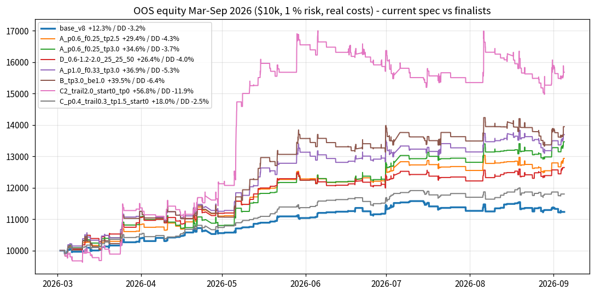
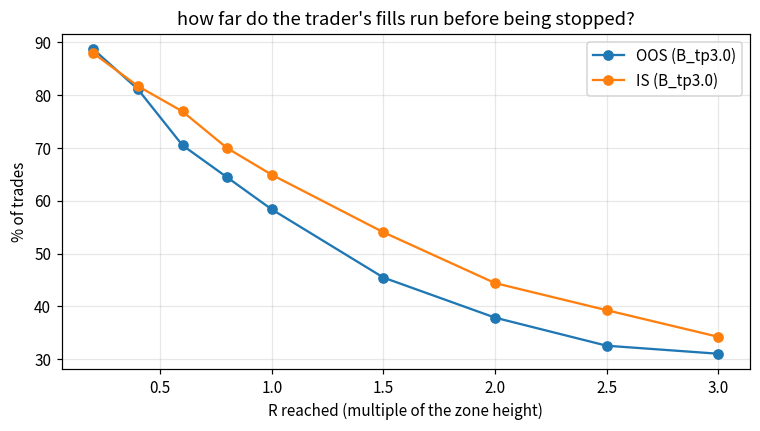
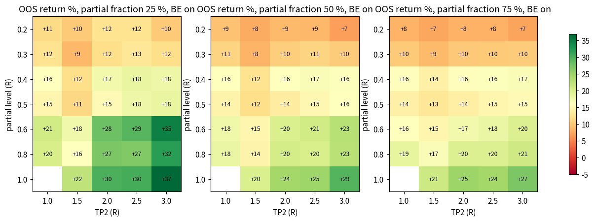
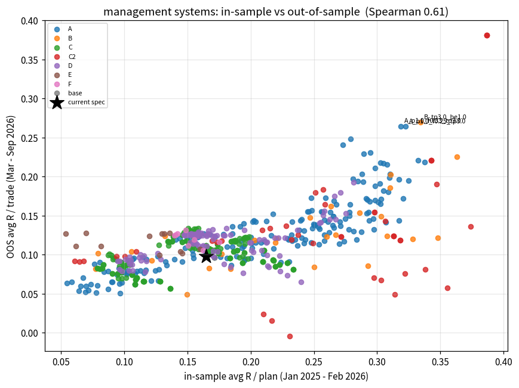
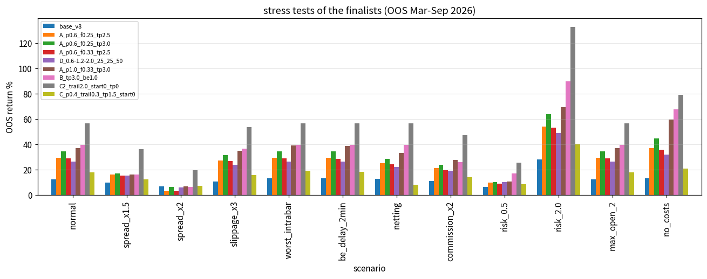
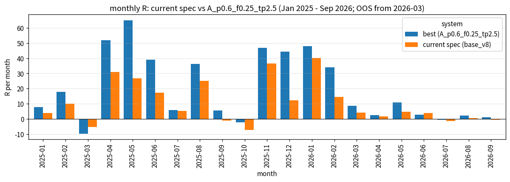

# RISK-MANAGEMENT STUDY (v9) — which exit system makes the LU-POI trader most profitable?

**Question.** The trader's management is *"close 50 % at +0.4R, move the stop to break-even, TP2 fixed at +1.5R"*.
Test different numbers **and** different systems and find the most profitable one.

**Answer in one line.** Keep the two-leg partial system, but **partial later, partial less, target further:
close 25 % at +0.6R → stop to break-even → TP2 at +2.5R** (`partial_r=0.6,partial_frac=0.25,tp2_r=2.5`).
In-sample it earns **+0.308 R per plan vs +0.165** for the current spec (+87 %, 1 270 plans, paired t = 7.1, better in 13 of
14 months) at the *same* drawdown in R; out-of-sample it turns **+12.3 % into +29.4 %** (max DD 3.2 → 4.3 %, PF 1.46 → 1.68).
TP2 = 3R is an equally good twin (better OOS, slightly worse in-sample).  Everything that makes more than this (single 3R
target with a 1R BE trigger, 1R partials, a 2R trail on the whole position) does so with 25–60 % win-rates and 1.5–2.5× the
drawdown, and the trail system is negative in the second OOS half.

---

## 0. Method (what was actually run — every number below has a file behind it)

* Entries are held fixed at the v8 recommended configuration (v8 M5 filter, `min_quality 0.60` on M10/M15/M30/H1, 1 % risk,
  $10 000, real costs: per-minute spread (imputed where the CSV has none), $7/lot commission, $0.10 stop slippage, swaps).
  Only the management changes.  R = zone height (entry at the near edge, SL at the far edge).
* **OOS portfolio grid** — `run_rm_study.py`: **580 managements** on the realistic portfolio simulator
  (`lubot/portfolio_sim.py`, M1 precision, MT5-tester intrabar path, 4 concurrent positions, mirror order policy)
  **2026-03-02 → 2026-09-04** (the period the quality model never saw).  → `rm_study_grid.csv`, `rm_study/<name>.json|_trades.csv|_equity.csv`.
* **In-sample replay** — `rm_insample.py --all`: **all 580 managements** replayed on the **1 270 plans** the same trader would
  have taken **Jan 2025 → Feb 2026** (bot-like candidates that pass the v8 gates; M5 503, M10 362, M15 239, M30 118, H1 48),
  one plan at a time with the *same simulator code*.  Parity with the OOS engine on the current spec is exact
  (1 270 / 1 270 identical outcomes, +0.1648 R/plan).  → `rm_insample.csv`, `rm_insample/<name>.json|_trades.csv`.
* **Stress tests** — `rm_stress.py`: 14 finalists × 12 scenarios (spread ×1.5 / ×2, slippage ×3, worst intrabar path, 2-min BE
  delay, netting account, commission ×2, risk 0.5 / 2 %, max 2 open positions, no costs).  → `rm_stress.csv` (168 runs).
* **Tables / charts** — `make_rm_report.py` → `rm_is_vs_oos.csv`, `rm_summary_table.csv`, `rm_family_summary.csv`,
  `rm_mfe_survival.csv`, `rm_monthly_R.csv`, `charts/rm_*.png`.  `bash run_v9_all.sh` reproduces the whole pipeline (resumable).
* Simulator mechanics are covered by `tests/test_rm_systems.py` (11 hand-built M1 scenarios) and the live bot by
  `tests/test_trader_live.py::test_v9_recommended_management_live_split`; 75 tests pass.

Families: **A** two-leg partial (level 0.2–1.0R × fraction 25–75 % × TP2 1–3R × BE on/off, 191 variants) · **B** single target
± BE trigger (27) · **C** partial + trailed runner (186) · **C2** trail on the whole position (45) · **D** three-leg ladders ±
stop ratchet (110) · **E** time stops (12) · **F** BE offset (8).

---

## 1. Result table

OOS = portfolio Mar–Sep 2026 (127–133 trades).  IS = in-sample replay Jan 2025–Feb 2026 (1 270 plans).  All net of costs.

| management | OOS return | OOS max DD | OOS PF | OOS R/trade | OOS win % | OOS H1 / H2 R | OOS +months | IS R/plan | IS PF | IS win % | IS max DD (R) | IS +months | IS t |
|---|---|---|---|---|---|---|---|---|---|---|---|---|---|
| **current spec** 50 % @ 0.4R → BE, TP2 1.5R | +12.3 % | −3.2 % | 1.46 | +0.098 | 80.9 | 10.6 / 2.2 | 5/7 | +0.165 | 1.88 | 80.8 | −20.1 | 11/14 | 9.0 |
| 50 % @ 0.4R → BE, TP2 2.5R | +18.6 % | −4.5 % | 1.55 | +0.140 | 80.9 | 15.5 / 2.4 | 6/7 | +0.186 | 1.96 | 80.8 | −19.7 | 12/14 | 9.6 |
| 50 % @ 0.6R → BE, TP2 1.5R | +14.7 % | −4.4 % | 1.36 | +0.113 | 70.2 | 13.3 / 1.5 | 4/7 | +0.254 | 2.07 | 76.5 | −18.4 | 11/14 | 11.6 |
| 50 % @ 0.6R → BE, TP2 2.5R | +20.7 % | −3.7 % | 1.48 | +0.158 | 70.2 | 15.3 / 5.5 | 5/7 | +0.278 | 2.18 | 76.5 | −20.4 | 12/14 | 11.3 |
| **★ 25 % @ 0.6R → BE, TP2 2.5R** | **+29.4 %** | −4.3 % | 1.68 | +0.215 | 70.9 | 21.8 / 5.6 | **6/7** | **+0.308** | **2.29** | 76.0 | −20.9 | 12/14 | **10.3** |
| **★ 25 % @ 0.6R → BE, TP2 3R** (twin) | **+34.6 %** | −3.7 % | **1.81** | +0.248 | 70.9 | 21.5 / **10.0** | **6/7** | +0.279 | 2.17 | 76.0 | −22.8 | **13/14** | 8.9 |
| 33 % @ 0.6R → BE, TP2 2.5R | +28.9 % | −4.1 % | 1.68 | +0.211 | 70.9 | 21.0 / 5.8 | 6/7 | +0.298 | 2.25 | 76.0 | −20.7 | 12/14 | 10.6 |
| 25 % @ 0.8R → BE, TP2 2.5R | +26.7 % | −5.2 % | 1.52 | +0.197 | 65.4 | 26.3 / 0.4 | 5/7 | +0.317 | 2.03 | 69.1 | −26.6 | 13/14 | 9.9 |
| 25 % @ 1.0R → BE, TP2 2.5R | +30.4 % | −5.5 % | 1.50 | +0.219 | 59.8 | 27.7 / 0.1 | 6/7 | +0.338 | 1.94 | 64.3 | −31.0 | 12/14 | 9.6 |
| 33 % @ 1.0R → BE, TP2 3R | +36.9 % | −5.3 % | 1.60 | +0.265 | 59.8 | 28.7 / 4.9 | 6/7 | +0.319 | 1.89 | 64.6 | −29.2 | 12/14 | 9.0 |
| 50 % @ 0.4R, **no BE**, TP2 3R | +24.1 % | −3.6 % | 1.46 | +0.173 | 31.3 | 17.9 / 4.7 | 6/7 | +0.248 | 1.74 | 35.0 | −30.8 | 12/14 | — |
| single TP 1.5R, no partial (B) | +16.8 % | −11.4 % | 1.21 | +0.121 | 45.5 | 22.5 / −6.5 | 4/7 | +0.348 | 1.76 | 54.6 | −35.4 | 12/14 | 9.9 |
| single TP 3R, no partial | +31.6 % | −8.9 % | 1.31 | +0.226 | 31.1 | 25.9 / 3.9 | 5/7 | +0.363 | 1.55 | 34.8 | −55.5 | 12/14 | 6.8 |
| single TP 3R, **BE after 1R** | +39.5 % | −6.4 % | 1.58 | +0.270 | 23.5 | 31.8 / 3.8 | 5/7 | +0.334 | 1.90 | 23.5 | −31.2 | 11/14 | 7.7 |
| 50 % @ 0.4R + **0.3R trail** on the runner, TP2 1.5R (C) | +18.0 % | **−2.5 %** | 1.65 | +0.134 | 80.9 | 13.6 / 3.9 | 6/7 | +0.150 | 1.80 | 81.5 | −19.8 | 12/14 | 9.2 |
| 50 % @ 0.5R + 1.5R trail, no TP2 (best C in-sample) | +10.4 % | −5.5 % | 2.07* | — | 78.3 | — / −0.5 | — | +0.234 | 2.07 | 78.3 | −17.7 | 11/14 | 9.5 |
| whole position, **2R trail**, no TP (C2) | +56.8 % | −11.9 % | 1.57 | +0.381 | 34.4 | 55.4 / **−5.5** | 4/7 | +0.387 | 1.80 | 40.1 | −53.4 | 11/14 | 6.9 |
| whole position, 1R trail from 1R | +7.9 % | −8.7 % | — | — | — | — / −3.2 | — | +0.356 | 1.99 | 63.6 | −27.9 | 12/14 | 9.3 |
| ladder 25/25/50 @ 0.6/1.2/2.0R (best D) | +26.4 % | −4.0 % | 1.62 | +0.193 | 70.9 | 21.3 / 3.2 | 6/7 | +0.281 | 2.18 | 76.0 | −21.3 | 12/14 | 11.3 |
| ladder 34/33/33 @ 0.4/1.0/2.0R | +17.0 % | −3.2 % | 1.65 | +0.132 | 81.0 | 13.5 / 3.2 | 6/7 | +0.170 | 1.91 | 81.2 | −20.7 | 12/14 | — |
| ladder 0.6/1.2/2.0 + stop ratchet | +19.7 % | −4.8 % | — | — | 76.1 | — / 2.6 | — | +0.275 | 2.16 | 76.1 | −21.3 | 12/14 | — |
| current spec + 8-h time stop (best E) | +13.9 % | −2.8 % | — | — | 80.0 | — / 3.5 | — | +0.160 | 1.85 | 80.0 | −20.1 | 11/14 | — |
| current spec + 30-min time stop | +17.4 % | −2.9 % | 1.70 | +0.130 | 78.8 | 13.1 / 3.8 | 6/7 | **+0.07** | 1.36 | 68.5 | −29.1 | 11/14 | 4.5 |
| current spec, BE at +0.2R instead of entry (F) | +15.7 % | −3.1 % | 1.58 | +0.120 | 80.9 | 11.7 / 3.9 | 5/7 | +0.155 | 1.83 | 81.0 | −19.3 | 11/14 | — |

(\* in-sample PF; "—" = see the csv.)  Full data: `rm_study_grid.csv` (580 rows, OOS), `rm_insample.csv` (580 rows, IS),
`rm_is_vs_oos.csv` (merged, rank-sum).  **Spearman rank correlation of R/trade between in-sample and out-of-sample across the
580 systems: 0.61 (p < 1e-60)** — the ranking is real, not six-month noise (`charts/rm_is_vs_oos.png`).



---

## 2. What the data says

**2.1 The current partial is too early and the target too close.**  Of the trader's fills (single 3R target, no partial, so
the excursion is uncapped), 81 % reach +0.4R but 70–77 % also reach +0.6R, 58–65 % reach +1R, 45–54 % +1.5R, 38–44 % +2R
and 31–34 % +3R (OOS / IS, `rm_mfe_survival.csv`).  Given the trade reached +0.6R it reaches +2.5R about half of the time.
The current spec sells half of every winner at +0.4R and caps the rest at 1.5R: **+0.165 R/plan** from a population that
would pay +0.36 R/plan with no management at all (single 3R target) — but that population also has a 35 % win-rate and a
−55 R drawdown.  The task is to keep the drawdown of the partial system and take more of the excursion.



**2.2 Moving the partial from 0.4R to 0.6R is the single biggest and cleanest improvement — monotone in-sample AND OOS.**
In-sample R/plan for 50 % partial / TP2 1.5R: 0.2R +0.087 · 0.3R +0.109 · **0.4R +0.165** · 0.5R +0.210 · **0.6R +0.254** ·
0.8R +0.270 · 1.0R +0.297.  OOS return, same sweep: +8 / +8 / +12 / +12 / +15 / +14 / +22 %.  Beyond 0.6R the win-rate
falls fast (76 → 69 → 64 %) and the in-sample drawdown jumps from −19/−21 R to −27/−31 R; up to 0.6R the drawdown is *flat*
(−18 to −21 R, i.e. the same as today).  **0.6R is the knee**: +54 % more R/plan than 0.4R at unchanged drawdown.

**2.3 Take a smaller partial.**  At every partial level and every TP2, 25 % beats 33 % beats 50 % beats 67 % beats 75 %
in-sample (`make_rm_report.py` table "in-sample avg R by partial level × TP2", 35/35 cells monotone) and OOS (heat-map).
At 0.6R / TP2 2.5R: 25 % +0.308 · 33 % +0.298 · 50 % +0.278 · 67 % +0.258 · 75 % +0.249 R/plan; OOS +29.4 / +28.9 / +20.7 /
+19.4 / +18.1 %.  The drawdown does not move (−20.9 / −20.7 / −20.4 R).  Below 25 % the two legs cannot be sized on a
0.01-lot account at 1 % risk for the smaller zones (the sizing code refuses rather than over-risks).

**2.4 TP2 2.5R is the in-sample optimum; 3R is the OOS optimum; 1.5R is a bad spot in both.**  In-sample, 2.5R beats 3R in
**every one of the 35 (level, fraction) cells** and beats 1.5R by +0.02–0.04 R/plan everywhere.  OOS, 3R beats 2.5R at
partial levels ≥ 0.6R (+34.6 vs +29.4 % at 0.6R/25 %) because the spring-2026 rally paid the last 0.5R.  The heat-map
(`charts/rm_heat_partial_tp.png`) shows the whole 0.6–1.0R × 2–3R block is green: this is a plateau, not a spike.



**2.5 Break-even stays.**  Removing the BE move (`_noBE`) raises the average slightly (in-sample +0.248 vs +0.165 at
0.4R/3R) but the win-rate collapses to 35 % and the in-sample drawdown goes from −20 R to −31 R.  The same R is made with a
later, smaller partial *with* BE at −21 R drawdown and 76 % win-rate.  A BE trigger without a partial (single 3R target, BE
once a closed bar is ≥ 1R away) is the best single-target system (+39.5 % OOS, +0.334 IS) but has a **23.5 % win-rate**
and −31 R in-sample drawdown — very hard to trade live.  A BE offset (+0.05…+0.2R or −0.1R) changes ±0.01 R/plan: noise.

**2.6 Trailing stops: a tight trail on the runner protects; a wide trail on the whole position is a trend bet.**
0.3R trail on the runner of the current spec is the lowest-drawdown system of the study (OOS +18 %, DD −2.5 %, Sharpe 3.6,
81 % win) but adds nothing in-sample (+0.150 vs +0.165).  No C variant reaches +0.24 R/plan in-sample; the best (1.5R trail
after a 0.5R partial) makes only +10 % OOS.  Trailing the *whole* position by 2R with no target is the OOS return winner
(+56.8 %) and the in-sample winner (+0.387 R/plan) — but it is a trend-following overlay: 34–40 % win-rate, 12 % OOS
drawdown, −53 R in-sample drawdown, **−5.5 R in the second OOS half**, 4-hour average hold (swaps, weekend exposure), and
the 1R / 1.5R trails are far worse OOS (+8 / +19 %).  Not a robust choice for a mean-reversion POI bot.

**2.7 Ladders, ratchets and time stops do not help.**  The best 3-leg ladder (25/25/50 @ 0.6/1.2/2.0R: +0.281 IS, +26.4 %
OOS) never beats the equivalent 2-leg system (+0.308 / +29.4 %); ratcheting the stop to the previous target costs 5–7 %
OOS (it stops runners in noise).  Short time stops look good OOS (30 min: +17 %) but are the **worst systems in-sample**
(+0.07 R/plan, PF 1.36) — a textbook OOS-only artefact; 8-hour stops are neutral.



---

## 3. Recommendation

**Change the management to: close 25 % at +0.6R, move the stop to break-even, TP2 = +2.5R** (`A_p0.6_f0.25_tp2.5`).
Live command (Windows, MT5 terminal open and logged in):

```
python trader.py --symbol XAUUSD.t --risk 1.0 --commission 7 --trader partial_r=0.6,partial_frac=0.25,tp2_r=2.5
```

| | current spec | recommended | change |
|---|---|---|---|
| in-sample R per plan (1 270 plans, 14 months) | +0.165 | **+0.308** | **+87 %** (paired t = 7.1, better in 13/14 months) |
| in-sample PF / win-rate | 1.88 / 80.8 % | **2.29** / 76.0 % | |
| in-sample max drawdown (R) / positive months | −20.1 / 11 of 14 | −20.9 / 12 of 14 | unchanged |
| in-sample by TF (R/plan) M5 · M10 · M15 · M30 · H1 | .07 · .20 · .32 · .16 · .20 | .12 · .37 · .56 · .38 · .33 | every TF improves |
| in-sample buys / sells (R/plan) | +0.20 / +0.11 | +0.40 / +0.17 | both improve |
| OOS return (Mar–Sep 2026, $10k, 1 %) | +12.3 % | **+29.4 %** | ×2.4 |
| OOS PF / R per trade / Sharpe (daily) | 1.46 / +0.098 / 2.35 | **1.68 / +0.215 / 3.26** | |
| OOS max drawdown | −3.2 % | −4.3 % | +1.1 pt |
| OOS positive months / first half / second half | 5 of 7 / 10.6 R / 2.2 R | **6 of 7** / 21.8 R / 5.6 R | |
| OOS M5 / other TFs / buys / sells (R) | 9.8 / 3.0 / 13.6 / −0.8 | 21.5 / 5.8 / 28.7 / −1.4 | |
| outcome mix (OOS) | 62 % partial→BE, 19 % TP2, 19 % SL | 49 % partial→BE, 22 % TP2, 29 % SL | more full stops |
| average hold | 43 min | 118 min | |

*Why this one.*  It has the best in-sample return / drawdown ratio of all 580 systems (390 R / 20.9 R = 18.7), the highest
in-sample PF (2.29), the largest in-sample t-statistic among the top-10 systems (10.3), it ranks in the OOS top-15 by
return / drawdown (6.8) with 6 of 7 positive months, and its parameters sit on a plateau (0.6R × 25–33 % × 2–3R are all
+0.27–0.31 R/plan in-sample and +27–35 % OOS).  It is executable **today** by the existing live bot: two limit legs
(25 % / 75 %) with server-side TPs and the BE modification after leg A closes — the identical order flow as the current
spec, only the numbers change (`tests/test_trader_live.py::test_v9_recommended_management_live_split`).

**Twin: TP2 = 3R** (`partial_r=0.6,partial_frac=0.25,tp2_r=3.0`): OOS +34.6 % / DD 3.7 % / PF 1.81 / best second half
(+10.0 R) / 13 of 14 in-sample months; in-sample +0.279 R/plan (−0.03 vs 2.5R) with −22.8 R drawdown.  Choose it if you
weight the recent six months more than the 14 months before.  Anything in 2.5–3R is fine.

**If lower drawdown matters more than return:** `trail_r=0.3` on top of the current spec (0.4R / 50 % / 1.5R + 0.3R trail
on the runner): OOS +18 %, max DD 2.5 %, Sharpe 3.6, win-rate unchanged at 81 % — but no in-sample gain, and it needs the
stop-modification loop in the live bot (simulator only today).

**Not recommended although they make more OOS:** 33 % @ 1.0R → 3R (+36.9 %), single 3R + BE after 1R (+39.5 %),
2R trail (+56.8 %): win-rates 60 / 24 / 34 %, OOS drawdowns 5.3 / 6.4 / 11.9 %, in-sample drawdowns −29 / −31 / −53 R,
and the trail is negative Jun–Sep 2026.

### Stress tests (OOS, `rm_stress.csv`, `charts/rm_stress.png`)

| scenario | current spec | **25 % @ 0.6R → 2.5R** | 25 % @ 0.6R → 3R | 33 % @ 1.0R → 3R | single 3R + BE@1R | 2R trail |
|---|---|---|---|---|---|---|
| normal | +12.3 % / DD 3.2 | **+29.4 % / 4.3** | +34.6 % / 3.7 | +36.9 % / 5.3 | +39.4 % / 6.4 | +56.8 % / 11.9 |
| spread ×1.5 | +9.8 | **+16.2** | +17.2 | +16.1 | +16.1 | +36.2 |
| spread ×2 | +6.9 | +3.0 | +6.5 | +7.0 | +6.3 | +19.5 |
| slippage ×3 | +10.6 | **+27.4** | +31.4 | +34.9 | +36.5 | +53.4 |
| worst intrabar path | +13.2 | **+29.4** | +34.6 | +39.1 | +39.4 | +56.8 |
| BE delay 2 min | +13.0 | **+29.3** | +34.4 | +38.9 | +39.4 | +56.8 |
| netting account | +12.5 | **+25.0** | +28.5 | +33.1 | +39.4 | +56.8 |
| commission ×2 | +10.9 | **+21.5** | +24.0 | +27.8 | +25.8 | +47.1 |
| risk 0.5 % | +6.2 / DD 1.4 | +9.7 / 1.7 | +10.4 / 2.5 | +10.7 / 2.3 | +17.0 / 3.1 | +25.6 / 5.9 |
| risk 2 % | +28.1 / DD 6.2 | +54.1 / 8.3 | +63.8 / 7.6 | +69.3 / 10.8 | +89.7 / 12.6 | +132.8 / 24.5 |
| max 2 open positions | +12.3 | +29.4 | +34.6 | +36.9 | +39.4 | +56.8 |
| no costs | +13.3 | +36.9 | +44.7 | +59.5 | +67.5 | +79.0 |

The recommendation stays ahead of the current spec in every cell except **spread ×2**, where every partial system falls to
+3…+7 % (the current spec, with its tiny 0.4R target, is the least spread-sensitive).  That is the whole bot's known weak
spot (v8 study), not a property of the management: a later partial needs the price to travel further, so it pays more spread
per R.  Under normal spread the cost drag of the recommendation is 7.5 pt (36.9 → 29.4 %) vs 1 pt for the current spec.





---

## 4. Honest caveats

* The OOS window is six months / 127 trades: the t-statistic of the recommended system's mean R is 2.2 (current spec 1.8).
  The in-sample replay (1 270 plans, t ≈ 10, paired improvement t = 7.1) is what makes the *direction* credible; the *size*
  of the OOS gain (+17 pt) is partly spring-2026 trend luck.  Expect the in-sample ratio (≈ +80–90 % more R per trade than
  the current spec), not necessarily ×2.4 in return.
* Fewer, later partials mean more full −1R stops (29 % vs 19 %) and 2-hour holds: psychologically harder than the 81 %-win
  current spec although it makes more.  Sells remain ≈ 0 OOS under every management; the edge is in the buys.
* The in-sample replay uses each plan in isolation (no position limits, no compounding); the OOS uses the full portfolio.
  Parity of the two engines on the current spec is exact.
* All partial (A) and ladder (D) systems are executable by the existing live bot.  `trail_r`, `be_trigger_r`, `max_hold_min`
  exist in the simulator only; the live bot would need a stop-modification loop before those could be used (not needed for
  the recommendation).
* The previous session's draft of this report (`RISK_MGMT_STUDY_draft_unverified.md`) was written before the grid had run
  past p0.5 and had no data files behind its p0.6+ / B–F / in-sample / stress numbers.  Its recommendation (25 % @ 0.6R →
  3R) turned out to be the twin of the final one; every number in *this* file was recomputed and is backed by the csv/json
  files listed in §0.

## 5. Files

* `run_rm_study.py` → `rm_study_grid.csv`, `rm_study/` (580 variants) · `rm_insample.py --all` → `rm_insample.csv`, `rm_insample/`
  (580 replays), population `rm_insample_population.pkl` · `rm_stress.py` → `rm_stress.csv`, `rm_stress/` (168 runs) ·
  `make_rm_report.py` → `charts/rm_*.png`, `rm_is_vs_oos.csv`, `rm_summary_table.csv`, `rm_family_summary.csv`, `rm_mfe_survival.csv`, `rm_monthly_R.csv`
* `run_v9_all.sh` — the whole pipeline, resumable, commits after every stage
* simulator additions (`lubot/execution.py::TraderConfig`, `lubot/portfolio_sim.py`): `partial_frac=0`, `tp2_r=0`, `tp_levels/tp_fracs`,
  `ratchet_sl`, `be_on_partial`, `be_trigger_r`, `be_offset_r`, `trail_r/trail_start_r/trail_after_partial/trail_source`, `max_hold_min`
  — defaults reproduce v8 byte-for-byte; `tests/test_rm_systems.py`, `tests/test_trader_live.py` (75 tests)
