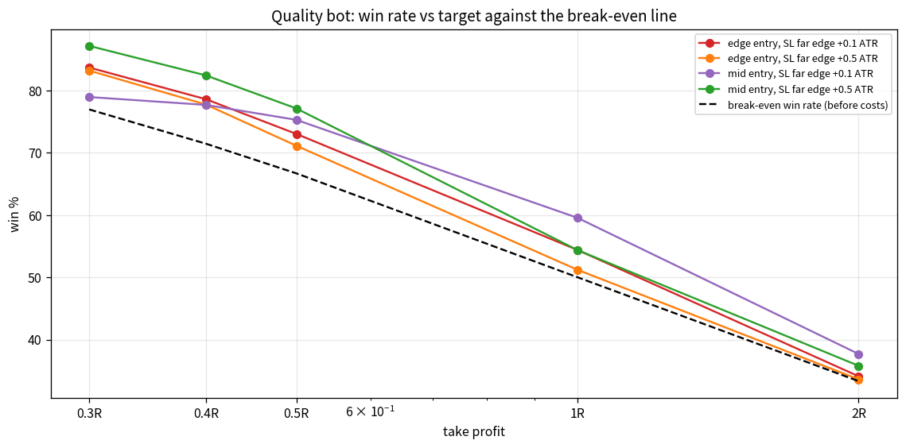
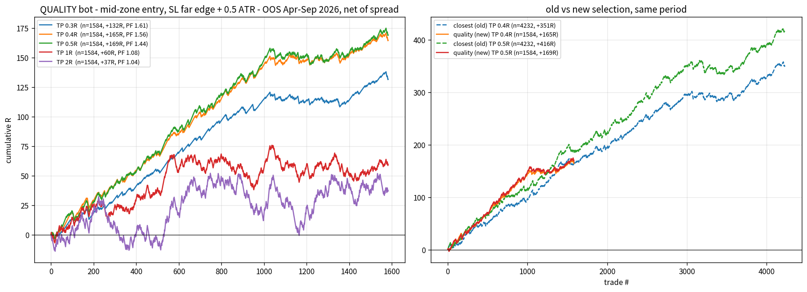

# Small-target backtest: 0.3R / 0.4R / 0.5R on the quality bot

**Setup.** Bot v2 (`selection_mode=quality`, model trained on Sep 2025 - Mar 2026 only) run **out-of-sample on Apr 1 - Sep 4 2026** across M5/M10/M15/M30/H1. Every selected POI that price reached is one trade. Limit entries (`edge` = near edge of the zone, `mid` = 50% of the zone), SL = far edge + buffer (0.1 or 0.5 ATR), TP = fixed R multiple. Same-minute ambiguity resolved against the trade (stop first); every fill pays the recorded spread (median $0.28). Open positions after 300 bars are marked to market. The old `closest` selection is run on the same period as control.

## 1. Does price reach small targets before the stop? (SL = far edge + 0.1 ATR)

| target | quality bot (new) | closest (old) | break-even win % |
|---|---|---|---|
| 0.3R | **83.7%** | 79.0% | 77% |
| 0.4R | **78.6%** | 75.6% | 71% |
| 0.5R | **73.0%** | 72.0% | 67% |
| 1R | **54.3%** | 56.4% | 50% |
| 2R | **33.9%** | 37.0% | 33% |

Small targets are reached **74-84%** of the time - above their 67-77% break-even lines. 1R (54%) sits on its 50% line and 2R (34%) on its 33% line. **The reaction at a quality POI is reliable but small: 0.3-0.5R captures it, 1R+ gives it back.**

## 2. Scenario grid (net of spread, OOS Apr-Sep 2026)

| mode | entry | sl_buffer_atr | tp_R | filled | win_% | avg_net_R | total_net_R | profit_factor | max_dd_R |
|---|---|---|---|---|---|---|---|---|---|
| closest | edge | 0.1 | 0.3 | 4305 | 75.8 | -0.089 | -384.8 | 0.64 | -394.3 |
| quality | edge | 0.1 | 0.3 | 1633 | 83.6 | 0.031 | 51.2 | 1.18 | -17.9 |
| closest | edge | 0.1 | 0.4 | 4305 | 74.4 | -0.057 | -246.4 | 0.8 | -259.1 |
| quality | edge | 0.1 | 0.4 | 1633 | 78.6 | 0.043 | 70.3 | 1.19 | -19.0 |
| closest | edge | 0.1 | 0.5 | 4305 | 71.5 | -0.036 | -154.8 | 0.89 | -199.2 |
| quality | edge | 0.1 | 0.5 | 1633 | 73.0 | 0.038 | 62.1 | 1.13 | -36.8 |
| closest | edge | 0.5 | 0.3 | 4305 | 85.4 | 0.058 | 249.1 | 1.38 | -17.5 |
| quality | edge | 0.5 | 0.3 | 1633 | 83.2 | 0.046 | 74.7 | 1.26 | -14.4 |
| closest | edge | 0.5 | 0.4 | 4305 | 80.0 | 0.068 | 291.9 | 1.32 | -24.0 |
| quality | edge | 0.5 | 0.4 | 1633 | 77.7 | 0.053 | 85.9 | 1.23 | -18.1 |
| closest | edge | 0.5 | 0.5 | 4305 | 74.1 | 0.059 | 252.1 | 1.21 | -32.0 |
| quality | edge | 0.5 | 0.5 | 1633 | 71.1 | 0.031 | 50.6 | 1.1 | -21.9 |
| closest | mid | 0.1 | 0.3 | 4232 | 64.7 | -0.237 | -1001.1 | 0.33 | -1002.9 |
| quality | mid | 0.1 | 0.3 | 1584 | 78.9 | -0.067 | -105.7 | 0.71 | -106.9 |
| closest | mid | 0.1 | 0.4 | 4232 | 67.8 | -0.183 | -773.0 | 0.49 | -776.8 |
| quality | mid | 0.1 | 0.4 | 1584 | 77.7 | -0.009 | -15.0 | 0.96 | -53.4 |
| closest | mid | 0.1 | 0.5 | 4232 | 67.9 | -0.137 | -579.9 | 0.64 | -585.8 |
| quality | mid | 0.1 | 0.5 | 1584 | 75.3 | 0.03 | 48.2 | 1.11 | -41.3 |
| closest | mid | 0.5 | 0.3 | 4232 | 86.9 | 0.064 | 272.5 | 1.46 | -17.6 |
| quality | mid | 0.5 | 0.3 | 1584 | 87.1 | 0.083 | 131.5 | 1.61 | -12.4 |
| closest | mid | 0.5 | 0.4 | 4232 | 82.0 | 0.083 | 350.5 | 1.43 | -19.8 |
| quality | mid | 0.5 | 0.4 | 1584 | 82.4 | 0.104 | 164.5 | 1.56 | -8.9 |
| closest | mid | 0.5 | 0.5 | 4232 | 77.6 | 0.098 | 415.6 | 1.41 | -28.3 |
| quality | mid | 0.5 | 0.5 | 1584 | 77.1 | 0.107 | 169.0 | 1.44 | -13.8 |

Best quality-bot scenario: **`mid_sl0.5_tp0.5`** -> **+0.107 R/trade**, win 77.1%, **PF 1.44**, max drawdown -13.8 R over 1584 trades (vs +0.05 R / PF 1.11 for the best 1R-2R scenario in the previous study).

Observations
- **The stop buffer matters more than the target.** With SL only 0.1 ATR beyond the zone, small-target trades lose (old bot: -0.09 to -0.24 R/trade); with +0.5 ATR they win at every TP. Price sweeps ~1.3 zone-heights before turning, so the stop has to sit beyond the sweep.
- **Mid-zone entry + 0.5 ATR buffer** is the robust combination: PF 1.4-1.6 at 0.3-0.5R for both selections; quality mode adds ~+0.02 R/trade while cutting the trade count by 60% (fewer, better POIs).
- **Per-trade vs total.** Quality mode has the better per-trade edge and drawdown (PF 1.56, DD -9 R vs PF 1.43, DD -20 R at 0.4R), but the old `closest` mode trades 2.7x more often and therefore banks more *total* R (+351 vs +165) in the robust `mid_sl0.5` setups. If execution capacity is not a constraint, running both selections (quality first, closest as a lower-priority stream) or lowering `min_quality` to ~0.45 is the way to get volume back without the tight-stop disasters.
- **Quality selection removes the disasters.** Every tight-stop scenario that was deeply negative with `closest` (-385 to -1000 R total) is flat or positive with `quality`.
- **Costs.** Median risk is $6.26/oz, so the spread is ~11% of a 0.4R target - material on M5 (risk ~$4), negligible on M30/H1. Slippage is *not* modelled; on M5 it would eat a good part of the edge.

## 3. Quality bot, mid entry / SL +0.5 ATR, by timeframe

| tf | n | median risk $ | 0.3R avg | 0.3R win% | 0.4R avg | 0.4R win% | 0.5R avg | 0.5R win% | 1R avg | 1R win% |
|---|---|---|---|---|---|---|---|---|---|---|
| M5 | 751 | 4.32 | +0.074 | 87.7 | +0.098 | 83.1 | +0.109 | 78.3 | +0.053 | 55.9 |
| M10 | 381 | 6.54 | +0.089 | 87.1 | +0.108 | 82.3 | +0.094 | 75.9 | +0.007 | 52.5 |
| M15 | 262 | 8.43 | +0.108 | 87.9 | +0.146 | 84.4 | +0.149 | 78.9 | +0.067 | 55.1 |
| M30 | 153 | 11.12 | +0.081 | 85.1 | +0.091 | 79.7 | +0.109 | 75.7 | +0.028 | 52.7 |
| H1 | 86 | 17.08 | +0.064 | 83.1 | +0.029 | 74.7 | +0.013 | 68.7 | -0.029 | 49.4 |

## 4. Stability - `mid_sl0.5_tp0.4` by month

| month | n | avg_net_R | win_pct | total_R |
|---|---|---|---|---|
| 2026-04 | 336 | 0.145 | 83.3 | 48.12 |
| 2026-05 | 309 | 0.138 | 81.2 | 40.799 |
| 2026-06 | 311 | 0.14 | 82.6 | 42.489 |
| 2026-07 | 330 | 0.054 | 77.3 | 17.214 |
| 2026-08 | 299 | 0.062 | 76.6 | 17.892 |
| 2026-09 | 48 | -0.043 | 68.8 | -1.996 |

Positive every full month; Jul-Aug (+0.05-0.06 R) weaker than Apr-Jun (+0.14 R). Sep is 4 trading days.

## 5. By POI type and session (`mid_sl0.5_tp0.4`)

| kind | n | avg_net_R | win_pct | total_R |
|---|---|---|---|---|
| IMB | 539 | 0.079 | 78.5 | 41.483 |
| OB | 499 | 0.125 | 81.0 | 60.389 |
| UW | 595 | 0.109 | 80.3 | 62.646 |

| session | n | avg_net_R | win_pct | total_R |
|---|---|---|---|---|
| Asia (17-01) | 500 | 0.084 | 78.4 | 40.364 |
| London (01-05) | 293 | 0.178 | 85.0 | 50.468 |
| London Close (10-12) | 174 | 0.161 | 85.1 | 27.893 |
| NY PM (12-17) | 247 | 0.048 | 76.5 | 11.459 |
| New York (07-10) | 328 | 0.068 | 76.2 | 21.299 |
| Pre-NY (05-07) | 91 | 0.145 | 84.6 | 13.035 |

London and London-Close touches are best (+0.16-0.18 R, 85% win); NY-PM and Asia weakest but still positive.

## 6. Bottom line

- With **TP 0.3-0.5R, mid-zone limit entry, SL = far edge + 0.5 ATR**, the quality bot is **positive out-of-sample on every timeframe and every full month**: about **+0.10 R/trade, ~80% win rate, PF ~1.5, ~14 trades/day across 5 TFs**, max drawdown ~10 R.
- Versus 1R/2R targets (~0 R/trade) the small targets turn the same POIs from break-even into a consistent low-variance edge. The trade-off is the classic scalper's one: many small wins, occasional -1R losses (0.80 x 0.4R - 0.20 x 1R = +0.12 R gross).
- It is an execution-sensitive edge: gross +0.12 R, net of spread +0.10 R, realistic slippage on M5 would remove roughly half of what is left. **M10-M30 are the sweet spot** (risk $6-11, win 80-84%).

Files: `compare_scenarios.csv`, `compare_scenarios_by_tf_quality.csv`, `compare_scenarios_by_tf_closest.csv`, `compare_summary.csv`, `charts/small_targets_*.png`.
