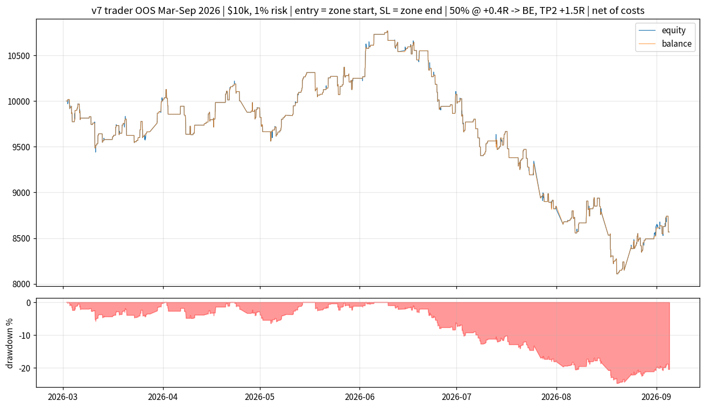
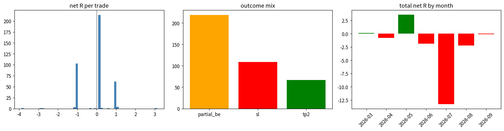
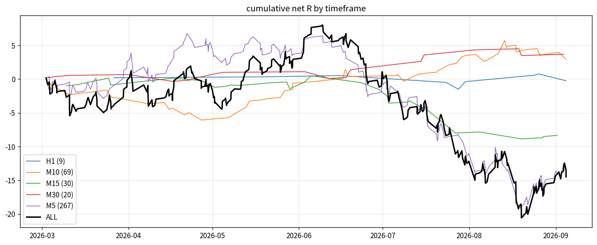
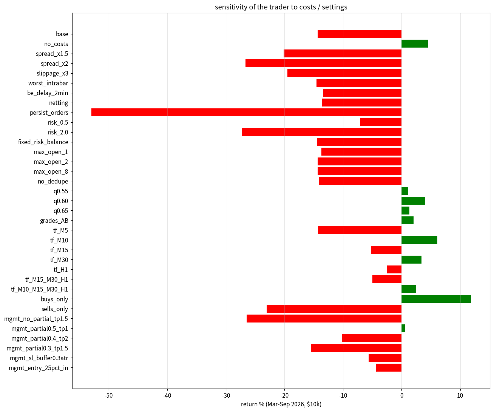

# TRADER v7 - realistic out-of-sample backtest

**Strategy**: v6 POI scanner (quality model, `min_quality 0.50`, model trained on data **before 2026-03-01**) ->
for every POI the bot shows: **limit entry at the start of the zone** (top of a bullish zone / bottom of a bearish
zone), **stop at the end of the zone** (far edge, no buffer) -> **1R = zone height**.
**Management (user spec)**: at **+0.4R close 50 %** and move the stop of the rest to **break-even**; **TP2 = +1.5R**.
Possible gross results per trade: stop before the partial **-1R**; partial then BE **+0.20R**;
partial then TP2 **+0.95R**.

**Data**: MT5 M1 export, out-of-sample **2026-03-02 -> 2026-09-05**, 9956 POI selections shown by the
scanner on M5 / M10 / M15 / M30 / H1 (the recorded stream is exactly what the live bot would have displayed at every bar
close).  Bars before 2026-04-06 carry no exported spread and were given the spread of the same weekday / NY-hour of the
bars that do (median $0.28).

**Realism** (`lubot/portfolio_sim.py`, M1 precision): limit fills on the **ask** (buys) / **bid** (sells); stops and
targets on the correct side (long on bid, short on ask); MT5-tester intrabar path (O -> L -> H -> C for bullish minutes,
O -> H -> L -> C for bearish); the TP1 leg is a **server-side take-profit** (no slippage), stop-outs are market executions
with **$0.10 slippage**; **$7 / lot round-turn commission**; **swaps** -$50 / +$15 per lot per night (3x Wednesday);
pending orders are cancelled when the scanner stops showing the POI (what the live bot does); one trade per POI;
overlapping zones (>= 50 %) are not traded twice; max 4 open trades; size **1 % of current equity** rounded down to 0.01
lots and split into two equal legs (hedging account); $10 000 start, leverage 1:100.

## 1. Base result (user specification)

| metric | value |
|---|---|
| trades | 395 |
| trades_per_day | 2.12 |
| win_% | 71.9 |
| profit_factor | 0.869 |
| avg_R | -0.0367 |
| median_R | 0.1667 |
| total_R | -14.49 |
| net_profit | -1433.01 |
| return_% | -14.33 |
| max_dd_% | -24.68 |
| max_dd_$ | -2657.44 |
| max_dd_R | -28.58 |
| sharpe_daily | -1.35 |
| partial_hit_% | 72.4 |
| tp2_% | 17.0 |
| partial_be_% | 55.4 |
| sl_% | 27.6 |
| forced_% | 0.0 |
| avg_hold_min | 60.0 |
| median_hold_min | 8.0 |
| avg_lots | 0.15 |
| avg_risk_$ | 91.34 |
| expectancy_$ | -3.63 |
| commission_$ | 414.4 |
| swap_$ | -2.0 |
| pending_placed | 7623 |
| cancelled | 7228 |
| skipped | 2330 |
| end_balance | 8566.99 |

`win_%` = trades with a positive net result (partial-then-break-even is a small win of ~+0.2R minus costs).
`partial_hit_%` = trades that reached +0.4R; `tp2_%` = trades that ran to +1.5R; `sl_%` = full -1R stops.

### Outcome mix
| outcome    |   n |   avg_R |          net |
|:-----------|----:|--------:|-------------:|
| partial_be | 219 |  0.1412 | 2824         |
| sl         | 109 | -1.033  |   -1.033e+04 |
| tp2        |  67 |  1.003  | 6072         |

### By timeframe
| tf   |   trades |   win_% |   avg_R |   total_R |    net_$ |   tp2_% |   partial_% |   PF |
|:-----|---------:|--------:|--------:|----------:|---------:|--------:|------------:|-----:|
| H1   |        9 |    66.7 | -0.0286 |     -0.26 |   -29.19 |    22.2 |        66.7 | 0.88 |
| M10  |       69 |    78.3 |  0.0422 |      2.91 |   257.6  |    15.9 |        78.3 | 1.18 |
| M15  |       30 |    56.7 | -0.2781 |     -8.34 |  -732.5  |    13.3 |        60   | 0.44 |
| M30  |       20 |    85   |  0.1838 |      3.68 |   337.7  |    20   |        85   | 2.31 |
| M5   |      267 |    71.2 | -0.0467 |    -12.48 | -1267    |    17.2 |        71.5 | 0.84 |

### By POI type
| kind   |   trades |   win_% |   avg_R |   total_R |   net_$ |   tp2_% |   partial_% |   PF |
|:-------|---------:|--------:|--------:|----------:|--------:|--------:|------------:|-----:|
| IMB    |      166 |    68.1 | -0.1237 |    -20.54 | -1982   |    13.3 |        68.7 | 0.63 |
| OB     |      123 |    76.4 |  0.0556 |      6.84 |   626.2 |    22   |        77.2 | 1.22 |
| UW     |      106 |    72.6 | -0.0075 |     -0.8  |   -77.5 |    17   |        72.6 | 0.97 |

### By side
| side   |   trades |   win_% |   avg_R |   total_R |   net_$ |   tp2_% |   partial_% |   PF |
|:-------|---------:|--------:|--------:|----------:|--------:|--------:|------------:|-----:|
| buy    |      225 |    75.6 |  0.0537 |     12.09 |    1068 |    20   |        75.6 | 1.21 |
| sell   |      170 |    67.1 | -0.1564 |    -26.59 |   -2501 |    12.9 |        68.2 | 0.57 |

### By grade
| grade   |   trades |   win_% |   avg_R |   total_R |   net_$ |   tp2_% |   partial_% |   PF |
|:--------|---------:|--------:|--------:|----------:|--------:|--------:|------------:|-----:|
| A       |       31 |    77.4 |  0.035  |      1.08 |    79   |    16.1 |        77.4 | 1.12 |
| B       |      163 |    76.1 |  0.0366 |      5.97 |   435.4 |    18.4 |        76.7 | 1.11 |
| C       |      201 |    67.7 | -0.1072 |    -21.55 | -1947   |    15.9 |        68.2 | 0.7  |

### Month by month
| month   |   trades |   win_% |   avg_R |   total_R |    net_$ |   tp2_% |   partial_% |   PF |
|:--------|---------:|--------:|--------:|----------:|---------:|--------:|------------:|-----:|
| 2026-03 |       69 |    76.8 |  0.0019 |      0.13 |    21.51 |    13   |        76.8 | 1.01 |
| 2026-04 |       50 |    66   | -0.0156 |     -0.78 |   -97.26 |    26   |        66   | 0.94 |
| 2026-05 |       69 |    79.7 |  0.0518 |      3.58 |   324.8  |    14.5 |        79.7 | 1.24 |
| 2026-06 |       50 |    72   | -0.037  |     -1.85 |  -174.9  |    16   |        72   | 0.88 |
| 2026-07 |       68 |    63.2 | -0.1947 |    -13.24 | -1226    |    14.7 |        64.7 | 0.53 |
| 2026-08 |       79 |    72.2 | -0.0282 |     -2.23 |  -263.7  |    19   |        73.4 | 0.88 |
| 2026-09 |       10 |    70   | -0.0102 |     -0.1  |   -17.87 |    20   |        70   | 0.93 |

## 2. Sensitivity (same selection stream, same period, one thing changed per row)

`no_costs` = zero spread / commission / slippage / swap (pure price path); `worst_intrabar` = the stop is always
assumed to be hit first when stop and target are both inside one minute; `be_delay_2min` = the bot needs 2 minutes to
move the stop to break-even after leg A closes; `netting` = one position, the bot closes half at market when +0.4R
prints; `persist_orders` = pending orders stay until filled / 300 bars instead of following the scanner; `mgmt_*` rows
are alternative managements for comparison (the delivered bot uses the user's spec = `base`).

| name                  |   trades |   win_% |   avg_R |   total_R |   profit_factor |   return_% |   max_dd_% |   max_dd_R |   sharpe_daily |   partial_hit_% |   tp2_% |   sl_% |   trades_per_day |
|:----------------------|---------:|--------:|--------:|----------:|----------------:|-----------:|-----------:|-----------:|---------------:|----------------:|--------:|-------:|-----------------:|
| base                  |      395 |    71.9 | -0.0367 |    -14.49 |           0.869 |     -14.33 |     -24.68 |     -28.58 |          -1.35 |            72.4 |    17   |   27.6 |             2.12 |
| no_costs              |      424 |    73.6 |  0.0127 |      5.4  |           1.039 |       4.49 |     -16.42 |     -17.51 |           0.38 |            74.1 |    17.9 |   25.9 |             2.28 |
| spread_x1.5           |      380 |    70.5 | -0.0596 |    -22.65 |           0.812 |     -20.16 |     -24.75 |     -29.52 |          -2.04 |            71.1 |    16.8 |   28.9 |             2.04 |
| spread_x2             |      366 |    68.9 | -0.0828 |    -30.32 |           0.748 |     -26.68 |     -29.63 |     -35.26 |          -2.76 |            69.4 |    16.7 |   30.6 |             1.97 |
| slippage_x3           |      395 |    71.9 | -0.0548 |    -21.65 |           0.821 |     -19.48 |     -26.56 |     -31.65 |          -1.86 |            72.4 |    17   |   27.6 |             2.12 |
| worst_intrabar        |      395 |    71.6 | -0.0379 |    -14.96 |           0.867 |     -14.56 |     -24.13 |     -27.66 |          -1.39 |            72.2 |    17.2 |   27.8 |             2.12 |
| be_delay_2min         |      395 |    69.9 | -0.0349 |    -13.79 |           0.878 |     -13.36 |     -23.4  |     -26.94 |          -1.25 |            72.4 |    18.2 |   27.6 |             2.12 |
| netting               |      395 |    71.4 | -0.0353 |    -13.96 |           0.877 |     -13.57 |     -24.86 |     -29.12 |          -1.25 |            71.1 |    17   |   28.1 |             2.12 |
| persist_orders        |     1025 |    66.8 | -0.0722 |    -73.99 |           0.808 |     -52.96 |     -58.24 |     -87.15 |          -3.47 |            67   |    19.5 |   33   |             5.5  |
| risk_0.5              |      379 |    71.5 | -0.0397 |    -15.04 |           0.865 |      -7.09 |     -12.95 |     -28.29 |          -1.31 |            72   |    17.4 |   28   |             2.04 |
| risk_2.0              |      395 |    71.9 | -0.0365 |    -14.41 |           0.872 |     -27.27 |     -44    |     -28.55 |          -1.33 |            72.4 |    17   |   27.6 |             2.12 |
| fixed_risk_balance    |      395 |    71.9 | -0.0378 |    -14.94 |           0.873 |     -14.48 |     -26.02 |     -28.75 |          -1.29 |            72.4 |    17   |   27.6 |             2.12 |
| max_open_1            |      381 |    71.9 | -0.0375 |    -14.29 |           0.872 |     -13.67 |     -25.26 |     -29.72 |          -1.25 |            72.4 |    17.1 |   27.6 |             2.05 |
| max_open_2            |      395 |    71.9 | -0.0367 |    -14.49 |           0.869 |     -14.33 |     -24.68 |     -28.58 |          -1.35 |            72.4 |    17   |   27.6 |             2.12 |
| max_open_8            |      395 |    71.9 | -0.0367 |    -14.49 |           0.869 |     -14.33 |     -24.68 |     -28.58 |          -1.35 |            72.4 |    17   |   27.6 |             2.12 |
| no_dedupe             |      523 |    71.9 | -0.0255 |    -13.33 |           0.902 |     -14.14 |     -26.48 |     -30.8  |          -1.04 |            72.3 |    17.6 |   27.7 |             2.81 |
| q0.55                 |      212 |    75.5 |  0.0098 |      2.08 |           1.021 |       1.15 |      -9.64 |     -10.14 |           0.16 |            75.9 |    16   |   24.1 |             1.14 |
| q0.60                 |       96 |    80.2 |  0.0463 |      4.45 |           1.21  |       4.02 |      -5.27 |      -5.74 |           0.92 |            80.2 |    13.5 |   19.8 |             0.53 |
| q0.65                 |       33 |    78.8 |  0.0381 |      1.26 |           1.203 |       1.35 |      -1.87 |      -2.04 |           0.58 |            78.8 |    15.2 |   21.2 |             0.19 |
| grades_AB             |      209 |    75.6 |  0.0125 |      2.6  |           1.038 |       2.06 |      -8.76 |      -9.42 |           0.28 |            76.1 |    16.3 |   23.9 |             1.13 |
| tf_M5                 |      275 |    70.5 | -0.0525 |    -14.44 |           0.822 |     -14.28 |     -23.76 |     -27.3  |          -1.59 |            70.9 |    17.1 |   29.1 |             1.48 |
| tf_M10                |      112 |    75.9 |  0.0627 |      7.02 |           1.225 |       6.12 |      -4.34 |      -4.49 |           1.17 |            75.9 |    21.4 |   24.1 |             0.6  |
| tf_M15                |       75 |    69.3 | -0.0799 |     -5.99 |           0.763 |      -5.27 |      -8.96 |     -10.06 |          -1.11 |            70.7 |    16   |   29.3 |             0.41 |
| tf_M30                |       39 |    79.5 |  0.0914 |      3.56 |           1.476 |       3.36 |      -2.08 |      -2.23 |           1.35 |            79.5 |    17.9 |   20.5 |             0.21 |
| tf_H1                 |       23 |    65.2 | -0.1161 |     -2.67 |           0.653 |      -2.46 |      -3.8  |      -4.37 |          -1.13 |            65.2 |    13   |   34.8 |             0.13 |
| tf_M15_M30_H1         |      107 |    70.1 | -0.0538 |     -5.75 |           0.835 |      -5.02 |      -7.05 |      -8.15 |          -0.93 |            71   |    16.8 |   29   |             0.58 |
| tf_M10_M15_M30_H1     |      183 |    74.3 |  0.0168 |      3.08 |           1.053 |       2.49 |      -5.16 |      -5.57 |           0.36 |            74.9 |    18.6 |   25.1 |             0.99 |
| buys_only             |      224 |    75.4 |  0.0524 |     11.73 |           1.211 |      11.84 |      -5.33 |      -5.81 |           1.4  |            75.4 |    20.1 |   24.6 |             1.2  |
| sells_only            |      170 |    67.1 | -0.156  |    -26.52 |           0.576 |     -23.03 |     -25.74 |     -30.24 |          -3.45 |            68.2 |    12.9 |   31.8 |             0.92 |
| mgmt_no_partial_tp1.5 |      395 |    17.5 | -0.076  |    -30    |           0.765 |     -26.46 |     -32.55 |     -39.28 |          -2.09 |            71.1 |    17   |   83   |             2.12 |
| mgmt_partial0.5_tp1   |      395 |    68.6 |  0.0034 |      1.36 |           1.005 |       0.57 |     -12.06 |     -12.52 |           0.05 |            68.6 |    31.6 |   31.4 |             2.12 |
| mgmt_partial0.4_tp2   |      395 |    71.9 | -0.0246 |     -9.73 |           0.909 |     -10.19 |     -23.39 |     -27.15 |          -0.9  |            72.4 |    13.9 |   27.6 |             2.12 |
| mgmt_partial0.3_tp1.5 |      395 |    76.2 | -0.0413 |    -16.32 |           0.834 |     -15.43 |     -20.72 |     -23.2  |          -1.75 |            76.7 |    15.2 |   23.3 |             2.12 |
| mgmt_sl_buffer0.3atr  |      395 |    72.4 | -0.0108 |     -4.25 |           0.948 |      -5.66 |     -19.83 |     -22.12 |          -0.53 |            72.9 |    18.5 |   27.1 |             2.12 |
| mgmt_entry_25pct_in   |      205 |    68.3 | -0.0171 |     -3.51 |           0.934 |      -4.35 |     -12.4  |     -13.21 |          -0.54 |            68.3 |    23.9 |   31.7 |             1.1  |

## 3. Reading the numbers

* Costs (spread + commission + slippage + swap) take **0.050 R per trade**: 5.4 R gross price path -> -14.5 R net.
* stop-first intrabar assumption: -15.0 R / -14.6 % (base -14.5 R / -14.3 %).
* 2-minute break-even latency: -13.8 R / -13.4 % (base -14.5 R / -14.3 %).
* double spread: -30.3 R / -26.7 % (base -14.5 R / -14.3 %).
* 3x slippage: -21.6 R / -19.5 % (base -14.5 R / -14.3 %).
* netting account: -14.0 R / -13.6 % (base -14.5 R / -14.3 %).
* persistent pending orders: -74.0 R / -53.0 % (base -14.5 R / -14.3 %).
* Timeframes: best M30 (+3.7 R, PF 2.31), M10 (+2.9 R, PF 1.18); worst M5 (-12.5 R, PF 0.84).
* 2 of 7 months positive.
* `q0.55`: 212 trades, +2.1 R, PF 1.021, return +1.1 %, max DD -9.6 %.
* `q0.60`: 96 trades, +4.5 R, PF 1.21, return +4.0 %, max DD -5.3 %.
* `grades_AB`: 209 trades, +2.6 R, PF 1.038, return +2.1 %, max DD -8.8 %.
* `tf_M15_M30_H1`: 107 trades, -5.8 R, PF 0.835, return -5.0 %, max DD -7.0 %.
* `tf_M10_M15_M30_H1`: 183 trades, +3.1 R, PF 1.053, return +2.5 %, max DD -5.2 %.
* `max_open_2`: 395 trades, -14.5 R, PF 0.869, return -14.3 %, max DD -24.7 %.
* `risk_0.5`: 379 trades, -15.0 R, PF 0.865, return -7.1 %, max DD -12.9 %.
* `mgmt_no_partial_tp1.5`: 395 trades, -30.0 R, PF 0.765, return -26.5 %, max DD -32.5 %.
* `mgmt_partial0.4_tp2`: 395 trades, -9.7 R, PF 0.909, return -10.2 %, max DD -23.4 %.
* `mgmt_partial0.5_tp1`: 395 trades, +1.4 R, PF 1.005, return +0.6 %, max DD -12.1 %.
* `mgmt_sl_buffer0.3atr`: 395 trades, -4.2 R, PF 0.948, return -5.7 %, max DD -19.8 %.
* `mgmt_entry_25pct_in`: 205 trades, -3.5 R, PF 0.934, return -4.3 %, max DD -12.4 %.

## 4. Caveats

* The quality model was trained on data before March 2026, so the whole period is out-of-sample for the model; the PDF
  rule set and the management numbers (0.4R / 50 % / 1.5R) were fixed by the user, not fitted here.
* 6 months of one instrument; monthly results vary - size risk so the observed max drawdown is comfortable.
* Limit orders are assumed to fill in full when the ask / bid trades through the level (no partial fills); news spikes
  can skip a level.  `spread_x2` / `slippage_x3` / `worst_intrabar` show the direction of that risk.
* Swaps are a broker constant here (-$50 / +$15 per lot per night); use your broker's symbol specification.

Reproduce: `bash run_v7_record.sh` (selection streams, resumable) then `python run_trader_study.py --csv <csv>`.
Single run with your own settings: `python backtest_trader.py --csv <csv> --trader risk_pct=0.5,min_quality=0.6`.
