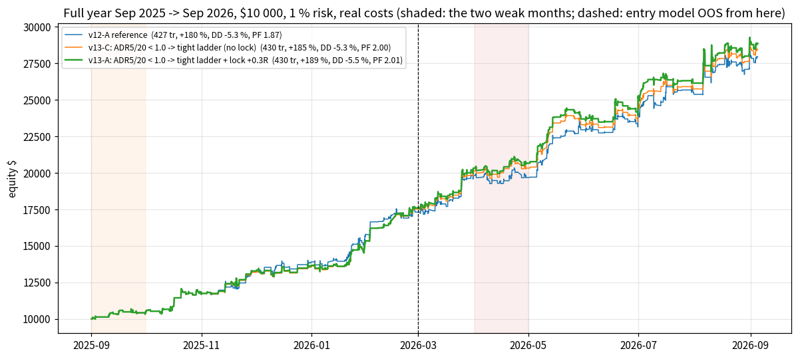
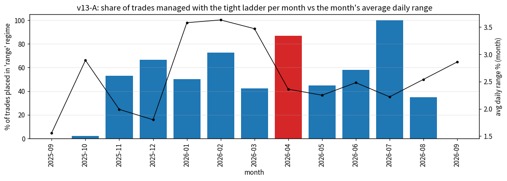
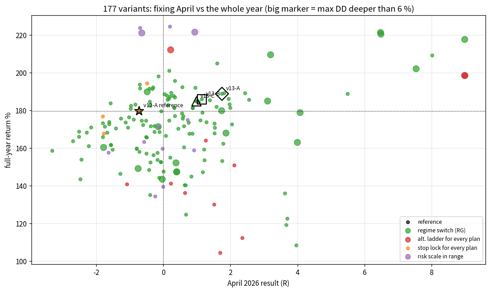
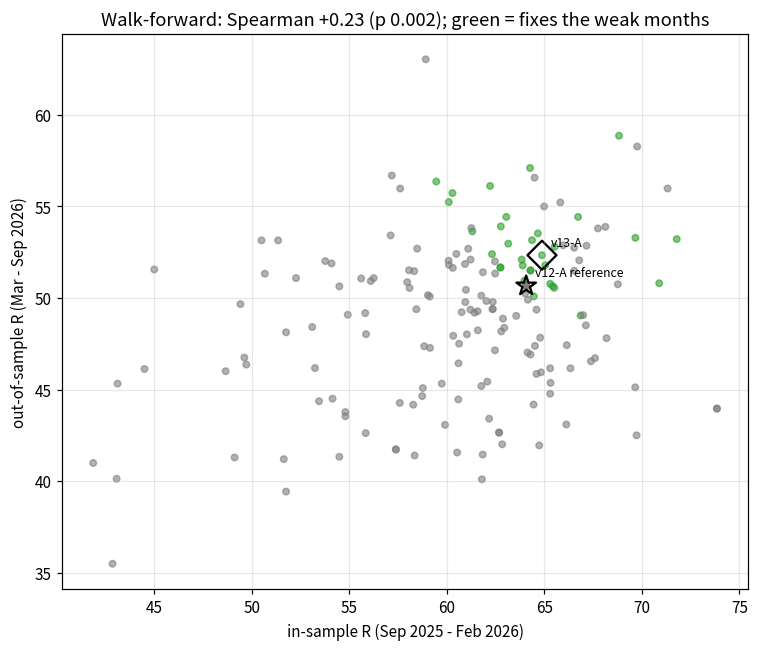
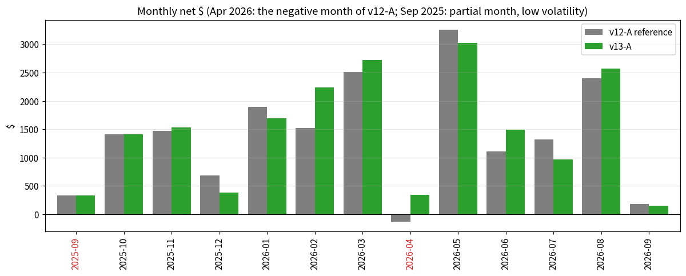
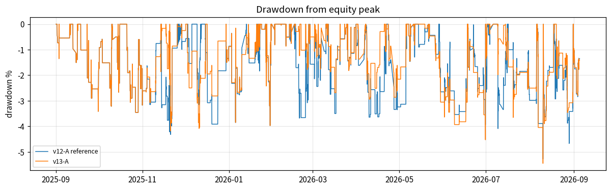

# WEAK MONTHS v13 — why Apr 2026 was negative and Sep 2025 weak, and the fix (regime-adaptive management)

*Generated by `make_v13_report.py` from the v13 result files.  Simulator = the M1 portfolio simulator used since v7 (limit fills on
ask/bid, MT5-tester intrabar path, imputed spread, $7 commission, slippage, broker rounding), full year Sep 2025 -> Sep 2026,
$10 000 start, 1 % risk.  Entry model trained until 2026-03-01: Sep25-Feb26 is in-sample (IS) for the *entries*, Mar-Sep26 out-of-sample (OOS).
Reference = v12-A, the trader shipped in `run_trader.bat` before this study.*

## 0. Result in one paragraph

The negative month was **not caused by bad trade selection but by trade management that does not fit a ranging market**.  In April 2026
(post-crash range after the -11.6 % March) the 4-leg ladder 0.6/1.2/2.4/4.8 R never reached its far legs, partials fell back to break-even
and the stop-rate rose - the reference lost -0.72 R ($-132).  A **regime switch** computed from CLOSED
daily bars only (`ADR5/ADR20 < 1.0` = volatility contracting) that manages plans placed in that regime with a **tight ladder
0.5/1.0/1.5/2.5 R + stop lock (BE after leg 1, +0.3 R after leg 2)** turns April into +1.75 R ($+343) while
the other 11 months are NET unchanged (+0.0 R in total vs reference; single months move between -2.8 and +4.6 R because 187 more trades are managed with the tight ladder in the other range weeks of the year).  Full year: **430 trades, +188.7 %, max DD
5.45 %, PF 2.01, win 75.3 %, worst day -2.28 %, 13/13 months positive**
(reference 427 / +179.5 % / 5.28 % / 1.87 / 72.6 % / -2.65 % / 12/13).
It beats the reference on return AND out-of-sample PF in 6 of 6 stress scenarios and sits in the middle of a smooth
plateau of 22 neighbouring settings that ALL make April positive.  **Sep 2025 stays +3.35 R**: that month is opportunity
starvation (lowest volatility of the year, M5 zones too small to pay the spread) - the honest finding is that nothing in the same stream can be
added without paying for it elsewhere (section 2).

`run_trader.bat` now ships v13-A; `verify_bat_v13.py` replays the exact bat strings to the same 430 trades / +188.65 %.

## 1. Diagnosis of April 2026 (the negative month)

* 38 trades, -0.72 R, PF 0.95, win 66 %, stops 34 %, TP2 5 % - a normal NUMBER of
  trades (funnel of the month = normal) and NOT one bad slice: sells -4.6 R, counter-trend -3.6 R, M10 and the
  pre-NY session were all negative in April but every one of those slices is strongly positive over the year and OOS -> a filter would cost more elsewhere.
* **The driver is the ladder**: legs reached in April vs the other months - 1.2 R 26 % (other months 29-56 %),
  2.4 R 18 %, 4.8 R 5 % (other 9-20 %); legs closed per trade 1.13
  (other 1.29-1.83); median MFE 0.95 R.  A flat 1 R exit on the same fills would have made +12 R.
* **Regime**: April = post-crash range.  Month range 8.1 % (lowest since Dec), chop 20.8 (year 1.4-9 except Jul), trend efficiency
  -0.12, 4 EMA20 flips, avg daily range 2.36 %.  Over the 13 months Spearman(monthly R, avg daily range %) = +0.56:
  the bot earns with volatility.
* **Were good POIs filtered out?**  The 205 April POIs rejected by the trade filter were replayed with the reference management:
  176 would have filled for -16.9 R GROSS (before commission) -> the filter threw nothing good away.
* Worst days 04-08 (-2.31 %, two confluence stops within 18 min) and 04-27 (-1.98 %).

**Hypothesis confirmed by the grid**: April cannot be fixed by trading less or selecting differently - it needs MANAGEMENT that adapts to a
ranging regime.

## 2. Diagnosis of September 2025 (the weak month)

* 19 trades, +3.35 R ($+332 on a $10 000 account = +3.3 % of equity, i.e. Dec/Jun/Jul level), PF 1.62, avg +0.18 R/trade = normal.
  The month is **partial** in the stream (starts 2025-09-01, 22 trading days but only 13 with a trade) and it was the **lowest-volatility month
  of the year**: avg daily range $54 = 1.56 % of a $3 500 gold price (later months 2-3.6 %).
* Consequence: M5 zones had a median height of $2.3 (year $4-7) -> cost_r = (spread + commission) / zone = 0.15 >> the 0.08 cap -> 160 of the
  M5 POIs were rejected by the cost gate, only 4 M5 trades (other months 8-23).  Replay of those 160 rejects: 130 fills,
  +0.7 R **gross** = zero edge before commission -> **the gate was right**.  M15 / M10 quality rejects replayed negative as well.
* Regime in September: chop 1.4, trend efficiency 0.94 = a steady low-volatility TREND, not a range -> the regime switch does not
  touch it (0 range trades); honest result: Sep 2025 stays +3.35 R.  The only variants that lift it (a lock on the ER metric) do it at the
  cost of April and of the OOS half -> rejected.

## 3. The lever: regime-adaptive management (`lubot/regime.py`, TraderConfig `regime_*` / `range_*`)

* `adr_ratio` = mean daily range of the last `regime_short`=5 CLOSED server days / last `regime_long`=20 days.  The value of day D uses days < D
  only (no look-ahead; the live bot excludes the unfinished current day).  `regime_of(v, 1.0)` -> **range** when v < 1.0, else **trend**.
* Plans PLACED in a range regime use `range_tp_levels=0.5|1.0|1.5|2.5` (25 % each) and `range_sl_after_leg=0|0.3|x|x` (SL -> BE after leg 1,
  -> +0.3 R after leg 2, then left); trend plans keep the v10 G ladder 0.6/1.2/2.4/4.8 with BE after leg 1.  Defaults are byte-identical to
  v12 (parity test), the trades frame carries a `regime` column.
* In the year 220 of 430 trades were range-managed (51 %): 33 in April, 38 in July (the two range months), 0 in Sep 2025 / Sep 2026.

### Same fills, different exits: the 220 range-managed trades under both managements

| slice | n | R v13-A | R v12-A (same fills) | win % A | sl % A | sl % ref | tp2 % A | tp2 % ref |
|---|---|---|---|---|---|---|---|---|
| all range trades | 220 | +41.00 | +37.41 | 75.5 | 24.5 | 29.5 | 16.8 | 10.5 |
| Apr 2026 | 33 | +1.76 | -0.72 | 69.7 | 30.3 | 36.4 | 12.1 | 6.1 |
| Jul 2026 | 38 | +4.03 | +5.82 | 71.1 | 28.9 | 34.2 | 13.2 | 13.2 |
| IS half | 86 | +27.98 | +27.03 | 79.1 | 20.9 | 24.4 | 24.4 | 12.8 |
| OOS half | 134 | +13.03 | +10.38 | 73.1 | 26.9 | 32.8 | 11.9 | 9.0 |

(Fills matched on key + entry time; 4 range trades of v13-A have no exact counterpart in the reference because an earlier exit freed a
slot for a different order.)  The tight ladder wins on the range trades in BOTH halves of the year; the trend trades are untouched.

## 4. Grid: 177 variants on top of v12-A

Families: `RG_` regime switch x metric (ADR ratio / efficiency ratio / absolute ADR %) x threshold x alternative ladder x stop lock x TF subset;
`LAD_` the alternative ladder for EVERY plan; `LOCK_` a stop lock for every plan; `RISK_` reduced/increased risk in a range.
Judged on: Apr26 R, Sep25 R, worst month, 13/13 months, the other 11 months not worse than -3 R, AND the v12 loss bands on the full year
(`hold_loss`: DD not > 0.5 pt deeper, PF >= ref-0.05, win >= ref-3, worst day >= ref-0.5) and on the OOS half (`hold_oos`).

* 32 variants fix the weak months (April > 0, no negative month, other months >= -3 R); **27 of them also hold BOTH loss bands - and
  25 of those 27 are regime switches (RG_)**.
* **The switch is needed**: the tight ladder for EVERY plan (LAD_tight) gives +130 % (April +1.5 R but the trending months pay for it),
  LAD_t3 +104 %, one leg at 1 R +198 % with DD 8.9 % - the far legs earn the year in trending months.
* Stop locks for every plan (LOCK_l03_10: April -0.48 R) and risk scaling in a range (RISK_adr0.9_0.5: return
  +157 %, April -1.63 R) do not fix April; not trading in a range at all costs ~50 % of the return.
* Spearman(April R, other-months R) over the grid = -0.11 (p 0.13): fixing April does NOT systematically cost the other months.

### Finalists

| name                  | what                                              |   trades |   return_% |   max_dd_% |   profit_factor |   win_% |   sl_% |   worst_day_% |   OOS_R |   OOS_PF |   apr26_R |   sep25_R |   worst_month_R |   months_pos |   range_n |   range_R | hold_loss   | hold_oos   | fix_weak   |
|:----------------------|:--------------------------------------------------|---------:|-----------:|-----------:|----------------:|--------:|-------:|--------------:|--------:|---------:|----------:|----------:|----------------:|-------------:|----------:|----------:|:------------|:-----------|:-----------|
| ref                   | v12-A reference                                   |      427 |     179.51 |      -5.28 |           1.874 |    72.6 |   26.9 |         -2.65 |   50.66 |    1.777 |     -0.72 |      3.35 |           -0.72 |           12 |         0 |      0    | True        | True       | False      |
| RG_adr1.0_tight_l03   | v13-A: ADR5/20 < 1.0 -> tight ladder + lock +0.3R |      430 |     188.65 |      -5.45 |           2.008 |    75.3 |   24.2 |         -2.28 |   52.33 |    1.91  |      1.75 |      3.35 |            0.72 |           13 |       220 |     41    | True        | True       | True       |
| RG_adr0.9_tight_w3_20 | v13-B: ADR3/20 < 0.9 -> tight ladder              |      430 |     185.76 |      -4.38 |           1.983 |    74.7 |   24.9 |         -2.58 |   55.23 |    1.931 |      1.15 |      3.35 |            0.72 |           13 |       152 |     32.9  | True        | True       | True       |
| RG_adr1.0_tight       | v13-C: ADR5/20 < 1.0 -> tight ladder (no lock)    |      430 |     184.65 |      -5.26 |           2.002 |    75.3 |   24.2 |         -2.28 |   51.5  |    1.903 |      0.99 |      3.35 |            0.72 |           13 |       220 |     39.21 | True        | True       | True       |
| RG_adr1.1_three       | ADR5/20 < 1.1 -> 3-leg 0.6/1.2/2.4                |      431 |     185.2  |      -4.54 |           1.886 |    72.9 |   26.7 |         -2.28 |   52.96 |    1.785 |      1.39 |      3.4  |            0.99 |           13 |       266 |     57.38 | True        | True       | True       |
| RG_er0.2_three        | ER5 < 0.2 -> 3-leg 0.6/1.2/2.4                    |      427 |     195.47 |      -5.39 |           1.933 |    72.8 |   26.7 |         -2.4  |   56.11 |    1.86  |      0.35 |      3.35 |            0.35 |           13 |        81 |     20.71 | True        | True       | True       |
| RG_er0.4_G_l03_10     | ER5 < 0.4 -> G ladder + lock 0.3/1.0              |      427 |     200.87 |      -5.1  |           1.93  |    73.1 |   26.9 |         -2.33 |   53.28 |    1.821 |      0.18 |      4.64 |            0.18 |           13 |       174 |     51.12 | True        | True       | True       |

## 5. Robustness

### Stress (return % / max DD % / OOS PF / April R)

| variant         | base                      | spread_x2                | commission_x2             | slip_x3                   | worst_intrabar            | risk0.5                  | risk2                      |
|:----------------|:--------------------------|:-------------------------|:--------------------------|:--------------------------|:--------------------------|:-------------------------|:---------------------------|
| v12-A reference | +180 / -5.3 / 1.78 / -0.7 | +80 / -6.6 / 1.48 / -0.8 | +145 / -5.7 / 1.71 / +0.6 | +167 / -5.4 / 1.72 / -1.2 | +176 / -5.3 / 1.76 / -0.9 | +72 / -3.1 / 1.77 / +5.9 | +658 / -10.2 / 1.74 / -0.6 |
| v13-A           | +189 / -5.5 / 1.91 / +1.8 | +88 / -7.1 / 1.51 / -0.8 | +162 / -5.1 / 1.86 / +2.9 | +176 / -5.3 / 1.86 / +1.3 | +192 / -5.2 / 1.96 / +2.2 | +74 / -2.6 / 1.81 / +7.7 | +672 / -10.1 / 1.84 / +1.9 |
| v13-B           | +186 / -4.4 / 1.93 / +1.1 | +84 / -7.3 / 1.49 / -1.6 | +151 / -5.4 / 1.81 / +1.8 | +172 / -4.8 / 1.85 / +0.8 | +180 / -4.6 / 1.91 / +1.1 | +74 / -2.5 / 1.85 / +9.8 | +532 / -10.0 / 1.84 / +1.0 |
| v13-C           | +185 / -5.3 / 1.90 / +1.0 | +85 / -7.4 / 1.51 / -1.6 | +158 / -5.1 / 1.85 / +2.1 | +172 / -5.3 / 1.84 / +0.7 | +186 / -5.2 / 1.94 / +0.8 | +72 / -2.5 / 1.79 / +7.1 | +530 / -10.2 / 1.83 / +1.2 |

v13-A beats the reference on return and OOS PF in 6/6 scenarios.  At DOUBLE spread every variant loses ~110 M5 trades to the cost gate
and April is negative for all of them (reference included) - the regime lever cannot fix a month whose trades vanish.

### Walk-forward (pick on the IS half only, verify OOS)

Spearman(IS R, OOS R) over the 177 variants = **+0.23** (p 0.002), (IS PF, OOS PF) = **+0.36** (p 7.5e-07) - POSITIVE, unlike the
v11/v12 selection levers (-0.29): management levers generalise.  Picking on the IS half alone (IS PF >= ref-0.05, sorted by IS R) gives a top-12
whose median OOS PF is 1.77 vs 1.78 for the reference; v13-A ranks 39/177 IS and 38/177 OOS
(reference 59/73) - consistent on both halves, not an OOS-picked outlier.

### Neighbourhood of v13-A (22 settings: threshold 0.8-1.1, windows 3-10 / 10-40 days, locks, ladders, fractions)

April positive in **22/22**, 13/13 months in 22/22, both loss bands held in 20/22
(misses: ADR windows 3/20 and 7/20 with DD 5.79 / 6.79 %), PF 1.87-2.03 (ref 1.87).
The plateau is smooth -> not a lucky cell.

| name                      |   trades |   return_% |   max_dd_% |   profit_factor |   worst_day_% |   OOS_R |   OOS_PF |   apr26_R |   worst_month_R |   months_pos |   range_n |   range_R | hold_loss   | hold_oos   |
|:--------------------------|---------:|-----------:|-----------:|----------------:|--------------:|--------:|---------:|----------:|----------------:|-------------:|----------:|----------:|:------------|:-----------|
| RG_adr0.8_tight           |      427 |     187.21 |      -5.44 |           1.94  |         -2.57 |   51.78 |    1.831 |      0.21 |            0.21 |           13 |        82 |     17.7  | True        | True       |
| RG_adr0.95_tight_l03      |      428 |     188.96 |      -5.26 |           2.018 |         -2.28 |   54.42 |    1.953 |      1.82 |            0.72 |           13 |       168 |     29.57 | True        | True       |
| RG_adr0.9_tight           |      428 |     181.1  |      -5.24 |           1.946 |         -2.63 |   51.66 |    1.856 |      0.88 |            0.72 |           13 |       121 |     25.99 | True        | True       |
| RG_adr0.9_tight_be2       |      428 |     181.1  |      -5.24 |           1.946 |         -2.63 |   51.66 |    1.856 |      0.88 |            0.72 |           13 |       121 |     25.99 | True        | True       |
| RG_adr0.9_tight_l03       |      428 |     184.17 |      -5.24 |           1.955 |         -2.6  |   51.77 |    1.857 |      1.06 |            0.72 |           13 |       121 |     26.83 | True        | True       |
| RG_adr0.9_tight_w10_40    |      427 |     170.09 |      -4.7  |           1.873 |         -2.54 |   46.16 |    1.732 |      0.45 |            0.45 |           13 |       131 |     32.87 | True        | True       |
| RG_adr0.9_tight_w3_20     |      430 |     185.76 |      -4.38 |           1.983 |         -2.58 |   55.23 |    1.931 |      1.15 |            0.72 |           13 |       152 |     32.9  | True        | True       |
| RG_adr0.9_tight_w5_10     |      426 |     181.19 |      -5.28 |           1.939 |         -2.42 |   53.81 |    1.858 |      2    |            0.72 |           13 |        92 |     18.87 | True        | True       |
| RG_adr0.9_tight_w5_30     |      426 |     173.33 |      -5.25 |           1.931 |         -2.62 |   48.37 |    1.814 |      0.76 |            0.76 |           13 |       146 |     29.01 | True        | True       |
| RG_adr1.05_tight_l03      |      430 |     185.47 |      -4.5  |           1.995 |         -2.28 |   50.64 |    1.879 |      2.56 |            0.48 |           13 |       244 |     51.38 | True        | True       |
| RG_adr1.0_t2_l03          |      428 |     167.48 |      -5.33 |           1.938 |         -2.28 |   50.07 |    1.864 |      0.87 |            0.57 |           13 |       218 |     31.61 | True        | True       |
| RG_adr1.0_tight           |      430 |     184.65 |      -5.26 |           2.002 |         -2.28 |   51.5  |    1.903 |      0.99 |            0.72 |           13 |       220 |     39.21 | True        | True       |
| RG_adr1.0_tight_be2       |      430 |     184.65 |      -5.26 |           2.002 |         -2.28 |   51.5  |    1.903 |      0.99 |            0.72 |           13 |       220 |     39.21 | True        | True       |
| RG_adr1.0_tight_l03       |      430 |     188.65 |      -5.45 |           2.008 |         -2.28 |   52.33 |    1.91  |      1.75 |            0.72 |           13 |       220 |     41    | True        | True       |
| RG_adr1.0_tight_l03_10    |      430 |     174.55 |      -5.3  |           1.964 |         -2.28 |   50.44 |    1.879 |      1.11 |            0.72 |           13 |       220 |     34.79 | True        | True       |
| RG_adr1.0_tight_l03_front |      430 |     178.63 |      -5.29 |           1.995 |         -2.28 |   52.4  |    1.924 |      1.17 |            0.72 |           13 |       220 |     35.25 | True        | True       |
| RG_adr1.0_tight_l03_w3_20 |      430 |     185.94 |      -5.79 |           2.034 |         -2.28 |   55.72 |    1.978 |      1.95 |            0.72 |           13 |       218 |     42.08 | False       | False      |
| RG_adr1.0_tight_l03_w5_15 |      429 |     188.97 |      -5.45 |           2.01  |         -2.02 |   53.15 |    1.924 |      2.44 |            0.72 |           13 |       215 |     36.91 | True        | True       |
| RG_adr1.0_tight_l03_w5_30 |      428 |     162.15 |      -4.53 |           1.924 |         -2.28 |   41.95 |    1.741 |      1.79 |            0.57 |           13 |       205 |     41.68 | True        | True       |
| RG_adr1.0_tight_l03_w7_20 |      430 |     179.7  |      -6.79 |           1.919 |         -2.59 |   46.54 |    1.765 |      1.74 |            0.72 |           13 |       201 |     41.03 | False       | False      |
| RG_adr1.0_tight_l05       |      430 |     181.71 |      -5.27 |           1.989 |         -2.28 |   50.94 |    1.89  |      1.59 |            0.72 |           13 |       220 |     38.34 | True        | True       |
| RG_adr1.1_tight           |      430 |     167.64 |      -5.58 |           1.951 |         -2.28 |   48.23 |    1.829 |      1.53 |            0.52 |           13 |       265 |     51.68 | True        | True       |

## 6. Month by month, reference vs v13-A

| month   |   v12-A $ |   v12-A R |   v13-A $ |   v13-A R |   range trades A |     d $ |
|:--------|----------:|----------:|----------:|----------:|-----------------:|--------:|
| 2025-09 |    332.09 |      3.35 |    332.09 |      3.35 |                0 |    0    |
| 2025-10 |   1410.41 |     12.78 |   1410.41 |     12.78 |                1 |    0    |
| 2025-11 |   1467.66 |     12.71 |   1532.4  |     13.35 |               17 |   64.74 |
| 2025-12 |    689.87 |      5.68 |    388.5  |      2.91 |               20 | -301.37 |
| 2026-01 |   1890.28 |     15.38 |   1691.71 |     13.75 |               24 | -198.57 |
| 2026-02 |   1521.78 |     14.17 |   2242.05 |     18.75 |               24 |  720.27 |
| 2026-03 |   2504.6  |     14.33 |   2722.93 |     15.49 |               17 |  218.33 |
| 2026-04 |   -131.99 |     -0.72 |    342.53 |      1.75 |               33 |  474.52 |
| 2026-05 |   3259.34 |     15.79 |   3026.89 |     14.09 |               13 | -232.45 |
| 2026-06 |   1107.83 |      5.17 |   1489.47 |      6.25 |               18 |  381.64 |
| 2026-07 |   1323.43 |      5.82 |    965.43 |      4.03 |               38 | -358    |
| 2026-08 |   2398.52 |      9.55 |   2572.57 |     10    |               15 |  174.05 |
| 2026-09 |    177.66 |      0.72 |    148.22 |      0.72 |                0 |  -29.44 |

## 7. Honest reading / limits

* One year of data, ONE deep range month (April) plus July; the lever is judged on 220 range-managed trades.  The neighbourhood, stress and
  walk-forward results say the effect is not a single lucky cell, but a regime switch tuned on a year that contains one deep range will be
  tested for real only in the next one.
* The finalists were chosen on the full year; their OOS numbers therefore carry some selection bias.  The IS-only pick still lands on the same
  family (RG with tight ladder / lock) and v13-A ranks consistently on both halves.
* Sep 2025 is NOT improved - by design.  The month is short, at the lowest volatility of the year, and the rejected trades had no gross edge.
  Any lever that lifts it in the grid does so through the entry stream's in-sample half and loses OOS.
* The live bot computes the same metric from the same closed daily bars (`Trader.current_regime`, logged in every status line), applies the
  range ladder / stop schedule per plan (`sl_after_leg` carried in the plan state) and was tested against the fake MT5 (3 tests).

## 8. Files

`run_v13_diag.py` (diagnosis -> `v13_diag/`), `lubot/regime.py`, `run_v13_levers.py` + `run_v13_all.sh` / `run_v13_stage4.sh` / `run_v13_neigh.sh`
(grid + stress + neighbourhood, resumable -> `v13_levers/`, `v13_levers.csv`, `v13_stress.csv`), `walkforward_v13.py` (-> `v13_walkforward.csv`,
`v13_neighbourhood.csv`), `verify_bat_v13.py`, `tests/test_v13_regime.py`, `tests/test_trader_live.py::test_v13_*`, `tests/test_bat_v13.py`, this report.
